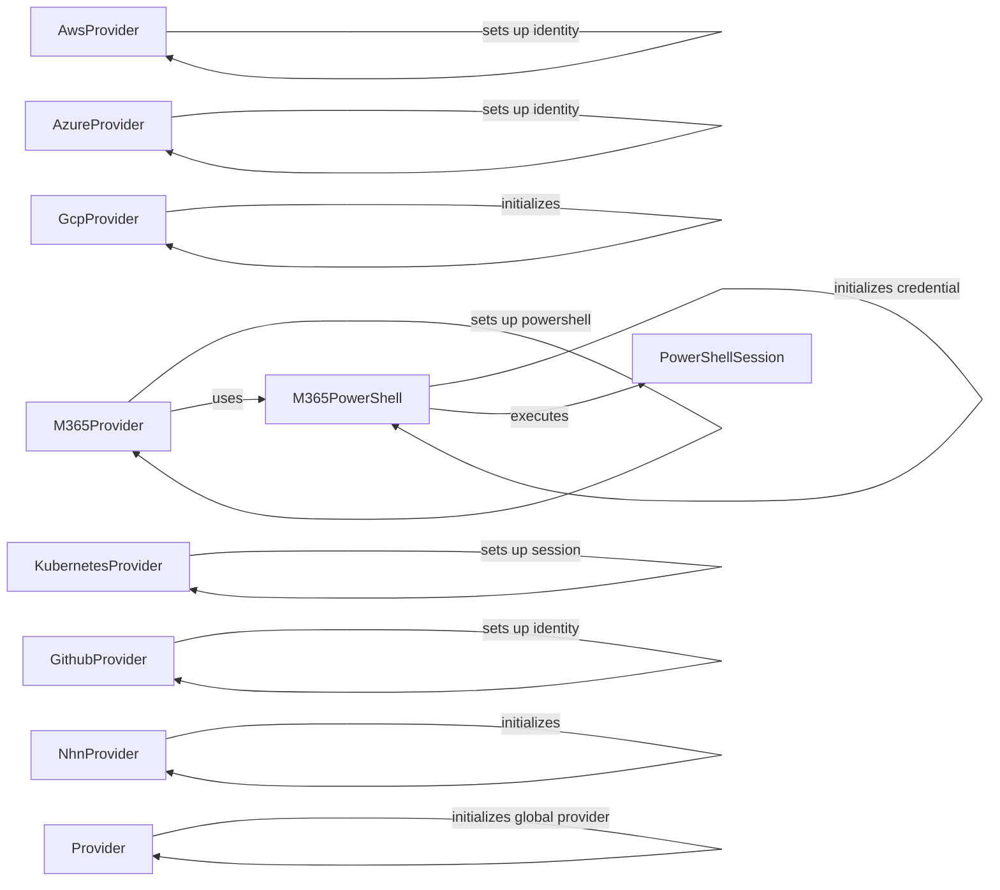

## Component Details

The Cloud Provider Abstraction Layer in Prowler offers a unified interface to interact with various cloud providers, including AWS, Azure, GCP, M365, Kubernetes, Github, and NHN. It abstracts the complexities of each provider's API, handling authentication, session management, and data retrieval. This abstraction allows Prowler to support multiple cloud environments without significant code changes. The layer also incorporates PowerShell session management specifically for M365, enabling command execution and configuration within the M365 environment.

### AwsProvider
The AwsProvider class is responsible for setting up and managing the AWS environment for Prowler. It handles session creation, credential management, region discovery, and client generation for various AWS services, providing a consistent interface for interacting with AWS resources.
- **Related Classes/Methods**: `prowler.providers.aws.aws_provider.AwsProvider`

### AzureProvider
The AzureProvider class is responsible for setting up and managing the Azure environment for Prowler. It handles session creation, credential management, and region configuration, providing a consistent interface for interacting with Azure resources.
- **Related Classes/Methods**: `prowler.providers.azure.azure_provider.AzureProvider`

### GcpProvider
The GcpProvider class is responsible for setting up and managing the GCP environment for Prowler. It handles project validation and connection testing, providing a consistent interface for interacting with GCP resources.
- **Related Classes/Methods**: `prowler.providers.gcp.gcp_provider.GcpProvider`

### M365Provider
The M365Provider class is responsible for setting up and managing the M365 environment for Prowler. It handles session creation, identity setup, PowerShell setup, and credential validation, providing a consistent interface for interacting with M365 services.
- **Related Classes/Methods**: `prowler.providers.m365.m365_provider.M365Provider`

### KubernetesProvider
The KubernetesProvider class is responsible for setting up and managing the Kubernetes environment for Prowler. It handles session creation, connection testing, and retrieving context user roles, providing a consistent interface for interacting with Kubernetes clusters.
- **Related Classes/Methods**: `prowler.providers.kubernetes.kubernetes_provider.KubernetesProvider`

### GithubProvider
The GithubProvider class is responsible for setting up and managing the Github environment for Prowler. It handles session creation and identity setup, providing a consistent interface for interacting with Github resources.
- **Related Classes/Methods**: `prowler.providers.github.github_provider.GithubProvider`

### NhnProvider
The NhnProvider class is responsible for setting up and managing the NHN environment for Prowler. It handles connection testing, providing a consistent interface for interacting with NHN resources.
- **Related Classes/Methods**: `prowler.providers.nhn.nhn_provider.NhnProvider`

### M365PowerShell
The M365PowerShell class is responsible for managing PowerShell sessions and executing commands in the M365 environment. It handles credential initialization and various M365-related configurations, enabling interaction with M365 services via PowerShell.
- **Related Classes/Methods**: `prowler.providers.m365.lib.powershell.m365_powershell.M365PowerShell`

### PowerShellSession
The PowerShellSession class is a generic PowerShell session handler that executes commands. It provides the underlying functionality for running PowerShell commands, used by M365PowerShell.
- **Related Classes/Methods**: `prowler.lib.powershell.powershell.PowerShellSession`

### Provider
The Provider class is a base class for all providers. It initializes global provider settings and retrieves available providers, serving as the foundation for all cloud provider interactions.
- **Related Classes/Methods**: `prowler.providers.common.provider.Provider`
