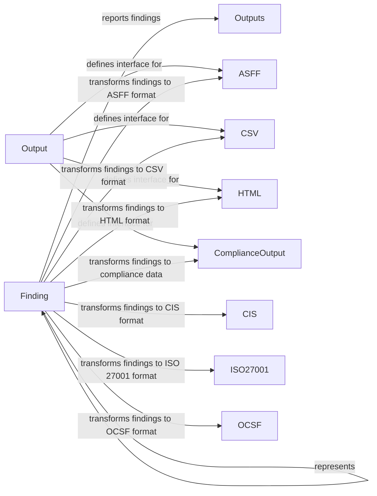

## Component Details

The Output and Compliance Handling component is responsible for formatting and delivering security findings generated by Prowler into various formats and destinations. It transforms raw finding data into standardized formats like JSON, CSV, HTML, and ASFF, and supports sending findings to different destinations, including files, S3 buckets, Jira, and Slack. Additionally, it handles the transformation of Prowler findings into compliance frameworks like CIS, NIST, ISO27001, and others, providing a comprehensive view of security posture against industry standards and best practices.

### Finding
Represents a single security finding generated by Prowler. It encapsulates the details of the security issue, its severity, and other relevant metadata. The Finding object serves as the central data structure that is transformed and formatted by other components for output and reporting.
- **Related Classes/Methods**: `prowler.lib.outputs.finding.Finding`

### Output
The base class for all output modules. It provides common functionalities like creating file descriptors and defines the interface for writing findings to different output formats. It serves as an abstraction layer for different output formats, ensuring consistency and extensibility.
- **Related Classes/Methods**: `prowler.lib.outputs.output.Output`

### Outputs
The Outputs component orchestrates the reporting of findings to the specified output destinations. It receives the processed findings and utilizes the appropriate output modules (e.g., ASFF, CSV, HTML) to format and deliver the data to the configured targets, such as files, S3 buckets, or external systems.
- **Related Classes/Methods**: `prowler.lib.outputs.outputs`

### ASFF
Transforms findings into the AWS Security Finding Format (ASFF). This format is used to integrate Prowler findings with AWS security services like Security Hub, enabling centralized security management and monitoring within the AWS ecosystem.
- **Related Classes/Methods**: `prowler.lib.outputs.asff.asff.ASFF`

### CSV
Transforms findings into CSV format, which can be easily imported into spreadsheets or other data analysis tools. This allows users to analyze and visualize the findings using their preferred data analysis methods.
- **Related Classes/Methods**: `prowler.lib.outputs.csv.csv.CSV`

### HTML
Generates an HTML report of the findings. It includes functionalities for writing headers and batch writing data to the file, providing a user-friendly and easily shareable report of the security assessment results.
- **Related Classes/Methods**: `prowler.lib.outputs.html.html.HTML`

### ComplianceOutput
Handles the output of compliance-related data. It is responsible for displaying compliance tables and transforming data into various compliance formats, providing a clear and concise view of the organization's compliance posture against different standards and regulations.
- **Related Classes/Methods**: `prowler.lib.outputs.compliance.compliance_output.ComplianceOutput`

### CIS
Transforms findings into CIS benchmark format for different platforms (AWS, Azure, GCP, Kubernetes, Github, M365). This enables organizations to assess their security configuration against the widely recognized CIS benchmarks and identify areas for improvement.
- **Related Classes/Methods**: `prowler.lib.outputs.compliance.cis.cis_kubernetes.KubernetesCIS`, `prowler.lib.outputs.compliance.cis.cis_github.GithubCIS`, `prowler.lib.outputs.compliance.cis.cis_m365.M365CIS`, `prowler.lib.outputs.compliance.cis.cis_gcp.GCPCIS`, `prowler.lib.outputs.compliance.cis.cis_aws.AWSCIS`, `prowler.lib.outputs.compliance.cis.cis_azure.AzureCIS`

### ISO27001
Transforms findings into ISO 27001 format for different platforms (AWS, Azure, GCP, Kubernetes, NHN). This allows organizations to map Prowler findings to the specific controls and requirements of the ISO 27001 standard, facilitating compliance efforts.
- **Related Classes/Methods**: `prowler.lib.outputs.compliance.iso27001.iso27001_aws.AWSISO27001`, `prowler.lib.outputs.compliance.iso27001.iso27001_gcp.GCPISO27001`, `prowler.lib.outputs.compliance.iso27001.iso27001_kubernetes.KubernetesISO27001`, `prowler.lib.outputs.compliance.iso27001.iso27001_azure.AzureISO27001`, `prowler.lib.outputs.compliance.iso27001.iso27001_nhn.NHNISO27001`

### OCSF
Transforms findings into the Open Cybersecurity Schema Framework (OCSF) format. This enables interoperability and data sharing between different security tools and platforms, facilitating a more integrated and comprehensive security ecosystem.
- **Related Classes/Methods**: `prowler.lib.outputs.ocsf.ocsf.OCSF`
