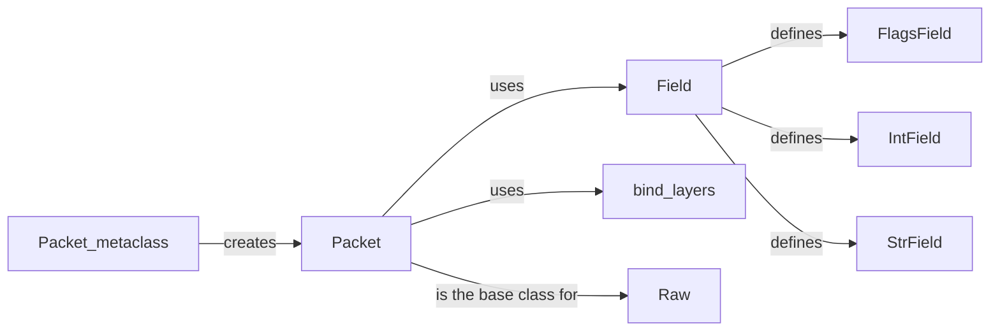

## Component Details

The PacketForge component in Scapy provides the foundation for defining, creating, manipulating, and dissecting network packets. It encompasses the core classes and functions necessary for working with packets at different layers of the network stack. The central flow involves defining packet structures using the Packet class and its metaclass, specifying fields within those structures using Field classes, and binding different layers together using the bind_layers function. This allows Scapy to craft and analyze network traffic effectively.

### Packet
The base class for all packet types in Scapy. It provides methods for building, dissecting, and manipulating packets. It manages fields, payload, and cached values. All packet types inherit from this class, defining their specific structure and behavior.
- **Related Classes/Methods**: `scapy.scapy.packet.Packet`

### Field
Base class for defining packet fields. It handles conversion between internal values, human-readable representations, and raw bytes. Different field types, such as IntField, StrField, and FlagsField, inherit from this class to define specific field behaviors.
- **Related Classes/Methods**: `scapy.scapy.fields.Field`

### bind_layers
Function that binds two packet layers together, specifying that if a packet of the first layer is followed by a certain byte sequence, it should be interpreted as the second layer. This is crucial for Scapy's ability to dissect complex protocols.
- **Related Classes/Methods**: `scapy.scapy.packet.bind_layers`

### Raw
A simple packet class that represents the raw payload of a packet. It's used when Scapy cannot dissect the payload into a known protocol, providing a way to access the raw bytes.
- **Related Classes/Methods**: `scapy.scapy.packet.Raw`

### Packet_metaclass
Metaclass for the Packet class. It handles the creation of new packet classes and sets up the fields defined within those classes. It's responsible for initializing the packet structure.
- **Related Classes/Methods**: `scapy.scapy.base_classes.Packet_metaclass`

### FlagsField
A field that represents a set of flags within a packet. It allows for easy manipulation and interpretation of flag values.
- **Related Classes/Methods**: `scapy.scapy.fields.FlagsField`

### IntField
A field that represents an integer value within a packet. It handles the conversion between integer values and their byte representations.
- **Related Classes/Methods**: `scapy.scapy.fields.IntField`

### StrField
A field that represents a string value within a packet. It handles the encoding and decoding of string values to and from bytes.
- **Related Classes/Methods**: `scapy.scapy.fields._StrField`
