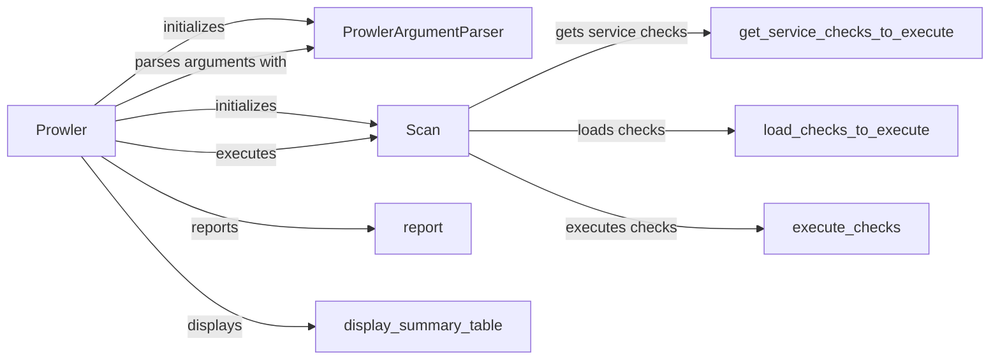

## Component Details

The Prowler application performs security assessments of cloud environments. It starts by parsing command-line arguments to configure the scan. The core of the process is managed by the Scan component, which orchestrates the loading of checks, their execution, and the collection of results. The scan determines which service checks to execute based on the environment. The results are then compiled into a comprehensive report and a summary table, providing insights into the security posture of the assessed cloud environment.

### Prowler
The main entry point of the Prowler application. It orchestrates the entire scanning process, from argument parsing to report generation.
- **Related Classes/Methods**: `prowler.prowler.__main__:prowler`

### ProwlerArgumentParser
Parses command-line arguments using `argparse`. It defines the arguments Prowler accepts and their expected types, providing a structured way to configure the scan.
- **Related Classes/Methods**: `prowler.prowler.lib.cli.parser.ProwlerArgumentParser:__init__`, `prowler.prowler.lib.cli.parser.ProwlerArgumentParser:parse`

### Scan
The core class responsible for managing the scanning process. It initializes the scan environment, determines which checks to run, executes them, and collects the results.
- **Related Classes/Methods**: `prowler.prowler.lib.scan.scan.Scan:__init__`, `prowler.prowler.lib.scan.scan.Scan:scan`

### get_service_checks_to_execute
Determines the specific service checks that should be executed based on the scan's configuration and the target environment. This allows for focused and efficient scanning.
- **Related Classes/Methods**: `prowler.prowler.lib.scan.scan:get_service_checks_to_execute`

### load_checks_to_execute
Loads the security check definitions that will be executed during the scan. This involves reading the check definitions and preparing them for execution.
- **Related Classes/Methods**: `prowler.prowler.lib.check.checks_loader:load_checks_to_execute`

### execute_checks
Executes the loaded security checks against the target environment. This component is responsible for running the checks and collecting the results.
- **Related Classes/Methods**: `prowler.prowler.lib.check.check:execute_checks`

### report
Generates a detailed report of the scan results, including findings, recommendations, and other relevant information. This report provides a comprehensive overview of the security posture.
- **Related Classes/Methods**: `prowler.prowler.lib.outputs.outputs:report`

### display_summary_table
Displays a summary table of the scan results, providing a high-level overview of the findings. This table allows users to quickly assess the overall security posture.
- **Related Classes/Methods**: `prowler.prowler.lib.outputs.summary_table:display_summary_table`
