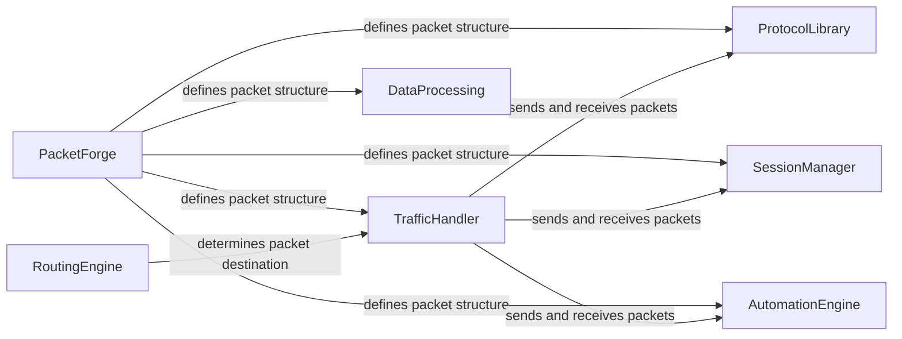

## Component Details

Scapy is a powerful interactive packet manipulation program. It is able to forge or decode packets of a wide number of protocols, send them on the wire, capture them, match requests and replies, and much more. It provides a command-line interface, allowing users to interactively define and manipulate network packets. Scapy can be used for various tasks such as network discovery, packet sniffing, network security testing, and protocol fuzzing. The core of Scapy revolves around defining packet structures, sending/receiving packets, and dissecting captured traffic.

### PacketForge
The PacketForge component is the foundation of Scapy, responsible for defining, creating, manipulating, and dissecting network packets. It provides the core functionality for working with packets at different layers of the network stack. It includes classes and methods for defining packet structures, adding fields, binding layers, and splitting packets. This component is central to Scapy's ability to craft and analyze network traffic.
- **Related Classes/Methods**: `scapy.scapy.packet`, `scapy.scapy.base_classes`, `scapy.scapy.fields`, `scapy.scapy.asn1packet`, `scapy.scapy.asn1fields`

### TrafficHandler
The TrafficHandler component handles the sending, receiving, and sniffing of network packets. It provides functions for sending packets at different layers (L2, L3), sending and receiving packets with request-response matching, sniffing network traffic, and bridging network interfaces. It relies on the PacketForge component to define the structure of the packets being sent and received.
- **Related Classes/Methods**: `scapy.scapy.sendrecv`, `scapy.scapy.supersocket`, `scapy.scapy.arch`, `scapy.scapy.arch.bpf.supersocket`, `scapy.scapy.arch.linux`, `scapy.scapy.arch.windows`

### ProtocolLibrary
The ProtocolLibrary component encompasses the definitions and implementations of various network protocol layers, including Ethernet, IP, TCP, UDP, ICMP, DNS, TLS, and many others. Each layer defines the structure and behavior of packets at that level of the network stack. It relies on PacketForge to define the structure of the packets and TrafficHandler to send and receive them.
- **Related Classes/Methods**: `scapy.scapy.layers.l2`, `scapy.scapy.layers.inet`, `scapy.scapy.layers.inet6`, `scapy.scapy.layers.dns`, `scapy.scapy.layers.tls`, `scapy.scapy.layers.*`

### SessionManager
The SessionManager component provides an interactive environment for users to interact with Scapy. It includes functionalities for loading modules, saving and loading sessions, tab completion, and command-line interface utilities. It uses PacketForge to create and dissect packets, and TrafficHandler to send and receive them.
- **Related Classes/Methods**: `scapy.scapy.main`, `scapy.scapy.utils`, `scapy.scapy.config`, `scapy.scapy.autorun`

### AutomationEngine
The AutomationEngine component provides the ability to automatically respond to network packets based on predefined rules. It can be used to simulate network services or perform automated network testing. It relies on PacketForge to define the structure of the packets and TrafficHandler to send and receive them.
- **Related Classes/Methods**: `scapy.scapy.ansmachine`

### RoutingEngine
The RoutingEngine component manages network routing information for IPv4 and IPv6. It provides functionalities for adding, deleting, and querying routes, as well as resolving interfaces and addresses. It is used by TrafficHandler to determine the destination of packets.
- **Related Classes/Methods**: `scapy.scapy.route`, `scapy.scapy.route6`, `scapy.scapy.interfaces`

### DataProcessing
The DataProcessing component provides functionalities for managing lists of packets, including filtering, summarizing, displaying, and exporting packets in various formats. It relies on PacketForge to understand the structure of the packets.
- **Related Classes/Methods**: `scapy.scapy.plist`, `scapy.scapy.pipetool`, `scapy.scapy.scapypipes`