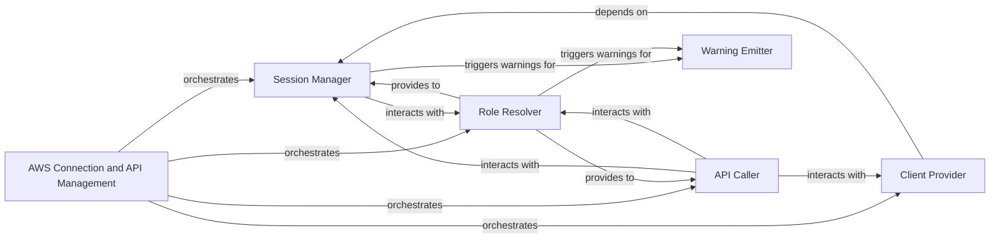

## Details

The `AWS CloudFormation Client` subsystem is primarily defined by the `sceptre.connection_manager` module, which acts as the central point for all AWS connection and API interaction logic within Sceptre.

### AWS Connection and API Management
This central component, implemented by the `sceptre.connection_manager` module, provides a comprehensive abstraction layer for interacting with various AWS services, particularly AWS CloudFormation. It is responsible for securely establishing and managing AWS sessions, provisioning specific AWS service clients, orchestrating and executing direct API calls, and handling IAM role resolution for proper permissions.

**Related Classes/Methods**:

- <a href="https://github.com/Sceptre/sceptre/blob/master/sceptre/connection_manager.py#L1-L9999" target="_blank" rel="noopener noreferrer">`sceptre.connection_manager`:1-9999</a>

### Session Manager
Responsible for establishing, managing, and providing authenticated AWS sessions. This includes handling session arguments and preparing environment variables for AWS interactions.

**Related Classes/Methods**:

- <a href="https://github.com/Sceptre/sceptre/blob/master/sceptre/connection_manager.py#L1-L9999" target="_blank" rel="noopener noreferrer">`sceptre.connection_manager:get_session`:1-9999</a>
- <a href="https://github.com/Sceptre/sceptre/blob/master/sceptre/connection_manager.py#L1-L9999" target="_blank" rel="noopener noreferrer">`sceptre.connection_manager:_get_session`:1-9999</a>
- <a href="https://github.com/Sceptre/sceptre/blob/master/sceptre/connection_manager.py#L1-L9999" target="_blank" rel="noopener noreferrer">`sceptre.connection_manager:_determine_session_args`:1-9999</a>
- <a href="https://github.com/Sceptre/sceptre/blob/master/sceptre/connection_manager.py#L1-L9999" target="_blank" rel="noopener noreferrer">`sceptre.connection_manager:create_session_environment_variables`:1-9999</a>

### Client Provider
Responsible for obtaining and providing specific AWS service clients (e.g., CloudFormation client, S3 client) using an established AWS session. It acts as a factory for AWS service interfaces.

**Related Classes/Methods**:

- <a href="https://github.com/Sceptre/sceptre/blob/master/sceptre/connection_manager.py#L1-L9999" target="_blank" rel="noopener noreferrer">`sceptre.connection_manager:_get_client`:1-9999</a>

### API Caller
The primary interface for executing direct API calls to AWS services. It orchestrates the retrieval of sessions and clients to perform the requested API operations, acting as the execution engine for AWS interactions.

**Related Classes/Methods**:

- <a href="https://github.com/Sceptre/sceptre/blob/master/sceptre/connection_manager.py#L1-L9999" target="_blank" rel="noopener noreferrer">`sceptre.connection_manager:call`:1-9999</a>

### Role Resolver
Manages the resolution and consolidation of IAM roles used for AWS interactions, ensuring proper permissions are applied for API calls and session establishment.

**Related Classes/Methods**:

- <a href="https://github.com/Sceptre/sceptre/blob/master/sceptre/connection_manager.py#L1-L9999" target="_blank" rel="noopener noreferrer">`sceptre.connection_manager:_coalesce_sceptre_role`:1-9999</a>

### Warning Emitter
A utility component dedicated to logging and emitting deprecation warnings, particularly concerning IAM role usage or other connection-related issues, ensuring users are informed of potential problems or changes.

**Related Classes/Methods**:

- <a href="https://github.com/Sceptre/sceptre/blob/master/sceptre/connection_manager.py#L1-L9999" target="_blank" rel="noopener noreferrer">`sceptre.connection_manager:_emit_iam_role_deprecation_warning`:1-9999</a>

### [FAQ](https://github.com/CodeBoarding/GeneratedOnBoardings/tree/main?tab=readme-ov-file#faq)