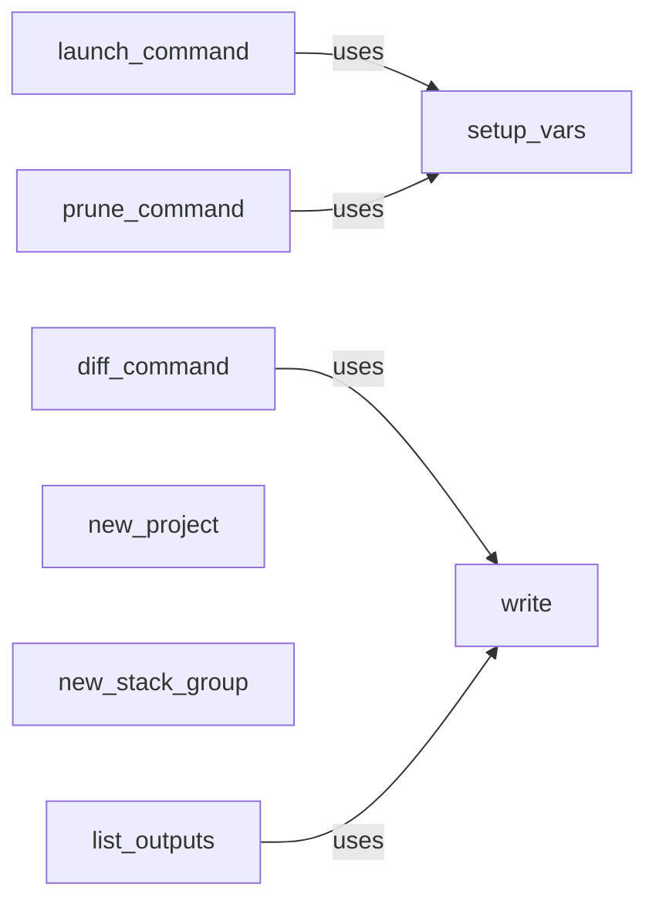

## Details

The CLI Interface subsystem in Sceptre is primarily defined by the `sceptre.cli` package. It serves as the user's direct interaction point, handling command parsing, input validation, and orchestrating high-level Sceptre operations.

### launch_command
Parses command-line arguments for the `launch` operation, prompts for user confirmation, displays the planned deployment actions, and orchestrates the high-level deployment flow.

**Related Classes/Methods**:

- <a href="https://github.com/Sceptre/sceptre/blob/master/sceptre/cli/launch.py#L18-L63" target="_blank" rel="noopener noreferrer">`sceptre.cli.launch.launch_command`:18-63</a>
- <a href="https://github.com/Sceptre/sceptre/blob/master/sceptre/cli/launch.py#L93-L106" target="_blank" rel="noopener noreferrer">`sceptre.cli.launch.launch`:93-106</a>
- <a href="https://github.com/Sceptre/sceptre/blob/master/sceptre/cli/helpers.py#L192-L264" target="_blank" rel="noopener noreferrer">`sceptre.cli.helpers.setup_vars`:192-264</a>

### prune_command
Parses command-line arguments for the `prune` operation, prompts for user confirmation, and displays the pruning plan.

**Related Classes/Methods**:

- <a href="https://github.com/Sceptre/sceptre/blob/master/sceptre/cli/prune.py#L13-L39" target="_blank" rel="noopener noreferrer">`sceptre.cli.prune.prune_command`:13-39</a>
- <a href="https://github.com/Sceptre/sceptre/blob/master/sceptre/cli/prune.py#L78-L88" target="_blank" rel="noopener noreferrer">`sceptre.cli.prune.prune`:78-88</a>
- <a href="https://github.com/Sceptre/sceptre/blob/master/sceptre/cli/helpers.py#L192-L264" target="_blank" rel="noopener noreferrer">`sceptre.cli.helpers.setup_vars`:192-264</a>

### diff_command
Filters the deployment plan to identify and present differences between local and deployed stack states to the user.

**Related Classes/Methods**:

- <a href="https://github.com/Sceptre/sceptre/blob/master/sceptre/cli/diff.py#L30-L147" target="_blank" rel="noopener noreferrer">`sceptre.cli.diff.diff_command`:30-147</a>
- <a href="https://github.com/Sceptre/sceptre/blob/master/sceptre/cli/helpers.py#L72-L110" target="_blank" rel="noopener noreferrer">`sceptre.cli.helpers.write`:72-110</a>

### new_project
Handles the setup of the basic directory structure and initial configuration for an entirely new Sceptre project.

**Related Classes/Methods**:

- <a href="https://github.com/Sceptre/sceptre/blob/master/sceptre/cli/new.py#L44-L81" target="_blank" rel="noopener noreferrer">`sceptre.cli.new.new_project`:44-81</a>

### new_stack_group
Manages the creation of new Sceptre stack group directories and their initial configuration files, ensuring a proper starting structure.

**Related Classes/Methods**:

- <a href="https://github.com/Sceptre/sceptre/blob/master/sceptre/cli/new.py#L21-L41" target="_blank" rel="noopener noreferrer">`sceptre.cli.new.new_stack_group`:21-41</a>

### list_outputs
Retrieves stack outputs and formats them for display to the user.

**Related Classes/Methods**:

- <a href="https://github.com/Sceptre/sceptre/blob/master/sceptre/cli/list.py#L106-L138" target="_blank" rel="noopener noreferrer">`sceptre.cli.list.list_outputs`:106-138</a>
- <a href="https://github.com/Sceptre/sceptre/blob/master/sceptre/cli/helpers.py#L72-L110" target="_blank" rel="noopener noreferrer">`sceptre.cli.helpers.write`:72-110</a>

### write
Provides a consistent utility for formatting and writing various types of output (YAML, plain text, JSON) to the console.

**Related Classes/Methods**:

- <a href="https://github.com/Sceptre/sceptre/blob/master/sceptre/cli/helpers.py#L72-L110" target="_blank" rel="noopener noreferrer">`sceptre.cli.helpers.write`:72-110</a>

### setup_vars
Initializes global variables and configures logging for the Sceptre application, ensuring the correct environmental context for CLI commands.

**Related Classes/Methods**:

- <a href="https://github.com/Sceptre/sceptre/blob/master/sceptre/cli/helpers.py#L192-L264" target="_blank" rel="noopener noreferrer">`sceptre.cli.helpers.setup_vars`:192-264</a>

### [FAQ](https://github.com/CodeBoarding/GeneratedOnBoardings/tree/main?tab=readme-ov-file#faq)