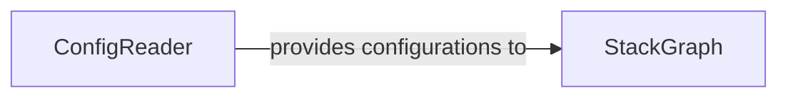

## Details

The Configuration Manager subsystem is central to Sceptre's operation, handling the entire lifecycle of project and stack group configurations. It ensures that raw configuration data is correctly interpreted, validated, and transformed into an actionable internal representation, including the crucial dependency relationships between stacks.

### ConfigReader
Acts as the primary Configuration Ingestion and Parsing Engine. It is responsible for reading raw Sceptre configuration files (YAML/JSON), handling custom YAML constructs, merging configurations, validating project paths, and transforming the raw data into structured, in-memory representations of individual stack configurations. It also orchestrates the overall resolution of all stack configurations within a project.

**Related Classes/Methods**:

- <a href="https://github.com/Sceptre/sceptre/blob/master/sceptre/config/reader.py" target="_blank" rel="noopener noreferrer">`sceptre.config.reader`</a>

### StackGraph
Functions as the Dependency Graph Builder. Its core role is to take the structured stack configurations provided by the ConfigReader and construct a directed graph that explicitly models the depends_on relationships between stacks. This graph is crucial for determining the correct, dependency-aware order for stack operations, aligning with the orchestration pattern of a CLI tool.

**Related Classes/Methods**:

- <a href="https://github.com/Sceptre/sceptre/blob/master/sceptre/config/graph.py" target="_blank" rel="noopener noreferrer">`sceptre.config.graph`</a>

### [FAQ](https://github.com/CodeBoarding/GeneratedOnBoardings/tree/main?tab=readme-ov-file#faq)