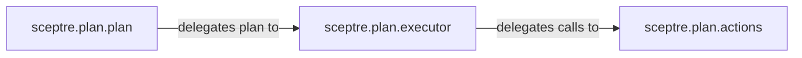

## Details

The Core Orchestration Engine subsystem is bounded by the sceptre.plan package, specifically encompassing the plan, executor, and actions modules. This subsystem is responsible for the entire lifecycle management of AWS CloudFormation stacks, from dependency resolution to the execution of AWS API operations.

### sceptre.plan.plan
This component serves as the strategic brain of the orchestration engine. It is responsible for constructing the overall execution plan for CloudFormation stack operations. This involves analyzing stack dependencies, determining the correct order of operations (e.g., create, update, delete), and preparing the high-level instructions for the executor. It acts as the primary interface for high-level stack commands initiated by the CLI.

**Related Classes/Methods**:

- <a href="https://github.com/Sceptre/sceptre/blob/master/sceptre/plan/plan.py" target="_blank" rel="noopener noreferrer">`sceptre.plan.plan`</a>

### sceptre.plan.executor
This component acts as the tactical manager, receiving the detailed execution plan from `sceptre.plan.plan`. Its primary role is to manage the sequential execution of individual stack operations. It orchestrates the flow, ensuring each step of the plan is processed in the correct order, and delegates the actual low-level CloudFormation API calls to the `sceptre.plan.actions` component.

**Related Classes/Methods**:

- <a href="https://github.com/Sceptre/sceptre/blob/master/sceptre/plan/executor.py" target="_blank" rel="noopener noreferrer">`sceptre.plan.executor`</a>

### sceptre.plan.actions
This component is the operational arm, encapsulating all direct interactions with the AWS CloudFormation API. It provides atomic operations for managing stacks, including creating, updating, deleting, managing change sets, and detecting drift. It handles low-level details such as waiting for operation completion, checking stack statuses, protecting execution, and formatting parameters for AWS API calls.

**Related Classes/Methods**:

- <a href="https://github.com/Sceptre/sceptre/blob/master/sceptre/plan/actions.py" target="_blank" rel="noopener noreferrer">`sceptre.plan.actions`</a>

### [FAQ](https://github.com/CodeBoarding/GeneratedOnBoardings/tree/main?tab=readme-ov-file#faq)