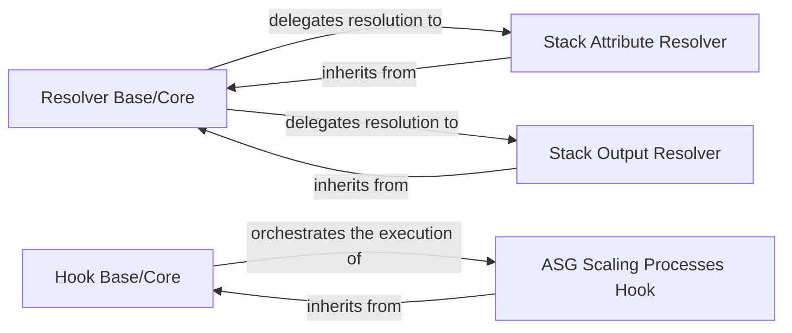

## Details

The Sceptre project's core functionality for dynamic value resolution and lifecycle management is encapsulated within its Resolver and Hook subsystems. The `Resolver Base/Core` component serves as the central abstraction for all value resolution, defining the `Resolver` interface and orchestrating the delegation of resolution tasks to concrete implementations like `Stack Attribute Resolver` and `Stack Output Resolver`. These concrete resolvers inherit from the `Resolver Base/Core`, providing specific logic for retrieving stack attributes and outputs, respectively. Similarly, the `Hook Base/Core` establishes the framework for lifecycle hooks, with concrete hooks such as `ASG Scaling Processes Hook` inheriting from it to execute specific actions at predefined stages of the deployment process. This architecture promotes extensibility and clear separation of concerns, allowing new resolvers and hooks to be added by implementing the defined base interfaces.

### Resolver Base/Core
This is the foundational component for Sceptre's dynamic value resolution. It defines the abstract interface (`Resolver` class) that all concrete resolvers must implement. It is responsible for managing the lifecycle of resolver instances, handling deferred and recursive resolutions, and providing a mechanism for cloning resolvers for different contexts. It acts as the central orchestrator for all resolution activities.

**Related Classes/Methods**:

- <a href="https://github.com/Sceptre/sceptre/blob/master/sceptre/resolvers" target="_blank" rel="noopener noreferrer">`sceptre.resolvers`</a>

### Hook Base/Core
This component provides the core framework for Sceptre's lifecycle hooks. It defines the abstract interface (`Hook` class) that all concrete hooks must adhere to. Its responsibility includes orchestrating the execution of hooks at predefined stages of the stack lifecycle (e.g., before stack creation, after stack update, on failure). It ensures that hooks are invoked with the necessary context and in the correct order.

**Related Classes/Methods**:

- <a href="https://github.com/Sceptre/sceptre/blob/master/sceptre/hooks" target="_blank" rel="noopener noreferrer">`sceptre.hooks`</a>

### Stack Attribute Resolver
A concrete resolver that implements the logic to dynamically retrieve values from attributes of a Sceptre stack (e.g., stack name, region, parameters).

**Related Classes/Methods**:

- <a href="https://github.com/Sceptre/sceptre/blob/master/sceptre/resolvers/stack_attr.py" target="_blank" rel="noopener noreferrer">`sceptre.resolvers.stack_attr`</a>

### Stack Output Resolver
A concrete resolver that implements the logic to fetch and resolve values from the outputs of other CloudFormation stacks, enabling inter-stack data dependencies.

**Related Classes/Methods**:

- <a href="https://github.com/Sceptre/sceptre/blob/master/sceptre/resolvers/stack_output.py" target="_blank" rel="noopener noreferrer">`sceptre.resolvers.stack_output`</a>

### ASG Scaling Processes Hook
A concrete hook implementation designed to manage or modify Auto Scaling Group (ASG) scaling processes (e.g., suspend/resume) during CloudFormation deployments to prevent unintended scaling actions.

**Related Classes/Methods**:

- <a href="https://github.com/Sceptre/sceptre/blob/master/sceptre/hooks/asg_scaling_processes.py" target="_blank" rel="noopener noreferrer">`sceptre.hooks.asg_scaling_processes`</a>

### [FAQ](https://github.com/CodeBoarding/GeneratedOnBoardings/tree/main?tab=readme-ov-file#faq)