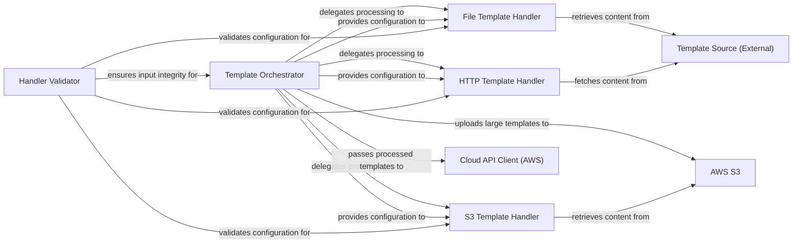

## Details

The `sceptre` template processing subsystem is orchestrated by the `Template Orchestrator`, which acts as the central hub for managing CloudFormation template lifecycle. It delegates the retrieval and initial processing of templates to specialized `Template Handlers` (File, S3, HTTP) based on the template's source. A `Handler Validator` ensures the integrity of handler configurations. Once processed, the `Template Orchestrator` prepares the final template for deployment, interacting with external services like `AWS S3` for large template storage and the `Cloud API Client (AWS)` for actual CloudFormation stack operations. External `Template Sources` provide the raw template content to the respective handlers.

### Template Orchestrator
Serves as the central coordinator for template processing. It determines the appropriate handler based on the template source, orchestrates the retrieval and rendering process, manages the upload of large templates to S3, and prepares the final template body and parameters for deployment.

**Related Classes/Methods**:

- <a href="https://github.com/Sceptre/sceptre/blob/master/sceptre/template.py#L21-L273" target="_blank" rel="noopener noreferrer">`sceptre.template.template`:21-273</a>

### File Template Handler
Specializes in reading, processing, and rendering CloudFormation templates sourced from local file paths. It supports various templating engines for dynamic content generation.

**Related Classes/Methods**:

- <a href="https://github.com/Sceptre/sceptre/blob/master/sceptre/template_handlers/file.py#L1-L9999" target="_blank" rel="noopener noreferrer">`sceptre.template_handlers.file`:1-9999</a>

### S3 Template Handler
Manages the retrieval, processing, and rendering of CloudFormation templates that are stored in Amazon S3 buckets.

**Related Classes/Methods**:

- <a href="https://github.com/Sceptre/sceptre/blob/master/sceptre/template_handlers/s3.py#L1-L9999" target="_blank" rel="noopener noreferrer">`sceptre.template_handlers.s3`:1-9999</a>

### HTTP Template Handler
Handles fetching, processing, and rendering CloudFormation templates from remote HTTP or HTTPS URLs.

**Related Classes/Methods**:

- <a href="https://github.com/Sceptre/sceptre/blob/master/sceptre/template_handlers/http.py#L1-L9999" target="_blank" rel="noopener noreferrer">`sceptre.template_handlers.http`:1-9999</a>

### Handler Validator
Ensures the structural and content validity of configuration data provided for template handlers, enforcing adherence to predefined schemas. This is crucial for maintaining the integrity of template processing inputs.

**Related Classes/Methods**:

- <a href="https://github.com/Sceptre/sceptre/blob/master/sceptre/template_handlers/__init__.py#L1-L9999" target="_blank" rel="noopener noreferrer">`sceptre.template_handlers.__init__`:1-9999</a>

### AWS S3
An external Amazon Web Services (AWS) component that serves as a storage backend for CloudFormation templates. It is used by the S3 Template Handler for retrieval and by the Template Orchestrator for uploading large templates.

**Related Classes/Methods**: _None_

### Cloud API Client (AWS)
An external client responsible for interacting with the AWS CloudFormation API. It receives the fully processed and prepared template body and parameters from the Template Orchestrator for actual CloudFormation stack deployments.

**Related Classes/Methods**: _None_

### Template Source (External)
Represents the various external data sources from which raw template content is retrieved. This includes the local filesystem for file-based templates and remote HTTP/HTTPS endpoints for URL-based templates.

**Related Classes/Methods**: _None_

### [FAQ](https://github.com/CodeBoarding/GeneratedOnBoardings/tree/main?tab=readme-ov-file#faq)