```mermaid
graph LR
    CLI_Interface["CLI Interface"]
    Configuration_Manager["Configuration Manager"]
    Template_Processor["Template Processor"]
    Core_Orchestration_Engine["Core Orchestration Engine"]
    Resolver_Hook_System["Resolver & Hook System"]
    AWS_CloudFormation_Client["AWS CloudFormation Client"]
    Diffing_Reporting_Module["Diffing & Reporting Module"]
    CLI_Interface -- "initiates operations and passes control to" --> Core_Orchestration_Engine
    CLI_Interface -- "triggers project setup via" --> Configuration_Manager
    Configuration_Manager -- "provides parsed configuration and dependency graphs to" --> Core_Orchestration_Engine
    Configuration_Manager -- "integrates with" --> Resolver_Hook_System
    Core_Orchestration_Engine -- "executes AWS operations via" --> AWS_CloudFormation_Client
    Core_Orchestration_Engine -- "requests template processing from" --> Template_Processor
    Core_Orchestration_Engine -- "triggers" --> Resolver_Hook_System
    Core_Orchestration_Engine -- "requests diffs and receives status updates from" --> Diffing_Reporting_Module
    Template_Processor -- "uploads templates to S3 using" --> AWS_CloudFormation_Client
    Resolver_Hook_System -- "may make AWS calls via" --> AWS_CloudFormation_Client
    AWS_CloudFormation_Client -- "returns AWS responses and status to" --> Core_Orchestration_Engine
    Diffing_Reporting_Module -- "provides formatted output back to" --> CLI_Interface
    click CLI_Interface href "https://github.com/CodeBoarding/GeneratedOnBoardings/blob/main/sceptre/CLI_Interface.md" "Details"
    click Configuration_Manager href "https://github.com/CodeBoarding/GeneratedOnBoardings/blob/main/sceptre/Configuration_Manager.md" "Details"
    click Template_Processor href "https://github.com/CodeBoarding/GeneratedOnBoardings/blob/main/sceptre/Template_Processor.md" "Details"
    click Core_Orchestration_Engine href "https://github.com/CodeBoarding/GeneratedOnBoardings/blob/main/sceptre/Core_Orchestration_Engine.md" "Details"
    click Resolver_Hook_System href "https://github.com/CodeBoarding/GeneratedOnBoardings/blob/main/sceptre/Resolver_Hook_System.md" "Details"
    click AWS_CloudFormation_Client href "https://github.com/CodeBoarding/GeneratedOnBoardings/blob/main/sceptre/AWS_CloudFormation_Client.md" "Details"
    click Diffing_Reporting_Module href "https://github.com/CodeBoarding/GeneratedOnBoardings/blob/main/sceptre/Diffing_Reporting_Module.md" "Details"
```

## Details

The Sceptre architecture is a well-structured CLI tool designed for robust AWS CloudFormation orchestration. It follows a clear pipeline: user commands are received by the CLI Interface, which delegates initial setup to the Configuration Manager for parsing project configurations and dependencies. The central Core Orchestration Engine then takes charge, coordinating the deployment lifecycle. This engine interacts with the Template Processor to prepare CloudFormation templates and leverages the Resolver & Hook System for dynamic value resolution and custom script execution. All direct communication with AWS CloudFormation is handled by the AWS CloudFormation Client. Finally, the Diffing & Reporting Module provides crucial feedback on stack differences and deployment status, which is then presented back to the user via the CLI Interface. This design emphasizes modularity, extensibility, and a clear separation of concerns, making it ideal for automating complex IaC deployments.

### CLI Interface [[Expand]](./CLI_Interface.md)
The primary user interaction point, responsible for parsing command-line arguments, validating input, and initiating high-level Sceptre operations. It acts as the facade for the entire system.

**Related Classes/Methods**:

- <a href="https://github.com/Sceptre/sceptre/blob/master/sceptre/cli/launch.py" target="_blank" rel="noopener noreferrer">`sceptre.cli.launch`</a>
- <a href="https://github.com/Sceptre/sceptre/blob/master/sceptre/cli/prune.py" target="_blank" rel="noopener noreferrer">`sceptre.cli.prune`</a>
- <a href="https://github.com/Sceptre/sceptre/blob/master/sceptre/cli/diff.py" target="_blank" rel="noopener noreferrer">`sceptre.cli.diff`</a>
- <a href="https://github.com/Sceptre/sceptre/blob/master/sceptre/cli/new.py" target="_blank" rel="noopener noreferrer">`sceptre.cli.new`</a>
- <a href="https://github.com/Sceptre/sceptre/blob/master/sceptre/cli/helpers.py" target="_blank" rel="noopener noreferrer">`sceptre.cli.helpers`</a>

### Configuration Manager [[Expand]](./Configuration_Manager.md)
Manages the lifecycle of Sceptre project and stack group configurations. This includes reading, parsing, validating, and resolving dependencies within the configuration files (YAML/JSON). It constructs the internal representation of stacks and their relationships.

**Related Classes/Methods**:

- <a href="https://github.com/Sceptre/sceptre/blob/master/sceptre/config/reader.py" target="_blank" rel="noopener noreferrer">`sceptre.config.reader`</a>
- <a href="https://github.com/Sceptre/sceptre/blob/master/sceptre/config/graph.py" target="_blank" rel="noopener noreferrer">`sceptre.config.graph`</a>

### Template Processor [[Expand]](./Template_Processor.md)
Handles the processing, rendering, and preparation of CloudFormation templates. It supports various template sources (local files, S3, HTTP) and manages the upload of large templates to S3 for CloudFormation deployment.

**Related Classes/Methods**:

- <a href="https://github.com/Sceptre/sceptre/blob/master/sceptre/template.py#L21-L273" target="_blank" rel="noopener noreferrer">`sceptre.template.template`:21-273</a>
- <a href="https://github.com/Sceptre/sceptre/blob/master/sceptre/template_handlers/file.py" target="_blank" rel="noopener noreferrer">`sceptre.template_handlers.file`</a>
- <a href="https://github.com/Sceptre/sceptre/blob/master/sceptre/template_handlers/s3.py" target="_blank" rel="noopener noreferrer">`sceptre.template_handlers.s3`</a>
- <a href="https://github.com/Sceptre/sceptre/blob/master/sceptre/template_handlers/http.py" target="_blank" rel="noopener noreferrer">`sceptre.template_handlers.http`</a>

### Core Orchestration Engine [[Expand]](./Core_Orchestration_Engine.md)
The central control unit that orchestrates the entire CloudFormation stack lifecycle. It takes the processed configuration and templates, resolves dependencies, and executes the necessary AWS CloudFormation operations (create, update, delete, diff, drift detection) in the correct order.

**Related Classes/Methods**:

- <a href="https://github.com/Sceptre/sceptre/blob/master/sceptre/plan/plan.py" target="_blank" rel="noopener noreferrer">`sceptre.plan.plan`</a>
- <a href="https://github.com/Sceptre/sceptre/blob/master/sceptre/plan/executor.py" target="_blank" rel="noopener noreferrer">`sceptre.plan.executor`</a>
- <a href="https://github.com/Sceptre/sceptre/blob/master/sceptre/plan/actions.py" target="_blank" rel="noopener noreferrer">`sceptre.plan.actions`</a>

### Resolver & Hook System [[Expand]](./Resolver_Hook_System.md)
Provides the extensibility framework for Sceptre. Resolvers dynamically fetch or compute configuration values at runtime, while Hooks execute custom scripts or commands at predefined stages of the stack lifecycle (e.g., before/after create/update).

**Related Classes/Methods**:

- <a href="https://github.com/Sceptre/sceptre/blob/master/sceptre/resolvers/__init__.py" target="_blank" rel="noopener noreferrer">`sceptre.resolvers.__init__`</a>
- <a href="https://github.com/Sceptre/sceptre/blob/master/sceptre/resolvers/stack_attr.py" target="_blank" rel="noopener noreferrer">`sceptre.resolvers.stack_attr`</a>
- <a href="https://github.com/Sceptre/sceptre/blob/master/sceptre/resolvers/stack_output.py" target="_blank" rel="noopener noreferrer">`sceptre.resolvers.stack_output`</a>
- <a href="https://github.com/Sceptre/sceptre/blob/master/sceptre/hooks/__init__.py" target="_blank" rel="noopener noreferrer">`sceptre.hooks.__init__`</a>

### AWS CloudFormation Client [[Expand]](./AWS_CloudFormation_Client.md)
Manages secure connections to AWS services and provides an abstraction layer for interacting with the AWS CloudFormation API. It handles authentication, session management, and direct API calls.

**Related Classes/Methods**:

- <a href="https://github.com/Sceptre/sceptre/blob/master/sceptre/connection_manager.py" target="_blank" rel="noopener noreferrer">`sceptre.connection_manager`</a>

### Diffing & Reporting Module [[Expand]](./Diffing_Reporting_Module.md)
Responsible for comparing the local stack configuration and template with the deployed state in AWS CloudFormation. It generates human-readable differences and formats various outputs and reports for the user.

**Related Classes/Methods**:

- <a href="https://github.com/Sceptre/sceptre/blob/master/sceptre/diffing/stack_differ.py" target="_blank" rel="noopener noreferrer">`sceptre.diffing.stack_differ`</a>
- <a href="https://github.com/Sceptre/sceptre/blob/master/sceptre/diffing/diff_writer.py" target="_blank" rel="noopener noreferrer">`sceptre.diffing.diff_writer`</a>

### [FAQ](https://github.com/CodeBoarding/GeneratedOnBoardings/tree/main?tab=readme-ov-file#faq)