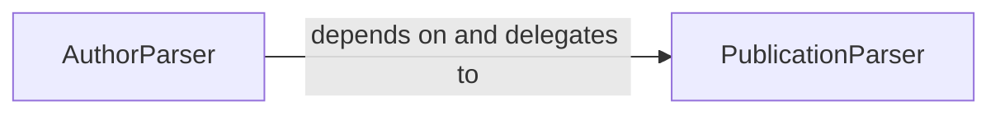

## Details

The `Data Parsers` subsystem is responsible for transforming raw HTML content, specifically from Google Scholar, into structured Python objects for authors and publications.

### AuthorParser
This component orchestrates the parsing of an author's complete profile from raw HTML data. It extracts core author information, their associated publications, and co-authors. Its primary public interface is `get_author`.

**Related Classes/Methods**:

- <a href="https://github.com/scholarly-python-package/scholarly/blob/main/scholarly/author_parser.py" target="_blank" rel="noopener noreferrer">`scholarly.author_parser:get_author`</a>
- <a href="https://github.com/scholarly-python-package/scholarly/blob/main/scholarly/author_parser.py" target="_blank" rel="noopener noreferrer">`scholarly.author_parser:_fill_publications`</a>
- <a href="https://github.com/scholarly-python-package/scholarly/blob/main/scholarly/author_parser.py" target="_blank" rel="noopener noreferrer">`scholarly.author_parser:_fill_coauthors`</a>

### PublicationParser
This component specializes in parsing individual publication details. It enriches existing publication objects with additional metadata (e.g., BibTeX, public access mandates), retrieves citing articles, and can generate BibTeX formatted strings. Its primary public interface is `get_publication`.

**Related Classes/Methods**:

- <a href="https://github.com/scholarly-python-package/scholarly/blob/main/scholarly/publication_parser.py" target="_blank" rel="noopener noreferrer">`scholarly.publication_parser:__init__`</a>
- <a href="https://github.com/scholarly-python-package/scholarly/blob/main/scholarly/publication_parser.py" target="_blank" rel="noopener noreferrer">`scholarly.publication_parser:get_publication`</a>
- <a href="https://github.com/scholarly-python-package/scholarly/blob/main/scholarly/publication_parser.py" target="_blank" rel="noopener noreferrer">`scholarly.publication_parser:citedby`</a>
- <a href="https://github.com/scholarly-python-package/scholarly/blob/main/scholarly/publication_parser.py" target="_blank" rel="noopener noreferrer">`scholarly.publication_parser:fill`</a>
- <a href="https://github.com/scholarly-python-package/scholarly/blob/main/scholarly/publication_parser.py" target="_blank" rel="noopener noreferrer">`scholarly.publication_parser:bibtex`</a>

### [FAQ](https://github.com/CodeBoarding/GeneratedOnBoardings/tree/main?tab=readme-ov-file#faq)