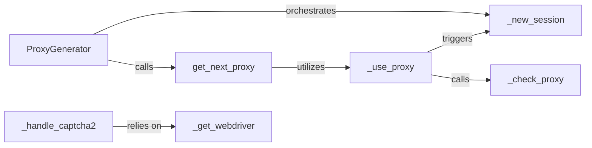

## Details

The Proxy Manager subsystem is primarily encapsulated within the scholarly._proxy_generator module, specifically the scholarly/_proxy_generator.py file. This module contains the core logic for proxy rotation, session management, and anti-bot circumvention.

### ProxyGenerator
The primary orchestrator for the proxy system. It initializes the proxy pool, manages the lifecycle of proxy sessions, and coordinates the use of various helper functions to ensure robust data retrieval while circumventing anti-bot measures. It acts as the main interface for the proxy management functionality.

**Related Classes/Methods**:

- <a href="https://github.com/scholarly-python-package/scholarly/blob/main/scholarly/_proxy_generator.py#L44-L681" target="_blank" rel="noopener noreferrer">`ProxyGenerator`:44-681</a>

### _new_session
Manages the lifecycle of proxy sessions. This includes creating new sessions, refreshing existing ones, and ensuring a clean state for new proxy interactions to avoid detection. It's critical for maintaining session integrity and avoiding IP bans.

**Related Classes/Methods**:

- <a href="https://github.com/scholarly-python-package/scholarly/blob/main/scholarly/_navigator.py#L77-L82" target="_blank" rel="noopener noreferrer">`_new_session`:77-82</a>

### _handle_captcha2
Specifically designed to detect and resolve CAPTCHA challenges, particularly reCAPTCHA v2. It often involves interacting with a web browser (via a webdriver) to solve the CAPTCHA, making it a key component for bypassing anti-bot measures.

**Related Classes/Methods**:

- <a href="https://github.com/scholarly-python-package/scholarly/blob/main/scholarly/_proxy_generator.py#L403-L451" target="_blank" rel="noopener noreferrer">`_handle_captcha2`:403-451</a>

### get_next_proxy
Determines and retrieves the next available proxy from the configured proxy pool. It prepares the selected proxy for use in a scraping operation, ensuring rotation and availability. This component is vital for effective proxy rotation.

**Related Classes/Methods**:

- <a href="https://github.com/scholarly-python-package/scholarly/blob/main/scholarly/_proxy_generator.py#L646-L666" target="_blank" rel="noopener noreferrer">`get_next_proxy`:646-666</a>

### _use_proxy
Applies the selected proxy settings to the current web session. This method is a core utility that configures the session to route requests through the chosen proxy, acting as a crucial step for all proxy types.

**Related Classes/Methods**:

- <a href="https://github.com/scholarly-python-package/scholarly/blob/main/scholarly/_proxy_generator.py#L181-L216" target="_blank" rel="noopener noreferrer">`_use_proxy`:181-216</a>

### _check_proxy
Verifies the operational status and validity of a given proxy. This ensures that only functional proxies are used, improving the reliability of data retrieval and preventing failed requests due to bad proxies.

**Related Classes/Methods**:

- <a href="https://github.com/scholarly-python-package/scholarly/blob/main/scholarly/_proxy_generator.py#L131-L159" target="_blank" rel="noopener noreferrer">`_check_proxy`:131-159</a>

### _get_webdriver
Provides instances of web drivers (e.g., Firefox, Chrome) necessary for browser automation. This is particularly critical for tasks like CAPTCHA resolution where direct browser interaction is required, supporting the `_handle_captcha2` component.

**Related Classes/Methods**:

- <a href="https://github.com/scholarly-python-package/scholarly/blob/main/scholarly/_proxy_generator.py#L347-L363" target="_blank" rel="noopener noreferrer">`_get_webdriver`:347-363</a>

### [FAQ](https://github.com/CodeBoarding/GeneratedOnBoardings/tree/main?tab=readme-ov-file#faq)