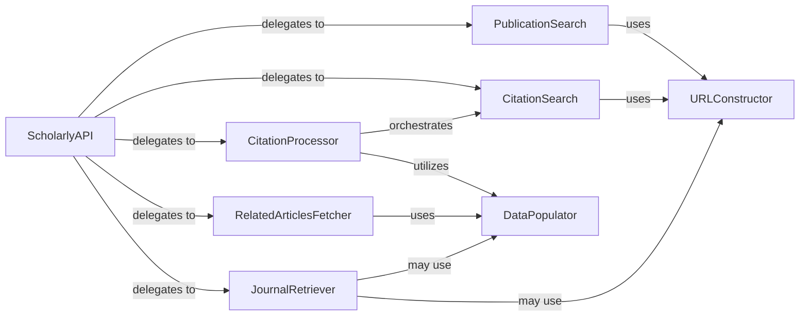

## Details

One paragraph explaining the functionality which is represented by this graph. What the main flow is and what is its purpose.

### ScholarlyAPI
The aggregate public interface of the `scholarly` library. It provides a high-level, user-friendly entry point for various scholarly data retrieval tasks, abstracting the underlying complexities.

**Related Classes/Methods**:

- <a href="https://github.com/scholarly-python-package/scholarly/blob/main/scholarly/_scholarly.py" target="_blank" rel="noopener noreferrer">`scholarly._scholarly:search_pubs`</a>
- <a href="https://github.com/scholarly-python-package/scholarly/blob/main/scholarly/_scholarly.py" target="_blank" rel="noopener noreferrer">`scholarly._scholarly:search_citedby`</a>
- <a href="https://github.com/scholarly-python-package/scholarly/blob/main/scholarly/_scholarly.py" target="_blank" rel="noopener noreferrer">`scholarly._scholarly:citedby`</a>
- <a href="https://github.com/scholarly-python-package/scholarly/blob/main/scholarly/_scholarly.py" target="_blank" rel="noopener noreferrer">`scholarly._scholarly:get_related_articles`</a>
- <a href="https://github.com/scholarly-python-package/scholarly/blob/main/scholarly/_scholarly.py" target="_blank" rel="noopener noreferrer">`scholarly._scholarly:get_journals`</a>

### PublicationSearch
Handles the logic for searching and retrieving scholarly publications based on user queries. It initiates the process of finding articles by title, author, or keywords.

**Related Classes/Methods**:

- <a href="https://github.com/scholarly-python-package/scholarly/blob/main/scholarly/_scholarly.py" target="_blank" rel="noopener noreferrer">`scholarly._scholarly:search_pubs`</a>

### CitationSearch
Manages the initiation of searches for articles that cite a specific publication. This component is responsible for setting up the query to find citing works.

**Related Classes/Methods**:

- <a href="https://github.com/scholarly-python-package/scholarly/blob/main/scholarly/_scholarly.py" target="_blank" rel="noopener noreferrer">`scholarly._scholarly:search_citedby`</a>

### CitationProcessor
Orchestrates the retrieval, processing, and organization of articles that cite a given publication. It includes advanced features like binning citations by year and handling detailed citation information.

**Related Classes/Methods**:

- <a href="https://github.com/scholarly-python-package/scholarly/blob/main/scholarly/_scholarly.py" target="_blank" rel="noopener noreferrer">`scholarly._scholarly:citedby`</a>
- <a href="https://github.com/scholarly-python-package/scholarly/blob/main/scholarly/_scholarly.py" target="_blank" rel="noopener noreferrer">`scholarly._scholarly:_bin_citations_by_year`</a>

### RelatedArticlesFetcher
Fetches and prepares data for articles that are related to a specified publication, identifying and retrieving similar scholarly works.

**Related Classes/Methods**:

- <a href="https://github.com/scholarly-python-package/scholarly/blob/main/scholarly/_scholarly.py" target="_blank" rel="noopener noreferrer">`scholarly._scholarly:get_related_articles`</a>

### JournalRetriever
Retrieves and provides access to lists of academic journals, potentially including categorization or other metadata.

**Related Classes/Methods**:

- <a href="https://github.com/scholarly-python-package/scholarly/blob/main/scholarly/_scholarly.py" target="_blank" rel="noopener noreferrer">`scholarly._scholarly:get_journals`</a>

### URLConstructor
A utility component responsible for dynamically constructing well-formed URLs required for various search and retrieval operations across Google Scholar.

**Related Classes/Methods**:

- <a href="https://github.com/scholarly-python-package/scholarly/blob/main/scholarly/_scholarly.py" target="_blank" rel="noopener noreferrer">`scholarly._scholarly:_construct_url`</a>

### DataPopulator
A utility component that takes raw, scraped data and transforms it into structured Python objects or formats, making it usable by the application and end-users.

**Related Classes/Methods**:

- <a href="https://github.com/scholarly-python-package/scholarly/blob/main/scholarly/author_parser.py#L15-L468" target="_blank" rel="noopener noreferrer">`scholarly.author_parser.AuthorParser`:15-468</a>
- <a href="https://github.com/scholarly-python-package/scholarly/blob/main/scholarly/publication_parser.py#L105-L447" target="_blank" rel="noopener noreferrer">`scholarly.publication_parser.PublicationParser`:105-447</a>

### [FAQ](https://github.com/CodeBoarding/GeneratedOnBoardings/tree/main?tab=readme-ov-file#faq)