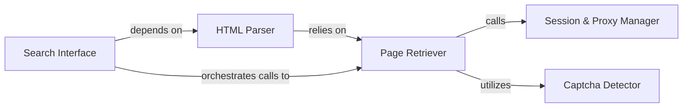

## Details

The Web Navigator subsystem is primarily encapsulated within the scholarly._navigator.py module. It handles all low-level HTTP requests, manages web sessions, integrates proxy and CAPTCHA handling, and retrieves raw HTML content from Google Scholar, subsequently preparing it for parsing.

### Session & Proxy Manager
Initializes and manages the web session, including configuring and refreshing proxy settings. It ensures robust and anonymous web requests by handling session creation and proxy integration.

**Related Classes/Methods**:

- <a href="https://github.com/scholarly-python-package/scholarly/blob/main/scholarly/_navigator.py" target="_blank" rel="noopener noreferrer">`scholarly/_navigator.py:__init__`</a>
- <a href="https://github.com/scholarly-python-package/scholarly/blob/main/scholarly/_navigator.py" target="_blank" rel="noopener noreferrer">`scholarly/_navigator.py:use_proxy`</a>
- <a href="https://github.com/scholarly-python-package/scholarly/blob/main/scholarly/_navigator.py" target="_blank" rel="noopener noreferrer">`scholarly/_navigator.py:_new_session`</a>

### Page Retriever
Executes HTTP requests to Google Scholar, handles timeouts, retries, and integrates with CAPTCHA detection and resolution mechanisms. It is responsible for fetching the raw web page content.

**Related Classes/Methods**:

- <a href="https://github.com/scholarly-python-package/scholarly/blob/main/scholarly/_navigator.py" target="_blank" rel="noopener noreferrer">`scholarly/_navigator.py:_get_page`</a>

### Captcha Detector
Identifies the presence of CAPTCHA challenges in web responses, crucial for navigating anti-bot measures. It provides a mechanism to detect when human intervention or a proxy refresh is needed.

**Related Classes/Methods**:

- <a href="https://github.com/scholarly-python-package/scholarly/blob/main/scholarly/_navigator.py" target="_blank" rel="noopener noreferrer">`scholarly/_navigator.py:_has_captcha`</a>
- <a href="https://github.com/scholarly-python-package/scholarly/blob/main/scholarly/_navigator.py" target="_blank" rel="noopener noreferrer">`scholarly/_navigator.py:_requests_has_captcha`</a>
- <a href="https://github.com/scholarly-python-package/scholarly/blob/main/scholarly/_navigator.py" target="_blank" rel="noopener noreferrer">`scholarly/_navigator.py:_webdriver_has_captcha`</a>

### HTML Parser
Transforms raw HTML content into a structured, navigable format (BeautifulSoup object), preparing it for subsequent data extraction. It acts as an initial processing layer for the retrieved web content.

**Related Classes/Methods**:

- <a href="https://github.com/scholarly-python-package/scholarly/blob/main/scholarly/_navigator.py" target="_blank" rel="noopener noreferrer">`scholarly/_navigator.py:_get_soup`</a>

### Search Interface
Provides high-level entry points for specific search operations (authors, publications, organizations) on Google Scholar, abstracting the underlying web navigation complexities. It serves as the primary interaction point for initiating searches within the subsystem.

**Related Classes/Methods**:

- <a href="https://github.com/scholarly-python-package/scholarly/blob/main/scholarly/_navigator.py" target="_blank" rel="noopener noreferrer">`scholarly/_navigator.py:search_authors`</a>
- <a href="https://github.com/scholarly-python-package/scholarly/blob/main/scholarly/_navigator.py" target="_blank" rel="noopener noreferrer">`scholarly/_navigator.py:search_publication`</a>
- <a href="https://github.com/scholarly-python-package/scholarly/blob/main/scholarly/_navigator.py" target="_blank" rel="noopener noreferrer">`scholarly/_navigator.py:search_organization`</a>

### [FAQ](https://github.com/CodeBoarding/GeneratedOnBoardings/tree/main?tab=readme-ov-file#faq)