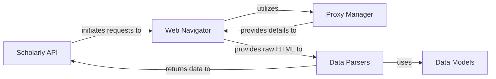

## Details

The `scholarly` library is architected as a robust web scraping solution for Google Scholar, emphasizing a clear separation of concerns to manage the complexities of data retrieval and parsing, especially in the face of anti-bot measures.

### Scholarly API [[Expand]](./Scholarly_API.md)
The public interface for users to interact with the library, abstracting the underlying scraping and parsing complexities.

**Related Classes/Methods**:

- <a href="https://github.com/scholarly-python-package/scholarly/blob/main/scholarly/_scholarly.py#L91-L160" target="_blank" rel="noopener noreferrer">`scholarly._scholarly.search_pubs`:91-160</a>
- <a href="https://github.com/scholarly-python-package/scholarly/blob/main/scholarly/_scholarly.py#L162-L171" target="_blank" rel="noopener noreferrer">`scholarly._scholarly.search_citedby`:162-171</a>
- <a href="https://github.com/scholarly-python-package/scholarly/blob/main/scholarly/_scholarly.py#L274-L308" target="_blank" rel="noopener noreferrer">`scholarly._scholarly.citedby`:274-308</a>
- <a href="https://github.com/scholarly-python-package/scholarly/blob/main/scholarly/_scholarly.py#L445-L461" target="_blank" rel="noopener noreferrer">`scholarly._scholarly.get_related_articles`:445-461</a>
- <a href="https://github.com/scholarly-python-package/scholarly/blob/main/scholarly/_scholarly.py#L627-L664" target="_blank" rel="noopener noreferrer">`scholarly._scholarly.get_journals`:627-664</a>

### Web Navigator [[Expand]](./Web_Navigator.md)
Handles low-level HTTP requests, manages web sessions, and retrieves raw HTML content from Google Scholar.

**Related Classes/Methods**:

- <a href="https://github.com/scholarly-python-package/scholarly/blob/main/scholarly/_navigator.py#L85-L190" target="_blank" rel="noopener noreferrer">`scholarly._navigator._get_page`:85-190</a>
- <a href="https://github.com/scholarly-python-package/scholarly/blob/main/scholarly/_navigator.py#L237-L246" target="_blank" rel="noopener noreferrer">`scholarly._navigator._get_soup`:237-246</a>
- <a href="https://github.com/scholarly-python-package/scholarly/blob/main/scholarly/_navigator.py#L248-L268" target="_blank" rel="noopener noreferrer">`scholarly._navigator.search_authors`:248-268</a>
- <a href="https://github.com/scholarly-python-package/scholarly/blob/main/scholarly/_navigator.py#L270-L286" target="_blank" rel="noopener noreferrer">`scholarly._navigator.search_publication`:270-286</a>
- <a href="https://github.com/scholarly-python-package/scholarly/blob/main/scholarly/_navigator.py#L319-L342" target="_blank" rel="noopener noreferrer">`scholarly._navigator.search_organization`:319-342</a>

### Proxy Manager [[Expand]](./Proxy_Manager.md)
Manages proxy rotation and circumvents anti-bot measures like CAPTCHAs and IP blocking, ensuring robust data retrieval.

**Related Classes/Methods**:

- <a href="https://github.com/scholarly-python-package/scholarly/blob/main/scholarly/_proxy_generator.py" target="_blank" rel="noopener noreferrer">`scholarly._proxy_generator._proxy_generator.__init__`</a>
- <a href="https://github.com/scholarly-python-package/scholarly/blob/main/scholarly/_proxy_generator.py" target="_blank" rel="noopener noreferrer">`scholarly._proxy_generator.use_proxy`</a>
- <a href="https://github.com/scholarly-python-package/scholarly/blob/main/scholarly/_proxy_generator.py#L453-L489" target="_blank" rel="noopener noreferrer">`scholarly._proxy_generator._new_session`:453-489</a>
- <a href="https://github.com/scholarly-python-package/scholarly/blob/main/scholarly/_proxy_generator.py#L403-L451" target="_blank" rel="noopener noreferrer">`scholarly._proxy_generator._handle_captcha2`:403-451</a>
- <a href="https://github.com/scholarly-python-package/scholarly/blob/main/scholarly/_proxy_generator.py#L646-L666" target="_blank" rel="noopener noreferrer">`scholarly._proxy_generator.get_next_proxy`:646-666</a>

### Data Parsers [[Expand]](./Data_Parsers.md)
Transforms raw HTML content into structured Python objects, specializing in extracting information for authors and publications.

**Related Classes/Methods**:

- <a href="https://github.com/scholarly-python-package/scholarly/blob/main/scholarly/author_parser.py#L27-L67" target="_blank" rel="noopener noreferrer">`scholarly.author_parser.get_author`:27-67</a>
- <a href="https://github.com/scholarly-python-package/scholarly/blob/main/scholarly/author_parser.py#L176-L197" target="_blank" rel="noopener noreferrer">`scholarly.author_parser._fill_publications`:176-197</a>
- <a href="https://github.com/scholarly-python-package/scholarly/blob/main/scholarly/author_parser.py#L244-L264" target="_blank" rel="noopener noreferrer">`scholarly.author_parser._fill_coauthors`:244-264</a>
- <a href="https://github.com/scholarly-python-package/scholarly/blob/main/scholarly/publication_parser.py#L108-L109" target="_blank" rel="noopener noreferrer">`scholarly.publication_parser.__init__`:108-109</a>
- <a href="https://github.com/scholarly-python-package/scholarly/blob/main/scholarly/publication_parser.py#L139-L156" target="_blank" rel="noopener noreferrer">`scholarly.publication_parser.get_publication`:139-156</a>
- <a href="https://github.com/scholarly-python-package/scholarly/blob/main/scholarly/publication_parser.py#L377-L389" target="_blank" rel="noopener noreferrer">`scholarly.publication_parser.citedby`:377-389</a>
- <a href="https://github.com/scholarly-python-package/scholarly/blob/main/scholarly/publication_parser.py#L270-L374" target="_blank" rel="noopener noreferrer">`scholarly.publication_parser.fill`:270-374</a>
- <a href="https://github.com/scholarly-python-package/scholarly/blob/main/scholarly/publication_parser.py#L391-L408" target="_blank" rel="noopener noreferrer">`scholarly.publication_parser.bibtex`:391-408</a>

### Data Models
Defines the fundamental data structures (e.g., `Author`, `Publication`) used to represent retrieved academic information consistently.

**Related Classes/Methods**:

- <a href="https://github.com/scholarly-python-package/scholarly/blob/main/scholarly/data_types.py#L227-L276" target="_blank" rel="noopener noreferrer">`scholarly.data_types.Author`:227-276</a>
- <a href="https://github.com/scholarly-python-package/scholarly/blob/main/scholarly/data_types.py#L161-L225" target="_blank" rel="noopener noreferrer">`scholarly.data_types.Publication`:161-225</a>

### [FAQ](https://github.com/CodeBoarding/GeneratedOnBoardings/tree/main?tab=readme-ov-file#faq)