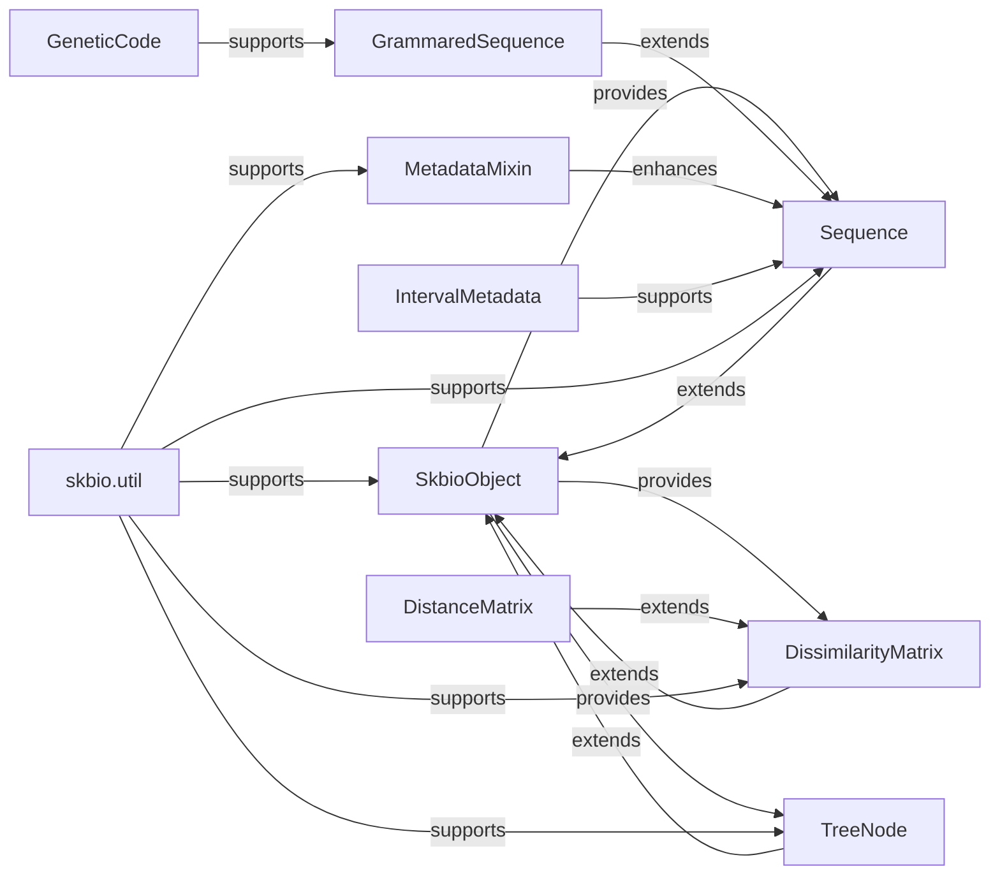

## Details

The `Core Data Structures & Utilities` component in `scikit-bio` serves as the foundational layer, providing the essential building blocks for representing biological data and offering common utilities that ensure consistency and reusability across the library. This component is critical for maintaining a cohesive and robust architecture, as it defines the fundamental types and behaviors upon which more complex bioinformatics functionalities are built.

### SkbioObject
The most fundamental base class in `scikit-bio`. It provides a common interface and basic functionalities (like equality testing and hashing) for many `scikit-bio` objects, ensuring consistency across diverse data types.

**Related Classes/Methods**:

- `SkbioObject` (1:1)

### Sequence
The abstract base class for all biological sequences (e.g., DNA, RNA, Protein). It defines core sequence-agnostic operations such as slicing, concatenation, and basic metadata handling.

**Related Classes/Methods**:

- `Sequence` (1:1)

### GrammaredSequence
Extends `Sequence` by incorporating a defined grammar (alphabet, degenerate characters, gap characters). This class is crucial for handling sequences with specific biological alphabets and rules, like DNA or Protein sequences.

**Related Classes/Methods**:

- `GrammaredSequence` (1:1)

### MetadataMixin
A mixin class that provides generic metadata handling capabilities. Objects inheriting from this mixin can store and manage arbitrary key-value pair metadata, allowing for rich annotation of biological data.

**Related Classes/Methods**:

- `MetadataMixin` (1:1)

### IntervalMetadata
A specialized data structure for managing metadata associated with specific intervals (e.g., genomic regions) on a sequence or other linear data. It allows for precise annotation of sub-regions.

**Related Classes/Methods**:

- `IntervalMetadata` (1:1)

### DissimilarityMatrix
The base class for representing pairwise dissimilarities (distances) between samples. It provides methods for accessing, manipulating, and validating dissimilarity data, which is central to many ecological and phylogenetic analyses.

**Related Classes/Methods**:

- `DissimilarityMatrix` (1:1)

### DistanceMatrix
A subclass of `DissimilarityMatrix` specifically designed for symmetric distance data, where the distance from A to B is the same as B to A. It adds specific validation for symmetry.

**Related Classes/Methods**:

- `DistanceMatrix` (1:1)

### TreeNode
The core data structure representing a node within a phylogenetic tree. It supports tree construction, traversal, and manipulation, forming the basis for all phylogenetic analyses.

**Related Classes/Methods**:

- `TreeNode` (1:1)

### GeneticCode
Represents a genetic code, mapping codons to amino acids. This utility is essential for translating nucleotide sequences into protein sequences.

**Related Classes/Methods**:

- `GeneticCode` (1:1)

### skbio.util
A module containing a collection of general-purpose helper functions, decorators, and testing utilities used across the library. This includes functions for validation, common data manipulations, and internal helpers.

**Related Classes/Methods**:

- `skbio.util` (1:1)

### [FAQ](https://github.com/CodeBoarding/GeneratedOnBoardings/tree/main?tab=readme-ov-file#faq)