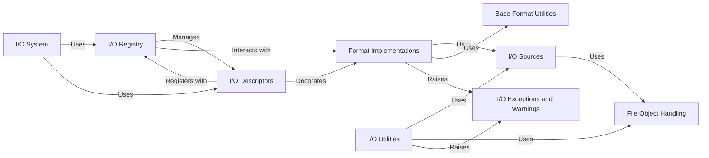

## Details

The `Input/Output (I/O) System` in `scikit-bio` provides a robust, flexible, and extensible framework for handling diverse biological data formats. Its primary purpose is to abstract away the complexities of file handling, allowing users and other library components to seamlessly read from and write to various standard and custom file formats (e.g., FASTA, FASTQ, Newick, BIOM). This system acts as a central gateway for data ingress and egress, ensuring consistency, error handling, and ease of use across the library.

The system is designed with a modular architecture, separating concerns such as format registration, data source abstraction, format-specific parsing/serialization, and utility functions. This design promotes extensibility, allowing new file formats to be easily integrated without modifying core components.

### I/O System [[Expand]](./I_O_System.md)
This is the top-level entry point for all I/O operations within `scikit-bio`. It provides the public API for reading and writing biological data, orchestrating the interactions between the registry, descriptors, and format-specific implementations.

**Related Classes/Methods**:

- `skbio.io` (1:1)

### I/O Registry
The central hub of the I/O system, responsible for registering and managing all supported file formats, their associated data types, and the corresponding reader, writer, and sniffer functions. It enables dynamic discovery and selection of appropriate I/O handlers.

**Related Classes/Methods**:

- <a href="https://github.com/biocore/scikit-bio/blob/main/skbio/io/registry.py#L1-L1" target="_blank" rel="noopener noreferrer">`skbio.io.registry` (1:1)</a>

### I/O Descriptors
This module provides decorators (`@read`, `@write`) that are used to register I/O functions (readers, writers, sniffers) with the `IORegistry`. They offer a declarative and Pythonic way to link data types (e.g., `skbio.sequence.Sequence`, `skbio.tree.TreeNode`) with specific file formats and their I/O operations.

**Related Classes/Methods**:

- <a href="https://github.com/biocore/scikit-bio/blob/main/skbio/io/descriptors.py#L1-L1" target="_blank" rel="noopener noreferrer">`skbio.io.descriptors` (1:1)</a>

### I/O Sources
Defines abstract `IOSource` classes (e.g., `FilePathSource`, `HTTPSource`, `BytesIOSource`) that represent various data origins. It also includes `Compressor` classes for transparently handling compressed data (e.g., gzip, bzip2). This component abstracts the physical location and compression of data.

**Related Classes/Methods**:

- <a href="https://github.com/biocore/scikit-bio/blob/main/skbio/io/_iosources.py#L1-L1" target="_blank" rel="noopener noreferrer">`skbio.io._iosources` (1:1)</a>

### Format Implementations
This is a collection of submodules (e.g., `skbio.io.format.fasta`, `skbio.io.format.fastq`, `skbio.io.format.newick`, `skbio.io.format.biom`) that contain the concrete parsing (reading) and serialization (writing) logic for each supported biological file format.

**Related Classes/Methods**:

- `skbio.io.format` (1:1)

### Base Format Utilities
Provides common base classes, helper functions, and abstract interfaces that specific format implementations can inherit from or utilize. This promotes code reuse and ensures consistency across different format handlers.

**Related Classes/Methods**:

- <a href="https://github.com/biocore/scikit-bio/blob/main/skbio/io/format/_base.py#L1-L1" target="_blank" rel="noopener noreferrer">`skbio.io.format._base` (1:1)</a>

### I/O Utilities
Contains general utility functions that support the overall I/O process, such as robust stream handling, temporary file management, and other common helper functions.

**Related Classes/Methods**:

- <a href="https://github.com/biocore/scikit-bio/blob/main/skbio/io/util.py#L1-L1" target="_blank" rel="noopener noreferrer">`skbio.io.util` (1:1)</a>

### I/O Exceptions and Warnings
These modules define custom exception classes (e.g., `FileFormatError`, `UnrecognizedFormatError`) and warning classes specific to I/O operations.

**Related Classes/Methods**:

- <a href="https://github.com/biocore/scikit-bio/blob/main/skbio/io/_exception.py#L1-L1" target="_blank" rel="noopener noreferrer">`skbio.io._exception` (1:1)</a>
- <a href="https://github.com/biocore/scikit-bio/blob/main/skbio/io/_warning.py#L1-L1" target="_blank" rel="noopener noreferrer">`skbio.io._warning` (1:1)</a>

### File Object Handling
This module provides utilities for working with low-level file-like objects, including handling buffered readers/writers and managing compressed streams.

**Related Classes/Methods**:

- <a href="https://github.com/biocore/scikit-bio/blob/main/skbio/io/_fileobject.py#L1-L1" target="_blank" rel="noopener noreferrer">`skbio.io._fileobject` (1:1)</a>

### [FAQ](https://github.com/CodeBoarding/GeneratedOnBoardings/tree/main?tab=readme-ov-file#faq)