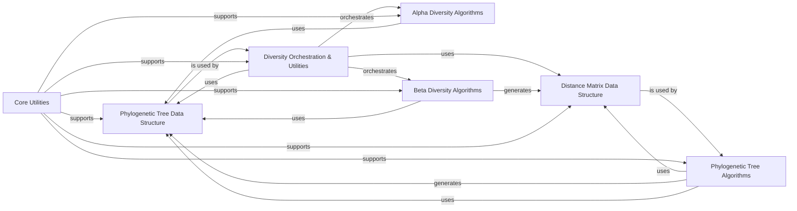

## Details

This component provides a comprehensive suite for analyzing evolutionary relationships and quantifying biological diversity. It encompasses core data structures for phylogenetic trees and distance matrices, algorithms for tree reconstruction and comparison, and a range of alpha and beta diversity metrics, including those that integrate phylogenetic information.

### Phylogenetic Tree Data Structure
This is the foundational data structure for representing phylogenetic trees. It provides methods for tree traversal, manipulation (e.g., pruning, rooting), and calculating tree-based properties. It is central to any phylogenetically-aware analysis.

**Related Classes/Methods**:

- <a href="https://github.com/biocore/scikit-bio/blob/main/skbio/tree/_tree.py#L53-L6193" target="_blank" rel="noopener noreferrer">`skbio.tree._tree.TreeNode` (53:6193)</a>

### Phylogenetic Tree Algorithms
This component implements algorithms for constructing phylogenetic trees from distance data (e.g., Neighbor-Joining, UPGMA) and for comparing the topological or branch length differences between trees (e.g., Robinson-Foulds distance).

**Related Classes/Methods**:

- <a href="https://github.com/biocore/scikit-bio/blob/main/skbio/tree/_nj.py#L158-L268" target="_blank" rel="noopener noreferrer">`skbio.tree._nj` (158:268)</a>
- <a href="https://github.com/biocore/scikit-bio/blob/main/skbio/tree/_upgma.py" target="_blank" rel="noopener noreferrer">`skbio.tree._upgma`</a>
- <a href="https://github.com/biocore/scikit-bio/blob/main/skbio/tree/_compare.py" target="_blank" rel="noopener noreferrer">`skbio.tree._compare`</a>

### Alpha Diversity Algorithms
This component provides a collection of functions for calculating various alpha diversity indices, which quantify diversity within a single sample or community. These metrics measure aspects like richness, evenness, and phylogenetic diversity.

**Related Classes/Methods**:

- <a href="https://github.com/biocore/scikit-bio/blob/main/skbio/diversity/alpha/_ace.py" target="_blank" rel="noopener noreferrer">`skbio.diversity.alpha._ace`</a>
- <a href="https://github.com/biocore/scikit-bio/blob/main/skbio/diversity/alpha/_base.py" target="_blank" rel="noopener noreferrer">`skbio.diversity.alpha._base`</a>
- <a href="https://github.com/biocore/scikit-bio/blob/main/skbio/diversity/alpha/_chao1.py" target="_blank" rel="noopener noreferrer">`skbio.diversity.alpha._chao1`</a>
- <a href="https://github.com/biocore/scikit-bio/blob/main/skbio/diversity/alpha/_gini.py" target="_blank" rel="noopener noreferrer">`skbio.diversity.alpha._gini`</a>
- <a href="https://github.com/biocore/scikit-bio/blob/main/skbio/diversity/alpha/_lladser.py" target="_blank" rel="noopener noreferrer">`skbio.diversity.alpha._lladser`</a>
- <a href="https://github.com/biocore/scikit-bio/blob/main/skbio/diversity/alpha/_pd.py" target="_blank" rel="noopener noreferrer">`skbio.diversity.alpha._pd`</a>

### Beta Diversity Algorithms
This component implements functions for calculating beta diversity metrics, which measure the dissimilarity or difference in community composition between two or more samples. Key implementations include UniFrac (weighted and unweighted), which leverages phylogenetic information.

**Related Classes/Methods**:

- <a href="https://github.com/biocore/scikit-bio/blob/main/skbio/diversity/beta/_unifrac.py" target="_blank" rel="noopener noreferrer">`skbio.diversity.beta._unifrac`</a>

### Diversity Orchestration & Utilities
This component serves as the primary user-facing interface for diversity calculations. It orchestrates the workflow for computing alpha and beta diversity metrics, handling input validation, dispatching to specific metric implementations, and integrating phylogenetic tree data when required. It also provides common utility functions for data preparation and validation.

**Related Classes/Methods**:

- <a href="https://github.com/biocore/scikit-bio/blob/main/skbio/diversity/_driver.py" target="_blank" rel="noopener noreferrer">`skbio.diversity._driver`</a>
- <a href="https://github.com/biocore/scikit-bio/blob/main/skbio/diversity/_util.py" target="_blank" rel="noopener noreferrer">`skbio.diversity._util`</a>

### Distance Matrix Data Structure
This component defines a fundamental data structure, `DistanceMatrix`, which represents a square matrix of pairwise distances or dissimilarities between a set of objects (e.g., samples, taxa). It is a crucial data structure used extensively as input and output in both diversity and phylogenetic tree analyses.

**Related Classes/Methods**:

- <a href="https://github.com/biocore/scikit-bio/blob/main/skbio/stats/distance/_base.py#L1040-L1303" target="_blank" rel="noopener noreferrer">`skbio.stats.distance._base.DistanceMatrix` (1040:1303)</a>

### Core Utilities
This component provides general-purpose utility functions, decorators, and helper classes used across the entire `scikit-bio` library, including the diversity and phylogenetic modules. This includes functionalities like deprecation warnings, aliasing, and random number generation, ensuring consistency, reducing code duplication, and providing foundational support.

**Related Classes/Methods**:

- <a href="https://github.com/biocore/scikit-bio/blob/main/skbio/util/_decorator.py" target="_blank" rel="noopener noreferrer">`skbio.util._decorator`</a>
- <a href="https://github.com/biocore/scikit-bio/blob/main/skbio/util/_misc.py" target="_blank" rel="noopener noreferrer">`skbio.util._misc`</a>
- <a href="https://github.com/biocore/scikit-bio/blob/main/skbio/util/_plotting.py" target="_blank" rel="noopener noreferrer">`skbio.util._plotting`</a>
- <a href="https://github.com/biocore/scikit-bio/blob/main/skbio/util/_testing.py" target="_blank" rel="noopener noreferrer">`skbio.util._testing`</a>
- <a href="https://github.com/biocore/scikit-bio/blob/main/skbio/util/_types.py" target="_blank" rel="noopener noreferrer">`skbio.util._types`</a>
- <a href="https://github.com/biocore/scikit-bio/blob/main/skbio/util/config/_config.py" target="_blank" rel="noopener noreferrer">`skbio.util.config._config`</a>

### [FAQ](https://github.com/CodeBoarding/GeneratedOnBoardings/tree/main?tab=readme-ov-file#faq)