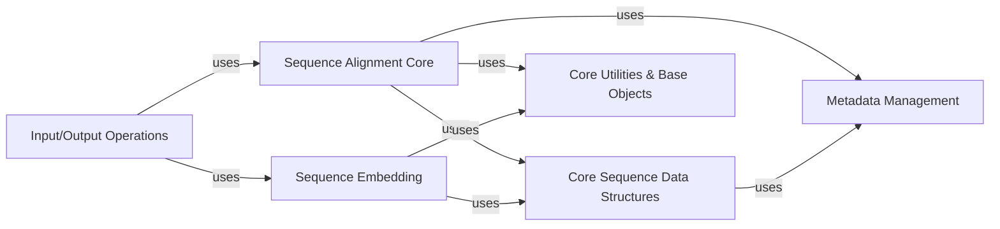

## Details

This section details the structure, flow, and purpose of the `Sequence & Alignment Modules` within the `scikit-bio` project, focusing on its core components and their interactions.

### Sequence Alignment Core
This component provides the fundamental algorithms and data structures for performing pairwise and multiple sequence alignments. It includes functionalities for representing alignment paths, scoring alignments, and handling tabular multiple sequence alignments. It is central to comparing and analyzing the evolutionary relationships between biological sequences.

**Related Classes/Methods**:

- <a href="https://github.com/biocore/scikit-bio/blob/main/skbio/alignment/_pair.py" target="_blank" rel="noopener noreferrer">`skbio.alignment._pair`</a>
- <a href="https://github.com/biocore/scikit-bio/blob/main/skbio/alignment/_pairwise.py" target="_blank" rel="noopener noreferrer">`skbio.alignment._pairwise`</a>
- <a href="https://github.com/biocore/scikit-bio/blob/main/skbio/alignment/_path.py#L38-L962" target="_blank" rel="noopener noreferrer">`skbio.alignment._path.AlignPath` (38:962)</a>
- <a href="https://github.com/biocore/scikit-bio/blob/main/skbio/alignment/_path.py#L965-L1273" target="_blank" rel="noopener noreferrer">`skbio.alignment._path.PairAlignPath` (965:1273)</a>
- <a href="https://github.com/biocore/scikit-bio/blob/main/skbio/alignment/_score.py" target="_blank" rel="noopener noreferrer">`skbio.alignment._score`</a>
- <a href="https://github.com/biocore/scikit-bio/blob/main/skbio/alignment/_tabular_msa.py#L30-L2540" target="_blank" rel="noopener noreferrer">`skbio.alignment._tabular_msa.TabularMSA` (30:2540)</a>

### Sequence Embedding
This component focuses on transforming biological sequences into numerical vector representations (embeddings). These embeddings are crucial for applying machine learning techniques and advanced statistical analyses to biological sequence data, enabling quantitative comparisons and analyses that are not directly possible with raw sequence data.

**Related Classes/Methods**:

- <a href="https://github.com/biocore/scikit-bio/blob/main/skbio/embedding/_embedding.py#L30-L74" target="_blank" rel="noopener noreferrer">`skbio.embedding._embedding.Embedding` (30:74)</a>
- <a href="https://github.com/biocore/scikit-bio/blob/main/skbio/embedding/_embedding.py#L137-L168" target="_blank" rel="noopener noreferrer">`skbio.embedding._embedding.EmbeddingVector` (137:168)</a>
- <a href="https://github.com/biocore/scikit-bio/blob/main/skbio/embedding/_embedding.py#L77-L134" target="_blank" rel="noopener noreferrer">`skbio.embedding._embedding.SequenceEmbedding` (77:134)</a>
- <a href="https://github.com/biocore/scikit-bio/blob/main/skbio/embedding/_embedding.py#L171-L229" target="_blank" rel="noopener noreferrer">`skbio.embedding._embedding.SequenceVector` (171:229)</a>
- <a href="https://github.com/biocore/scikit-bio/blob/main/skbio/embedding/_protein.py#L28-L113" target="_blank" rel="noopener noreferrer">`skbio.embedding._protein.ProteinEmbedding` (28:113)</a>
- <a href="https://github.com/biocore/scikit-bio/blob/main/skbio/embedding/_protein.py#L122-L187" target="_blank" rel="noopener noreferrer">`skbio.embedding._protein.ProteinVector` (122:187)</a>

### Core Sequence Data Structures
This component defines the foundational data structures for representing various types of biological sequences (DNA, RNA, Protein) and their associated characteristics. These structures serve as the primary input and output for alignment and embedding operations, ensuring data integrity and consistency across the library.

**Related Classes/Methods**:

- <a href="https://github.com/biocore/scikit-bio/blob/main/skbio/sequence/_sequence.py#L35-L2377" target="_blank" rel="noopener noreferrer">`skbio.sequence._sequence.Sequence` (35:2377)</a>
- <a href="https://github.com/biocore/scikit-bio/blob/main/skbio/sequence/_grammared_sequence.py#L79-L935" target="_blank" rel="noopener noreferrer">`skbio.sequence._grammared_sequence.GrammaredSequence` (79:935)</a>
- <a href="https://github.com/biocore/scikit-bio/blob/main/skbio/sequence/_dna.py#L15-L490" target="_blank" rel="noopener noreferrer">`skbio.sequence._dna.DNA` (15:490)</a>
- <a href="https://github.com/biocore/scikit-bio/blob/main/skbio/sequence/_rna.py#L15-L468" target="_blank" rel="noopener noreferrer">`skbio.sequence._rna.RNA` (15:468)</a>
- <a href="https://github.com/biocore/scikit-bio/blob/main/skbio/sequence/_protein.py#L15-L287" target="_blank" rel="noopener noreferrer">`skbio.sequence._protein.Protein` (15:287)</a>

### Metadata Management
This component provides mechanisms for attaching, accessing, and managing descriptive metadata (e.g., sample information, experimental conditions) to biological data objects. This ensures that contextual information is preserved and accessible alongside the sequence and alignment data, facilitating richer and more interpretable analyses.

**Related Classes/Methods**:

- <a href="https://github.com/biocore/scikit-bio/blob/main/skbio/metadata/_metadata.py#L912-L1255" target="_blank" rel="noopener noreferrer">`skbio.metadata._metadata.MetadataColumn` (912:1255)</a>
- <a href="https://github.com/biocore/scikit-bio/blob/main/skbio/metadata/_metadata.py#L241-L909" target="_blank" rel="noopener noreferrer">`skbio.metadata._metadata.SampleMetadata` (241:909)</a>
- <a href="https://github.com/biocore/scikit-bio/blob/main/skbio/metadata/_mixin.py#L16-L174" target="_blank" rel="noopener noreferrer">`skbio.metadata._mixin.MetadataMixin` (16:174)</a>
- <a href="https://github.com/biocore/scikit-bio/blob/main/skbio/metadata/_mixin.py#L177-L421" target="_blank" rel="noopener noreferrer">`skbio.metadata._mixin.PositionalMetadataMixin` (177:421)</a>
- <a href="https://github.com/biocore/scikit-bio/blob/main/skbio/metadata/_interval.py#L391-L1008" target="_blank" rel="noopener noreferrer">`skbio.metadata._interval.IntervalMetadata` (391:1008)</a>

### Input/Output Operations
This component handles the serialization and deserialization of biological data objects, including sequences, alignments, and embeddings, to and from various standard bioinformatics file formats. It provides a unified and extensible interface for data persistence and interoperability with other tools.

**Related Classes/Methods**:

- <a href="https://github.com/biocore/scikit-bio/blob/main/skbio/io/descriptors.py#L13-L62" target="_blank" rel="noopener noreferrer">`skbio.io.descriptors.Read` (13:62)</a>
- <a href="https://github.com/biocore/scikit-bio/blob/main/skbio/io/descriptors.py#L65-L121" target="_blank" rel="noopener noreferrer">`skbio.io.descriptors.Write` (65:121)</a>
- <a href="https://github.com/biocore/scikit-bio/blob/main/skbio/io/registry.py" target="_blank" rel="noopener noreferrer">`skbio.io.registry.IORegistry`</a>
- `skbio.io.format`

### Core Utilities & Base Objects
This component provides foundational utility functions, abstract base classes, and mixins that are widely used across the scikit-bio library. It ensures consistency, promotes code reuse, and establishes a common interface for various biological data objects.

**Related Classes/Methods**:

- <a href="https://github.com/biocore/scikit-bio/blob/main/skbio/_base.py#L11-L22" target="_blank" rel="noopener noreferrer">`skbio._base.SkbioObject` (11:22)</a>
- <a href="https://github.com/biocore/scikit-bio/blob/main/skbio/util/_testing.py#L18-L44" target="_blank" rel="noopener noreferrer">`skbio.util._testing.ReallyEqualMixin` (18:44)</a>
- <a href="https://github.com/biocore/scikit-bio/blob/main/skbio/util/_decorator.py" target="_blank" rel="noopener noreferrer">`skbio.util._decorator`</a>
- <a href="https://github.com/biocore/scikit-bio/blob/main/skbio/util/_misc.py#L40-L83" target="_blank" rel="noopener noreferrer">`skbio.util._misc.MiniRegistry` (40:83)</a>

### [FAQ](https://github.com/CodeBoarding/GeneratedOnBoardings/tree/main?tab=readme-ov-file#faq)