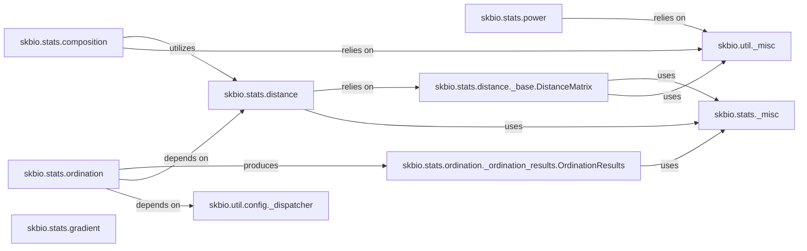

## Details

The `skbio.stats` package is a cornerstone of the scikit-bio library, providing a robust suite of statistical tools essential for biological data analysis. Its modular design, leveraging core data structures and utility functions, exemplifies the "Python library/toolkit for scientific computing in bioinformatics" architectural pattern by offering specialized, high-performance functionalities. Here are the fundamental components of the `Statistical Analysis Modules` subsystem: 

### skbio.stats.composition
This module is dedicated to compositional data analysis, which is vital for microbiome and other relative abundance datasets. It provides functions for data transformations (e.g., CLR, ILR), perturbation operations, and statistical tests like ANCOM and DirMult LME/T-test, specifically adapted for the unique properties of compositional data.

**Related Classes/Methods**:

- <a href="https://github.com/biocore/scikit-bio/blob/main/skbio/stats/composition.py#L1-L1" target="_blank" rel="noopener noreferrer">`skbio.stats.composition` (1:1)</a>

### skbio.stats.distance
This package focuses on distance-based statistical methods. It includes functionalities for calculating, manipulating, and analyzing distance matrices, which quantify dissimilarity between samples. Key methods include Mantel tests (for correlating distance matrices), ANOSIM, and PERMANOVA (for testing group differences based on distances).

**Related Classes/Methods**:

- `skbio.stats.distance` (1:1)

### skbio.stats.ordination
This package implements a variety of ordination techniques, which are powerful dimensionality reduction methods used to visualize and analyze complex biological datasets. It includes widely used methods such as Principal Coordinate Analysis (PCoA), Canonical Correspondence Analysis (CCA), Correspondence Analysis (CA), and Redundancy Analysis (RDA).

**Related Classes/Methods**:

- `skbio.stats.ordination` (1:1)

### skbio.stats.gradient
This module provides ANOVA-like methods specifically designed for analyzing trajectories or changes along a defined gradient (e.g., environmental, temporal). It offers different classes for various types of gradient ANOVA.

**Related Classes/Methods**:

- <a href="https://github.com/biocore/scikit-bio/blob/main/skbio/stats/gradient.py#L1-L1" target="_blank" rel="noopener noreferrer">`skbio.stats.gradient` (1:1)</a>

### skbio.stats.power
This module offers tools for performing statistical power analysis, particularly relevant for subsampling and paired sample scenarios. It assists researchers in determining the necessary sample size for a study or evaluating the power of an existing study to detect a specific effect size.

**Related Classes/Methods**:

- <a href="https://github.com/biocore/scikit-bio/blob/main/skbio/stats/power.py#L1-L1" target="_blank" rel="noopener noreferrer">`skbio.stats.power` (1:1)</a>

### skbio.stats.distance._base.DistanceMatrix
This is a core data structure within `skbio.stats` for representing and manipulating pairwise distance data between samples. It provides a standardized and efficient way to store and operate on distance information, which is fundamental to many statistical analyses.

**Related Classes/Methods**:

- <a href="https://github.com/biocore/scikit-bio/blob/main/skbio/stats/distance/_base.py#L1040-L1303" target="_blank" rel="noopener noreferrer">`skbio.stats.distance._base.DistanceMatrix` (1040:1303)</a>

### skbio.stats.ordination._ordination_results.OrdinationResults
This class is designed to encapsulate the comprehensive output of any ordination analysis performed within `skbio.stats.ordination`. It provides structured access to various components of the results, including eigenvalues, eigenvectors, sample and feature loadings, and offers methods for further analysis or visualization.

**Related Classes/Methods**:

- <a href="https://github.com/biocore/scikit-bio/blob/main/skbio/stats/ordination/_ordination_results.py#L21-L496" target="_blank" rel="noopener noreferrer">`skbio.stats.ordination._ordination_results.OrdinationResults` (21:496)</a>

### skbio.stats._misc
This module contains miscellaneous utility functions that are broadly applicable across various statistical modules within `skbio.stats`. These are typically helper functions that do not belong to a specific statistical domain but are essential for common internal operations.

**Related Classes/Methods**:

- <a href="https://github.com/biocore/scikit-bio/blob/main/skbio/stats/_misc.py#L1-L1" target="_blank" rel="noopener noreferrer">`skbio.stats._misc` (1:1)</a>

### skbio.util._misc
A general-purpose utility module from the broader `skbio.util` package. It provides foundational helper functions, such as random number generation (`get_rng`) and methods for finding duplicates, which are frequently leveraged by the `skbio.stats` components.

**Related Classes/Methods**:

- <a href="https://github.com/biocore/scikit-bio/blob/main/skbio/util/_misc.py#L1-L1" target="_blank" rel="noopener noreferrer">`skbio.util._misc` (1:1)</a>

### skbio.util.config._dispatcher
This module, part of `skbio.util.config`, is responsible for handling array dispatching and creating structured tables. Its primary role is to ensure compatibility with different numerical array backends (e.g., NumPy, JAX, PyTorch) and to facilitate the organization of data into tabular formats for computations.

**Related Classes/Methods**:

- <a href="https://github.com/biocore/scikit-bio/blob/main/skbio/util/config/_dispatcher.py#L1-L1" target="_blank" rel="noopener noreferrer">`skbio.util.config._dispatcher` (1:1)</a>

### [FAQ](https://github.com/CodeBoarding/GeneratedOnBoardings/tree/main?tab=readme-ov-file#faq)