```mermaid
graph LR
    skbio_io_registry_IORegistry["skbio.io.registry.IORegistry"]
    skbio_sequence__sequence_Sequence["skbio.sequence._sequence.Sequence"]
    skbio_alignment__tabular_msa_TabularMSA["skbio.alignment._tabular_msa.TabularMSA"]
    skbio_stats_distance__base_DistanceMatrix["skbio.stats.distance._base.DistanceMatrix"]
    skbio_tree__tree_TreeNode["skbio.tree._tree.TreeNode"]
    skbio_io_registry_IORegistry -- "manages I/O for" --> skbio_sequence__sequence_Sequence
    skbio_io_registry_IORegistry -- "manages I/O for" --> skbio_alignment__tabular_msa_TabularMSA
    skbio_io_registry_IORegistry -- "manages I/O for" --> skbio_stats_distance__base_DistanceMatrix
    skbio_io_registry_IORegistry -- "manages I/O for" --> skbio_tree__tree_TreeNode
    skbio_sequence__sequence_Sequence -- "is contained within" --> skbio_alignment__tabular_msa_TabularMSA
    skbio_sequence__sequence_Sequence -- "is handled by I/O via" --> skbio_io_registry_IORegistry
    skbio_alignment__tabular_msa_TabularMSA -- "contains" --> skbio_sequence__sequence_Sequence
    skbio_alignment__tabular_msa_TabularMSA -- "is input for generating" --> skbio_stats_distance__base_DistanceMatrix
    skbio_alignment__tabular_msa_TabularMSA -- "is handled by I/O via" --> skbio_io_registry_IORegistry
    skbio_stats_distance__base_DistanceMatrix -- "is generated from" --> skbio_alignment__tabular_msa_TabularMSA
    skbio_stats_distance__base_DistanceMatrix -- "is input for constructing" --> skbio_tree__tree_TreeNode
    skbio_stats_distance__base_DistanceMatrix -- "is handled by I/O via" --> skbio_io_registry_IORegistry
    skbio_tree__tree_TreeNode -- "is constructed from" --> skbio_stats_distance__base_DistanceMatrix
    skbio_tree__tree_TreeNode -- "is handled by I/O via" --> skbio_io_registry_IORegistry
    click skbio_io_registry_IORegistry href "https://github.com/CodeBoarding/GeneratedOnBoardings/blob/main//scikit-bio/skbio_io_registry_IORegistry.md" "Details"
    click skbio_sequence__sequence_Sequence href "https://github.com/CodeBoarding/GeneratedOnBoardings/blob/main//scikit-bio/skbio_sequence__sequence_Sequence.md" "Details"
    click skbio_alignment__tabular_msa_TabularMSA href "https://github.com/CodeBoarding/GeneratedOnBoardings/blob/main//scikit-bio/skbio_alignment__tabular_msa_TabularMSA.md" "Details"
    click skbio_stats_distance__base_DistanceMatrix href "https://github.com/CodeBoarding/GeneratedOnBoardings/blob/main//scikit-bio/skbio_stats_distance__base_DistanceMatrix.md" "Details"
    click skbio_tree__tree_TreeNode href "https://github.com/CodeBoarding/GeneratedOnBoardings/blob/main//scikit-bio/skbio_tree__tree_TreeNode.md" "Details"
```

## Component Details

The `scikit-bio` library is designed around a set of core data structures that represent common biological data types, coupled with a robust I/O system and analytical capabilities. The most fundamental components are those that define these core data types and the mechanism for interacting with external data.

### skbio.io.registry.IORegistry
This class serves as the central registry for all I/O formats within `scikit-bio`. It manages the registration, retrieval, and execution of readers, writers, and sniffers for various biological file formats, providing a unified interface for data import and export.

**Related Classes/Methods**:

- <a href="https://github.com/scikit-bio/scikit-bio/blob/master/skbio/io/registry.py#L1-L1" target="_blank" rel="noopener noreferrer">`skbio.io.registry.IORegistry` (1:1)</a>

### skbio.sequence._sequence.Sequence
The foundational abstract base class for all biological sequences (e.g., DNA, RNA, Protein). It provides common functionalities like slicing, concatenation, and character counting, serving as the base for more specific sequence types.

**Related Classes/Methods**:

- <a href="https://github.com/scikit-bio/scikit-bio/blob/master/skbio/sequence/_sequence.py#L35-L2380" target="_blank" rel="noopener noreferrer">`skbio.sequence._sequence.Sequence` (35:2380)</a>

### skbio.alignment._tabular_msa.TabularMSA
Represents a multiple sequence alignment (MSA) in a tabular format. It allows for efficient indexing and manipulation of aligned sequences and their associated metadata, serving as a key data structure for alignment-based analyses.

**Related Classes/Methods**:

- <a href="https://github.com/scikit-bio/scikit-bio/blob/master/skbio/alignment/_tabular_msa.py#L30-L2540" target="_blank" rel="noopener noreferrer">`skbio.alignment._tabular_msa.TabularMSA` (30:2540)</a>

### skbio.stats.distance._base.DistanceMatrix
Represents a square matrix of distances between a set of objects (e.g., samples, sequences). It provides methods for manipulation and filtering, and serves as a fundamental data structure for representing relationships in various statistical and phylogenetic analyses.

**Related Classes/Methods**:

- <a href="https://github.com/scikit-bio/scikit-bio/blob/master/skbio/stats/distance/_base.py#L1040-L1303" target="_blank" rel="noopener noreferrer">`skbio.stats.distance._base.DistanceMatrix` (1040:1303)</a>

### skbio.tree._tree.TreeNode
Represents a node in a phylogenetic tree, forming the fundamental data structure for phylogenetic analyses. It provides methods for tree traversal, manipulation (e.g., pruning, rooting), and calculating tree-based metrics.

**Related Classes/Methods**:

- <a href="https://github.com/scikit-bio/scikit-bio/blob/master/skbio/tree/_tree.py#L53-L6193" target="_blank" rel="noopener noreferrer">`skbio.tree._tree.TreeNode` (53:6193)</a>

### [FAQ](https://github.com/CodeBoarding/GeneratedOnBoardings/tree/main?tab=readme-ov-file#faq)