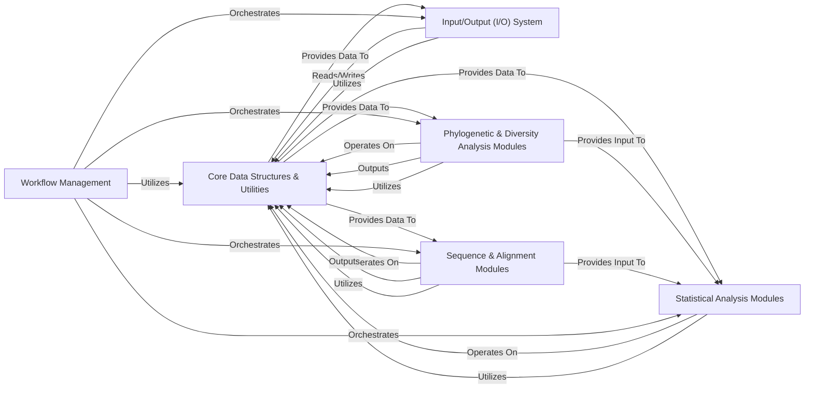

## Details

The `scikit-bio` library, designed for scientific computing in bioinformatics, exhibits a modular and layered architecture with a strong data-centric design. The analysis of its Control Flow Graph (CFG) and source code reveals a clear separation of concerns, enabling robust data flow and efficient processing of biological information.

### Core Data Structures & Utilities [[Expand]](./Core_Data_Structures_Utilities.md)
This foundational component defines the primary data types used throughout `scikit-bio` to represent biological information (e.g., sequences, metadata, distance matrices, phylogenetic trees). It also encompasses essential utility functions, base classes, decorators, and testing infrastructure that support the entire library, ensuring consistency and reusability.

**Related Classes/Methods**:

- `skbio.sequence`
- `skbio.metadata`
- <a href="https://github.com/biocore/scikit-bio/blob/main/skbio/stats/distance/_base.py" target="_blank" rel="noopener noreferrer">`skbio.stats.distance._base`</a>
- <a href="https://github.com/biocore/scikit-bio/blob/main/skbio/tree/_tree.py" target="_blank" rel="noopener noreferrer">`skbio.tree._tree`</a>
- <a href="https://github.com/biocore/scikit-bio/blob/main/skbio/_base.py" target="_blank" rel="noopener noreferrer">`skbio._base`</a>
- `skbio.util`

### Input/Output (I/O) System [[Expand]](./Input_Output_I_O_System.md)
This component provides a flexible and extensible framework for reading and writing biological data in various standard and custom file formats (e.g., FASTA, FASTQ, Newick, BIOM). It abstracts away file handling complexities, allowing seamless data serialization and deserialization.

**Related Classes/Methods**:

- <a href="https://github.com/biocore/scikit-bio/blob/main/skbio/io/registry.py" target="_blank" rel="noopener noreferrer">`skbio.io.registry`</a>
- <a href="https://github.com/biocore/scikit-bio/blob/main/skbio/io/descriptors.py" target="_blank" rel="noopener noreferrer">`skbio.io.descriptors`</a>
- <a href="https://github.com/biocore/scikit-bio/blob/main/skbio/io/util.py" target="_blank" rel="noopener noreferrer">`skbio.io.util`</a>
- `skbio.io.format`
- <a href="https://github.com/biocore/scikit-bio/blob/main/skbio/io/_iosources.py" target="_blank" rel="noopener noreferrer">`skbio.io._iosources`</a>

### Sequence & Alignment Modules [[Expand]](./Sequence_Alignment_Modules.md)
This component implements algorithms for performing pairwise and multiple sequence alignments. Additionally, it provides functionalities for transforming biological sequences into numerical vector representations (embeddings), which are crucial for machine learning applications and advanced statistical analyses.

**Related Classes/Methods**:

- `skbio.alignment`
- `skbio.embedding`

### Phylogenetic & Diversity Analysis Modules [[Expand]](./Phylogenetic_Diversity_Analysis_Modules.md)
This component offers a suite of functions for calculating various alpha (within-sample) and beta (between-sample) diversity metrics, often incorporating phylogenetic information. It also provides algorithms for constructing, manipulating, and comparing phylogenetic trees, essential for understanding evolutionary relationships.

**Related Classes/Methods**:

- `skbio.tree`
- `skbio.diversity`

### Statistical Analysis Modules [[Expand]](./Statistical_Analysis_Modules.md)
This component provides a comprehensive collection of statistical methods tailored for biological data analysis. It includes functionalities for compositional data analysis, ordination techniques (e.g., PCoA), gradient analysis, and various statistical tests (e.g., Mantel test, ANOSIM, PERMANOVA).

**Related Classes/Methods**:

- <a href="https://github.com/biocore/scikit-bio/blob/main/skbio/stats/composition.py" target="_blank" rel="noopener noreferrer">`skbio.stats.composition`</a>
- <a href="https://github.com/biocore/scikit-bio/blob/main/skbio/stats/distance/_mantel.py" target="_blank" rel="noopener noreferrer">`skbio.stats.distance._mantel`</a>
- `skbio.stats.ordination`
- <a href="https://github.com/biocore/scikit-bio/blob/main/skbio/stats/gradient.py" target="_blank" rel="noopener noreferrer">`skbio.stats.gradient`</a>
- <a href="https://github.com/biocore/scikit-bio/blob/main/skbio/stats/power.py" target="_blank" rel="noopener noreferrer">`skbio.stats.power`</a>

### Workflow Management
This component provides tools for defining, orchestrating, and executing complex bioinformatics workflows. It helps in managing dependencies between analytical steps and coordinating the flow of data through different `scikit-bio` components.

**Related Classes/Methods**:

- <a href="https://github.com/biocore/scikit-bio/blob/main/skbio/workflow.py" target="_blank" rel="noopener noreferrer">`skbio.workflow`</a>

### [FAQ](https://github.com/CodeBoarding/GeneratedOnBoardings/tree/main?tab=readme-ov-file#faq)