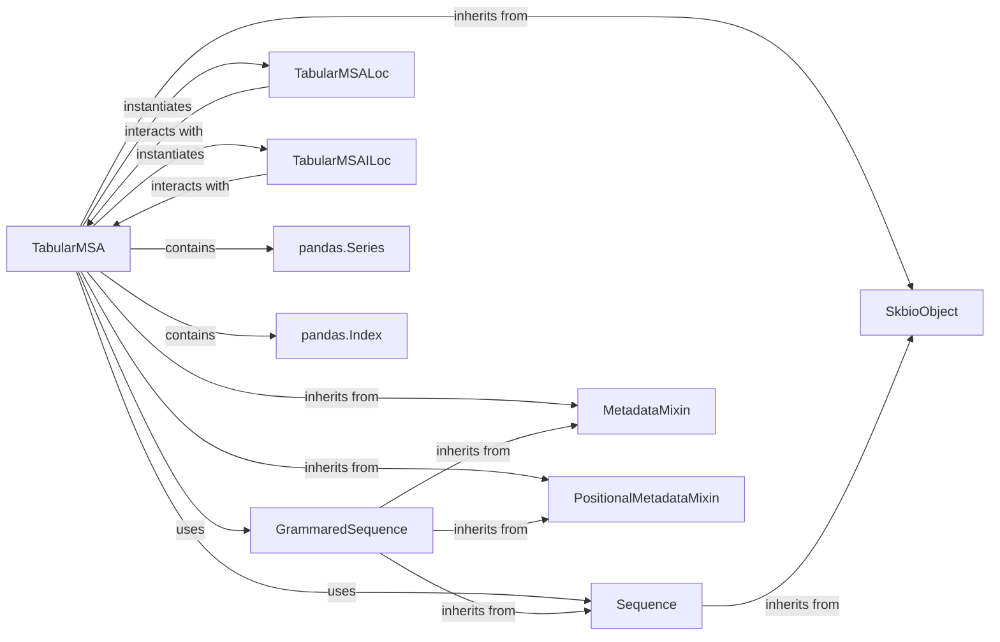

## Component Details

# 📦 Component Overview: `skbio.alignment._tabular_msa.TabularMSA`

This overview details the structure, flow, and purpose of the `TabularMSA` component within the `skbio.alignment` subsystem. `TabularMSA` is a cornerstone data structure for handling multiple sequence alignments in `scikit-bio`, providing efficient storage, indexing, and manipulation capabilities.

### TabularMSA
The primary component, acting as a container for aligned biological sequences. It provides a rich API for constructing, accessing, modifying, and analyzing multiple sequence alignments, including operations like consensus calculation and conservation scoring.

**Related Classes/Methods**:

- `TabularMSA` (1:1)

### GrammaredSequence
An abstract base class for biological sequences (e.g., DNA, RNA, Protein) that adhere to a specific grammar (alphabet, gap characters, degenerate characters). `TabularMSA` is designed to store and operate on collections of `GrammaredSequence` objects, ensuring type consistency and enabling grammar-aware operations.

**Related Classes/Methods**:

- `GrammaredSequence` (1:1)

### Sequence
A more general base class for biological sequences, providing fundamental sequence operations and metadata handling. `GrammaredSequence` inherits from `Sequence`. When `TabularMSA` extracts a column (position), it returns a `Sequence` object, as a column of an alignment does not necessarily conform to a biological grammar.

**Related Classes/Methods**:

- `Sequence` (1:1)

### TabularMSALoc
A helper class that enables label-based indexing and slicing (`.loc`) on `TabularMSA` objects. It allows users to select sequences by their assigned labels and positions by their column names, providing a user-friendly interface for data access.

**Related Classes/Methods**:

- `TabularMSALoc` (1:1)

### TabularMSAILoc
A helper class that enables integer-location based indexing and slicing (`.iloc`) on `TabularMSA` objects. It allows users to select sequences and positions by their numerical indices, offering precise, position-based data access.

**Related Classes/Methods**:

- `TabularMSAILoc` (1:1)

### pandas.Series
A one-dimensional labeled array capable of holding any data type from the `pandas` library. `TabularMSA` internally uses a `pandas.Series` to efficiently store the collection of `GrammaredSequence` objects, leveraging `pandas`' robust indexing and data manipulation capabilities.

**Related Classes/Methods**: _None_

### pandas.Index
The base object for all index types in `pandas`, used for managing axis labels. `TabularMSA` utilizes `pandas.Index` to manage the labels (identifiers) for its sequences, enabling efficient lookup and alignment of sequences.

**Related Classes/Methods**: _None_

### MetadataMixin
A mixin class that provides functionality for attaching and managing arbitrary key-value metadata to `scikit-bio` objects. `TabularMSA` inherits from this to store metadata relevant to the entire alignment.

**Related Classes/Methods**:

- `MetadataMixin` (1:1)

### PositionalMetadataMixin
A mixin class that provides functionality for attaching and managing metadata associated with specific positions (columns) within a sequence or alignment. `TabularMSA` inherits from this to store metadata relevant to each column of the alignment.

**Related Classes/Methods**:

- `PositionalMetadataMixin` (1:1)

### SkbioObject
The foundational base class for most objects in the `scikit-bio` library. It provides common functionalities such as I/O descriptors (`Read`, `Write`). `TabularMSA` inherits from `SkbioObject`.

**Related Classes/Methods**:

- `SkbioObject` (1:1)

### [FAQ](https://github.com/CodeBoarding/GeneratedOnBoardings/tree/main?tab=readme-ov-file#faq)