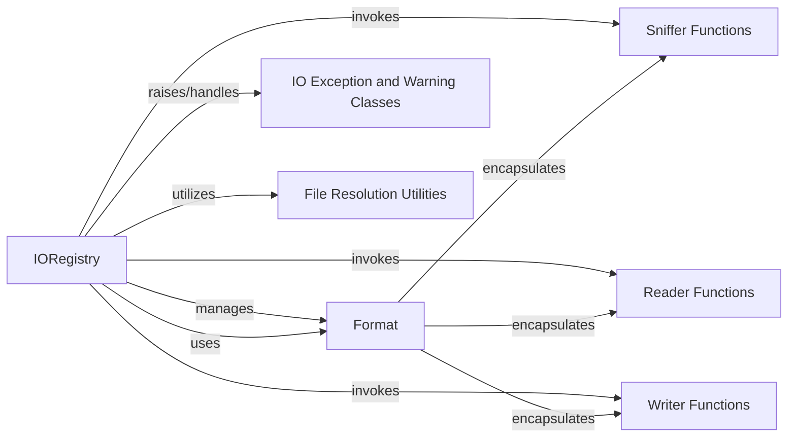

## Component Details

This overview details the structure, flow, and purpose of the `IORegistry` subsystem, which is central to `scikit-bio`'s data import and export capabilities. The `IORegistry` acts as a comprehensive hub for managing various biological file formats and their associated I/O operations.

### IORegistry
The core class that serves as the central registry for all I/O formats within `scikit-bio`. It manages the registration, retrieval, and execution of readers, writers, and sniffers for various biological file formats, providing a unified interface for data import and export. It maintains separate internal dictionaries for binary and text formats to optimize format resolution.

**Related Classes/Methods**:

- <a href="https://github.com/scikit-bio/scikit-bio/blob/master/skbio/io/registry.py#L0-L0" target="_blank" rel="noopener noreferrer">`skbio.io.registry.IORegistry` (0:0)</a>

### Format
A class that encapsulates the definition of a specific biological file format. Each `Format` object stores the format's name, whether it's a binary or text format, and references to its associated sniffer, reader, and writer functions for different `skbio` data types. It acts as a container for the I/O logic pertaining to a single format.

**Related Classes/Methods**:

- <a href="https://github.com/scikit-bio/scikit-bio/blob/master/skbio/io/registry.py#L0-L0" target="_blank" rel="noopener noreferrer">`skbio.io.registry.Format` (0:0)</a>

### Sniffer Functions
Individual functions, typically defined in `skbio.io.format.*` modules, responsible for "sniffing" or detecting the format of a given file. Each sniffer attempts to determine if a file conforms to its specific format and may suggest additional keyword arguments for reading.

**Related Classes/Methods**: _None_

### Reader Functions
Functions, typically found in `skbio.io.format.*` modules, responsible for parsing data from a file in a specific format and converting it into a `skbio` data structure (e.g., `Sequence`, `TabularMSA`).

**Related Classes/Methods**: _None_

### Writer Functions
Functions, typically located in `skbio.io.format.*` modules, responsible for serializing `skbio` data structures (e.g., `Sequence`, `TabularMSA`) into a specific file format.

**Related Classes/Methods**: _None_

### IO Exception and Warning Classes
Custom exception and warning classes (`DuplicateRegistrationError`, `UnrecognizedFormatError`, `FormatIdentificationWarning`, `ArgumentOverrideWarning`) specifically designed for I/O operations within `scikit-bio`, providing specific feedback on I/O issues.

**Related Classes/Methods**:

- <a href="https://github.com/scikit-bio/scikit-bio/blob/master/skbio/io/_exception.py#L122-L125" target="_blank" rel="noopener noreferrer">`skbio.io._exception.DuplicateRegistrationError` (122:125)</a>
- <a href="https://github.com/scikit-bio/scikit-bio/blob/master/skbio/io/_exception.py#L21-L24" target="_blank" rel="noopener noreferrer">`skbio.io._exception.UnrecognizedFormatError` (21:24)</a>
- <a href="https://github.com/scikit-bio/scikit-bio/blob/master/skbio/io/_warning.py#L9-L12" target="_blank" rel="noopener noreferrer">`skbio.io._warning.FormatIdentificationWarning` (9:12)</a>
- <a href="https://github.com/scikit-bio/scikit-bio/blob/master/skbio/io/_warning.py#L15-L18" target="_blank" rel="noopener noreferrer">`skbio.io._warning.ArgumentOverrideWarning` (15:18)</a>

### File Resolution Utilities
A collection of utility functions, such as `_resolve_file` and `_open_kwargs`, that facilitate robust handling of various input types (file paths, URLs, file handles) and provide standard keyword arguments for opening files.

**Related Classes/Methods**:

- <a href="https://github.com/scikit-bio/scikit-bio/blob/master/skbio/io/util.py#L0-L0" target="_blank" rel="noopener noreferrer">`skbio.io.util._resolve_file` (0:0)</a>
- <a href="https://github.com/scikit-bio/scikit-bio/blob/master/skbio/io/util.py#L0-L0" target="_blank" rel="noopener noreferrer">`skbio.io.util._open_kwargs` (0:0)</a>

### [FAQ](https://github.com/CodeBoarding/GeneratedOnBoardings/tree/main?tab=readme-ov-file#faq)