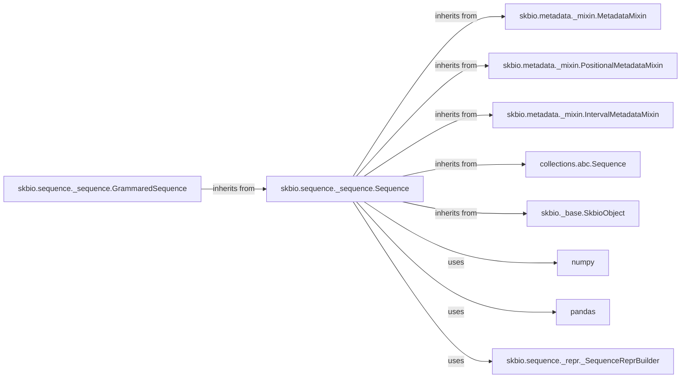

## Component Details

The `skbio.sequence._sequence.Sequence` component is the cornerstone of biological sequence representation within the `scikit-bio` library. It provides a robust and extensible foundation for handling sequence data, along with comprehensive metadata management.

### skbio.sequence._sequence.Sequence
The foundational abstract base class for all biological sequences (e.g., DNA, RNA, Protein). It provides common functionalities like slicing, concatenation, character counting, and robust metadata management (general, positional, and interval metadata). It handles the underlying immutable byte array representation of the sequence.

**Related Classes/Methods**:

- <a href="https://github.com/scikit-bio/scikit-bio/blob/master/skbio/sequence/_sequence.py#L35-L2380" target="_blank" rel="noopener noreferrer">`skbio.sequence._sequence.Sequence` (35:2380)</a>

### skbio.metadata._mixin.MetadataMixin
An abstract base class providing the core functionality for managing arbitrary, sequence-wide metadata (e.g., `id`, `description`) as a dictionary.

**Related Classes/Methods**:

- <a href="https://github.com/scikit-bio/scikit-bio/blob/master/skbio/metadata/_mixin.py#L16-L174" target="_blank" rel="noopener noreferrer">`skbio.metadata._mixin.MetadataMixin` (16:174)</a>

### skbio.metadata._mixin.PositionalMetadataMixin
An abstract base class enabling the management of per-character metadata, typically stored and manipulated using a `pandas.DataFrame`. This allows associating specific data points with each position in the sequence.

**Related Classes/Methods**:

- <a href="https://github.com/scikit-bio/scikit-bio/blob/master/skbio/metadata/_mixin.py#L177-L421" target="_blank" rel="noopener noreferrer">`skbio.metadata._mixin.PositionalMetadataMixin` (177:421)</a>

### skbio.metadata._mixin.IntervalMetadataMixin
An abstract base class for handling metadata associated with specific intervals or regions within the sequence, crucial for annotating features like genes or regulatory elements.

**Related Classes/Methods**:

- <a href="https://github.com/scikit-bio/scikit-bio/blob/master/skbio/metadata/_mixin.py#L424-L561" target="_blank" rel="noopener noreferrer">`skbio.metadata._mixin.IntervalMetadataMixin` (424:561)</a>

### collections.abc.Sequence
Python's built-in Abstract Base Class (ABC) that defines the standard interface for sequence-like objects. `skbio.Sequence` inherits from this to ensure compliance with Python's sequence protocol, enabling standard operations like iteration, length checking, and item access.

**Related Classes/Methods**:

- `collections.abc.Sequence` (1:1)

### skbio._base.SkbioObject
A base class within the `scikit-bio` library that likely provides common utilities, methods, or attributes shared across various `skbio` data structures, ensuring consistent behavior and integration within the library's ecosystem.

**Related Classes/Methods**:

- <a href="https://github.com/scikit-bio/scikit-bio/blob/master/skbio/_base.py#L11-L22" target="_blank" rel="noopener noreferrer">`skbio._base.SkbioObject` (11:22)</a>

### skbio.sequence._sequence.GrammaredSequence
An abstract base class that extends `Sequence` by introducing and enforcing a specific `Alphabet` and grammar rules for the sequence characters. It serves as the direct parent for specialized biological sequence types like DNA, RNA, and Protein, ensuring their character validity.

**Related Classes/Methods**:

- <a href="https://github.com/scikit-bio/scikit-bio/blob/master/skbio/sequence/_sequence.py#L1-L1" target="_blank" rel="noopener noreferrer">`skbio.sequence._sequence.GrammaredSequence` (1:1)</a>

### numpy
A fundamental external library for numerical computing in Python. `skbio.Sequence` heavily relies on NumPy arrays (`np.uint8` and `|S1` dtypes) for efficient, immutable storage and manipulation of the raw sequence data, enabling high-performance operations.

**Related Classes/Methods**:

- `numpy` (1:1)

### pandas
A powerful external library for data manipulation and analysis. It is primarily used by `skbio.Sequence` for managing `positional_metadata` as `DataFrame` objects, providing flexible and robust handling of per-character annotations.

**Related Classes/Methods**:

- `pandas` (1:1)

### skbio.sequence._repr._SequenceReprBuilder
A utility class responsible for constructing the detailed and formatted string representation (`__repr__`) of `Sequence` objects. This includes displaying sequence type, various metadata, and chunked sequence data, which is crucial for user understanding and debugging.

**Related Classes/Methods**:

- <a href="https://github.com/scikit-bio/scikit-bio/blob/master/skbio/sequence/_repr.py#L14-L110" target="_blank" rel="noopener noreferrer">`skbio.sequence._repr._SequenceReprBuilder` (14:110)</a>

### [FAQ](https://github.com/CodeBoarding/GeneratedOnBoardings/tree/main?tab=readme-ov-file#faq)