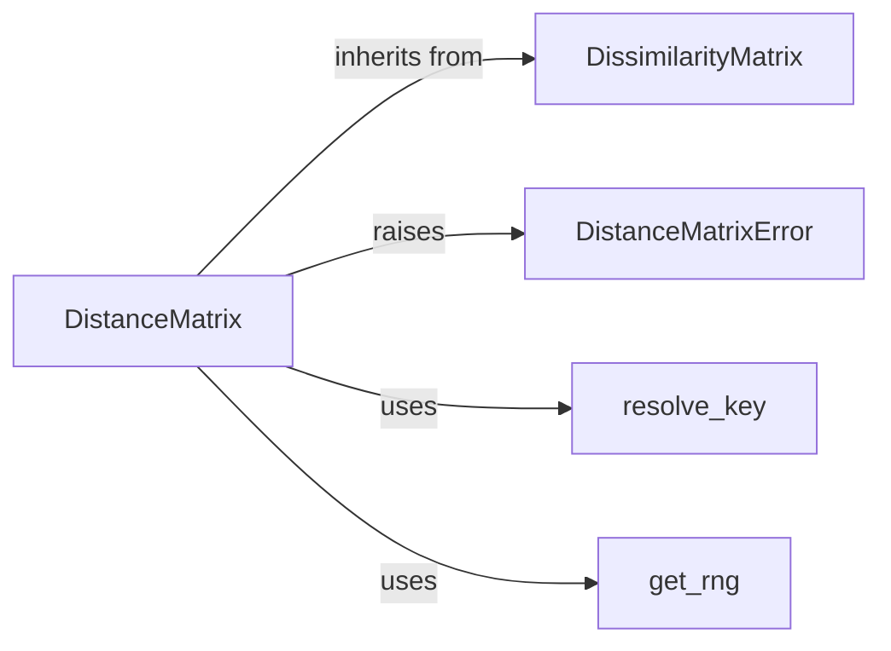

## Component Details

These components are fundamental because they collectively define, validate, and enable the manipulation of distance matrices, which are a cornerstone of many bioinformatics and ecological analyses within the `scikit-bio` library. `DistanceMatrix` itself is the core data structure, while `DissimilarityMatrix` provides its essential foundation. The `DistanceMatrixError` ensures data integrity, and `resolve_key` and `get_rng` provide crucial utility for constructing and operating on these matrices in a flexible and reproducible manner.

### DistanceMatrix
Represents a square, symmetric, and hollow matrix of distances between a set of objects. It extends `DissimilarityMatrix` by enforcing symmetry and provides methods for creation, validation, permutation, and conversion to other data structures (like condensed form or pandas Series/DataFrame). It's the primary data structure for distance-based analyses in `scikit-bio`.

**Related Classes/Methods**:

- <a href="https://github.com/scikit-bio/scikit-bio/blob/master/skbio/stats/distance/_base.py#L1040-L1303" target="_blank" rel="noopener noreferrer">`skbio.stats.distance._base.DistanceMatrix` (1040:1303)</a>

### DissimilarityMatrix
The base class for `DistanceMatrix`, representing a general square matrix of dissimilarities. It provides the fundamental structure and methods for creating such matrices from iterables, managing object IDs, and performing basic matrix operations like transposing, copying, renaming IDs, and filtering. It lays the groundwork for `DistanceMatrix`'s specialized properties.

**Related Classes/Methods**:

- <a href="https://github.com/scikit-bio/scikit-bio/blob/master/skbio/stats/distance/_base.py#L64-L1037" target="_blank" rel="noopener noreferrer">`skbio.stats.distance._base.DissimilarityMatrix` (64:1037)</a>

### DistanceMatrixError
A custom exception specifically raised when validation of a `DistanceMatrix` fails, particularly for issues related to symmetry or hollowness. It ensures that invalid distance matrices are explicitly flagged, maintaining data integrity. It inherits from `DissimilarityMatrixError`.

**Related Classes/Methods**:

- <a href="https://github.com/scikit-bio/scikit-bio/blob/master/skbio/stats/distance/_base.py#L50-L53" target="_blank" rel="noopener noreferrer">`skbio.stats.distance._base.DistanceMatrixError` (50:53)</a>

### resolve_key
A utility function used by `DistanceMatrix` (specifically in its `from_iterable` class method) to extract an identifier (key) from an object. It offers flexibility by allowing either a callable function or access to a `metadata` attribute on the object to derive the ID. This is crucial for correctly labeling the rows and columns of the distance matrix.

**Related Classes/Methods**:

- <a href="https://github.com/scikit-bio/scikit-bio/blob/master/skbio/util/_misc.py#L15-L24" target="_blank" rel="noopener noreferrer">`skbio.util._misc.resolve_key` (15:24)</a>

### get_rng
A utility function that provides a NumPy random number generator instance, ensuring reproducibility of stochastic operations by handling various seed inputs (integer, `Generator`, `RandomState`). It is used by `DistanceMatrix` for operations involving randomness, such as the `permute` method, which shuffles the rows and columns of the matrix.

**Related Classes/Methods**:

- <a href="https://github.com/scikit-bio/scikit-bio/blob/master/skbio/util/_misc.py#L212-L318" target="_blank" rel="noopener noreferrer">`skbio.util._misc.get_rng` (212:318)</a>

### [FAQ](https://github.com/CodeBoarding/GeneratedOnBoardings/tree/main?tab=readme-ov-file#faq)