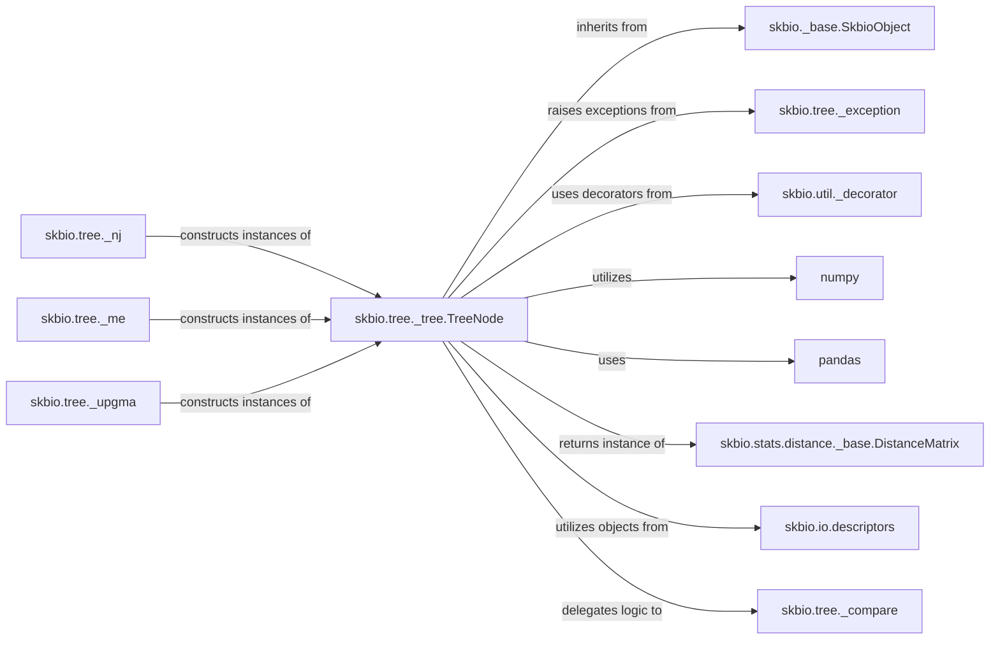

## Component Details

Component Overview: `skbio.tree._tree.TreeNode`. The `skbio.tree._tree.TreeNode` class is the fundamental building block for representing and manipulating tree structures within the `scikit-bio` library. It serves as the core data structure for phylogenetic trees, taxonomic hierarchies, and other hierarchical data.

### skbio.tree._tree.TreeNode
The central component, representing a single node within a tree structure. It provides methods for tree traversal, manipulation, rerooting, metric calculation, and format conversion.

**Related Classes/Methods**:

- <a href="https://github.com/scikit-bio/scikit-bio/blob/master/skbio/_base.py#L11-L22" target="_blank" rel="noopener noreferrer">`skbio._base.SkbioObject` (11:22)</a>
- <a href="https://github.com/scikit-bio/scikit-bio/blob/master/skbio/tree/_exception.py#L9-L12" target="_blank" rel="noopener noreferrer">`skbio.tree._exception.TreeError` (9:12)</a>
- <a href="https://github.com/scikit-bio/scikit-bio/blob/master/skbio/tree/_exception.py#L33-L36" target="_blank" rel="noopener noreferrer">`skbio.tree._exception.NoParentError` (33:36)</a>
- <a href="https://github.com/scikit-bio/scikit-bio/blob/master/skbio/tree/_exception.py#L27-L30" target="_blank" rel="noopener noreferrer">`skbio.tree._exception.MissingNodeError` (27:30)</a>
- <a href="https://github.com/scikit-bio/scikit-bio/blob/master/skbio/util/_decorator.py#L158-L198" target="_blank" rel="noopener noreferrer">`skbio.util._decorator.aliased` (158:198)</a>
- <a href="https://github.com/scikit-bio/scikit-bio/blob/master/skbio/util/_decorator.py#L123-L155" target="_blank" rel="noopener noreferrer">`skbio.util._decorator.deprecated` (123:155)</a>
- `numpy` (1:100)
- `pandas.DataFrame` (1:100)
- <a href="https://github.com/scikit-bio/scikit-bio/blob/master/skbio/stats/distance/_base.py#L1040-L1303" target="_blank" rel="noopener noreferrer">`skbio.stats.distance._base.DistanceMatrix` (1040:1303)</a>
- <a href="https://github.com/scikit-bio/scikit-bio/blob/master/skbio/io/descriptors.py#L13-L62" target="_blank" rel="noopener noreferrer">`skbio.io.descriptors.Read` (13:62)</a>
- <a href="https://github.com/scikit-bio/scikit-bio/blob/master/skbio/io/descriptors.py#L65-L121" target="_blank" rel="noopener noreferrer">`skbio.io.descriptors.Write` (65:121)</a>
- <a href="https://github.com/scikit-bio/scikit-bio/blob/master/skbio/tree/_compare.py#L108-L190" target="_blank" rel="noopener noreferrer">`skbio.tree._compare._topo_dists` (108:190)</a>
- <a href="https://github.com/scikit-bio/scikit-bio/blob/master/skbio/tree/_compare.py#L374-L439" target="_blank" rel="noopener noreferrer">`skbio.tree._compare._path_dists` (374:439)</a>

### skbio._base.SkbioObject
A foundational base class within `scikit-bio` that provides common functionalities and a standardized interface for various `skbio` objects.

**Related Classes/Methods**:

- <a href="https://github.com/scikit-bio/scikit-bio/blob/master/skbio/_base.py#L11-L22" target="_blank" rel="noopener noreferrer">`skbio._base.SkbioObject` (11:22)</a>

### skbio.tree._exception
Defines custom exception classes (e.g., `TreeError`, `NoParentError`, `MissingNodeError`) specifically for errors encountered during tree operations, ensuring robust and specific error handling.

**Related Classes/Methods**:

- <a href="https://github.com/scikit-bio/scikit-bio/blob/master/skbio/tree/_exception.py#L9-L12" target="_blank" rel="noopener noreferrer">`skbio.tree._exception.TreeError` (9:12)</a>
- <a href="https://github.com/scikit-bio/scikit-bio/blob/master/skbio/tree/_exception.py#L33-L36" target="_blank" rel="noopener noreferrer">`skbio.tree._exception.NoParentError` (33:36)</a>
- <a href="https://github.com/scikit-bio/scikit-bio/blob/master/skbio/tree/_exception.py#L27-L30" target="_blank" rel="noopener noreferrer">`skbio.tree._exception.MissingNodeError` (27:30)</a>

### skbio.util._decorator
A utility module providing decorators for common functionalities such as aliasing methods and marking them as deprecated, which helps in managing API evolution and backward compatibility.

**Related Classes/Methods**:

- <a href="https://github.com/scikit-bio/scikit-bio/blob/master/skbio/util/_decorator.py#L158-L198" target="_blank" rel="noopener noreferrer">`skbio.util._decorator.aliased` (158:198)</a>
- <a href="https://github.com/scikit-bio/scikit-bio/blob/master/skbio/util/_decorator.py#L123-L155" target="_blank" rel="noopener noreferrer">`skbio.util._decorator.deprecated` (123:155)</a>

### numpy
A fundamental library for numerical computing in Python, providing support for large, multi-dimensional arrays and matrices, along with a collection of mathematical functions.

**Related Classes/Methods**:

- `numpy` (1:100)

### pandas
A powerful library for data manipulation and analysis, especially with tabular data structures like DataFrames and Series.

**Related Classes/Methods**:

- `pandas.DataFrame` (1:100)

### skbio.stats.distance._base.DistanceMatrix
A specialized data structure for storing and manipulating pairwise distance data, crucial for various phylogenetic and ecological analyses.

**Related Classes/Methods**:

- <a href="https://github.com/scikit-bio/scikit-bio/blob/master/skbio/stats/distance/_base.py#L1040-L1303" target="_blank" rel="noopener noreferrer">`skbio.stats.distance._base.DistanceMatrix` (1040:1303)</a>

### skbio.io.descriptors
A module related to input/output descriptors, used for defining how data structures can be read from or written to various file formats.

**Related Classes/Methods**:

- <a href="https://github.com/scikit-bio/scikit-bio/blob/master/skbio/io/descriptors.py#L13-L62" target="_blank" rel="noopener noreferrer">`skbio.io.descriptors.Read` (13:62)</a>
- <a href="https://github.com/scikit-bio/scikit-bio/blob/master/skbio/io/descriptors.py#L65-L121" target="_blank" rel="noopener noreferrer">`skbio.io.descriptors.Write` (65:121)</a>

### skbio.tree._compare
This module contains internal helper functions for comparing tree topologies, such as calculating Robinson-Foulds distances and other tree comparison metrics.

**Related Classes/Methods**:

- <a href="https://github.com/scikit-bio/scikit-bio/blob/master/skbio/tree/_compare.py#L108-L190" target="_blank" rel="noopener noreferrer">`skbio.tree._compare._topo_dists` (108:190)</a>
- <a href="https://github.com/scikit-bio/scikit-bio/blob/master/skbio/tree/_compare.py#L374-L439" target="_blank" rel="noopener noreferrer">`skbio.tree._compare._path_dists` (374:439)</a>

### skbio.tree._nj
Implements Neighbor-Joining algorithm for constructing phylogenetic trees.

**Related Classes/Methods**:

- <a href="https://github.com/scikit-bio/scikit-bio/blob/master/skbio/tree/_nj.py#L158-L268" target="_blank" rel="noopener noreferrer">`skbio.tree._nj` (158:268)</a>

### skbio.tree._me
Implements Minimum Evolution algorithm for constructing phylogenetic trees.

**Related Classes/Methods**:

- <a href="https://github.com/scikit-bio/scikit-bio/blob/master/skbio/tree/_me.py#L1-L100" target="_blank" rel="noopener noreferrer">`skbio.tree._me` (1:100)</a>

### skbio.tree._upgma
Implements UPGMA algorithm for constructing phylogenetic trees.

**Related Classes/Methods**:

- <a href="https://github.com/scikit-bio/scikit-bio/blob/master/skbio/tree/_upgma.py#L1-L100" target="_blank" rel="noopener noreferrer">`skbio.tree._upgma` (1:100)</a>

### [FAQ](https://github.com/CodeBoarding/GeneratedOnBoardings/tree/main?tab=readme-ov-file#faq)