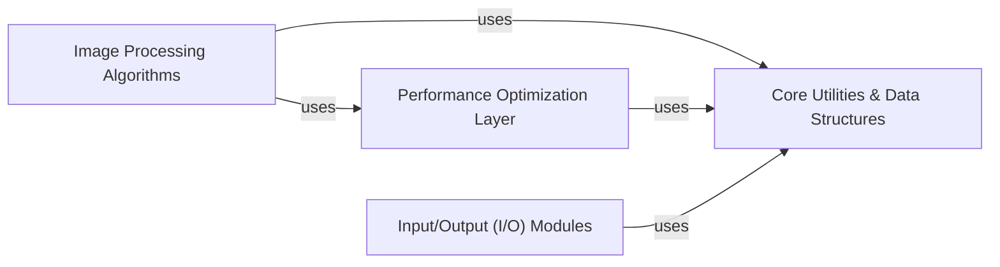

## Details

One paragraph explaining the functionality which is represented by this graph. What the main flow is and what is its purpose.

### Core Utilities & Data Structures [[Expand]](./Core_Utilities_Data_Structures.md)
This foundational component provides essential utility functions, common data structures, and helper methods. It ensures consistent data handling, array manipulation, type conversion, and other general-purpose operations leveraged across various image processing modules. It acts as the backbone for data consistency and basic operations.

**Related Classes/Methods**:

- <a href="https://github.com/scikit-image/scikit-image/blob/main/skimage/util/_map_array.py#L75-L198" target="_blank" rel="noopener noreferrer">`skimage.util._map_array.ArrayMap` (75:198)</a>

### Image Processing Algorithms
This is the primary functional core of the library, encompassing a wide range of domain-specific image processing capabilities. It includes modules for filters, segmentation, feature detection, transformations, and other high-level image analysis operations.

**Related Classes/Methods**:

- <a href="https://github.com/scikit-image/scikit-image/blob/main/skimage/feature/orb.py#L24-L365" target="_blank" rel="noopener noreferrer">`skimage.feature.orb.ORB` (24:365)</a>

### Performance Optimization Layer
This component is responsible for optimizing the execution of computationally intensive image processing tasks. It leverages numerical backends like NumPy and SciPy, and potentially specialized kernels, to ensure efficient processing of large image datasets. It provides optimized routines that algorithms can utilize.

**Related Classes/Methods**:

- <a href="https://github.com/scikit-image/scikit-image/blob/main/skimage/transform/_geometric.py#L255-L354" target="_blank" rel="noopener noreferrer">`skimage.transform._geometric._GeometricTransform` (255:354)</a>

### Input/Output (I/O) Modules
This component handles the reading and writing of various image file formats. It provides the necessary interfaces for users to load image data into the library's internal data structures and save processed images back to disk.

**Related Classes/Methods**:

- <a href="https://github.com/scikit-image/scikit-image/blob/main/skimage/io/collection.py#L99-L405" target="_blank" rel="noopener noreferrer">`skimage.io.collection.ImageCollection` (99:405)</a>

### [FAQ](https://github.com/CodeBoarding/GeneratedOnBoardings/tree/main?tab=readme-ov-file#faq)