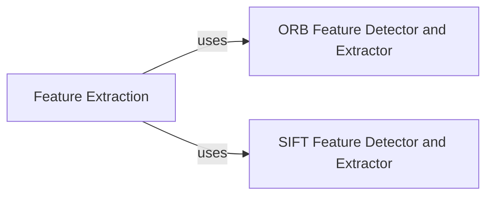

## Details

One paragraph explaining the functionality which is represented by this graph. What the main flow is and what is its purpose.

### Feature Extraction [[Expand]](./Feature_Extraction.md)
Provides a high-level, unified interface for various feature extraction algorithms through abstract base classes. It acts as an entry point for users to access different feature detection and description functionalities without needing to interact directly with the specific algorithm implementations.

**Related Classes/Methods**: _None_

### ORB Feature Detector and Extractor
Encapsulates the entire ORB (Oriented FAST and Rotated BRIEF) algorithm, responsible for detecting keypoints and computing their descriptors. It handles internal steps such as image pyramid construction, keypoint detection within octaves, and descriptor generation.

**Related Classes/Methods**:

- <a href="https://github.com/scikit-image/scikit-image/blob/main/skimage/feature/orb.py#L24-L365" target="_blank" rel="noopener noreferrer">`skimage.feature.orb.ORB` (24:365)</a>
- <a href="https://github.com/scikit-image/scikit-image/blob/main/skimage/feature/orb.py#L140-L146" target="_blank" rel="noopener noreferrer">`skimage.feature.orb.ORB:_build_pyramid` (140:146)</a>
- <a href="https://github.com/scikit-image/scikit-image/blob/main/skimage/feature/orb.py#L148-L169" target="_blank" rel="noopener noreferrer">`skimage.feature.orb.ORB:_detect_octave` (148:169)</a>
- <a href="https://github.com/scikit-image/scikit-image/blob/main/skimage/feature/orb.py#L227-L236" target="_blank" rel="noopener noreferrer">`skimage.feature.orb.ORB:_extract_octave` (227:236)</a>

### SIFT Feature Detector and Extractor
Implements the Scale-Invariant Feature Transform (SIFT) algorithm, covering all stages from image preprocessing and scale-space creation to keypoint localization, orientation assignment, and descriptor generation. It provides robust feature detection invariant to scale, rotation, and illumination changes.

**Related Classes/Methods**:

- <a href="https://github.com/scikit-image/scikit-image/blob/main/skimage/feature/sift.py#L101-L770" target="_blank" rel="noopener noreferrer">`skimage.feature.sift.SIFT` (101:770)</a>
- <a href="https://github.com/scikit-image/scikit-image/blob/main/skimage/feature/sift.py#L694-L701" target="_blank" rel="noopener noreferrer">`skimage.feature.sift.SIFT:_preprocess` (694:701)</a>
- `skimage.feature.sift.SIFT:_create_scale_space`
- `skimage.feature.sift.SIFT:_localize_keypoints`
- <a href="https://github.com/scikit-image/scikit-image/blob/main/skimage/feature/sift.py#L465-L573" target="_blank" rel="noopener noreferrer">`skimage.feature.sift.SIFT:_compute_orientation` (465:573)</a>
- `skimage.feature.sift.SIFT:_generate_descriptors`

### [FAQ](https://github.com/CodeBoarding/GeneratedOnBoardings/tree/main?tab=readme-ov-file#faq)