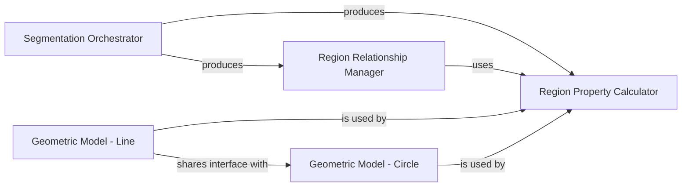

## Details

Abstract Components Overview

### Segmentation Orchestrator
This component is responsible for managing and executing the image segmentation workflow, particularly focusing on trainable segmentation techniques. It provides the high-level interface for users to apply learned models to divide images into meaningful regions.

**Related Classes/Methods**:

- <a href="https://github.com/scikit-image/scikit-image/blob/main/skimage/future/trainable_segmentation.py#L14-L86" target="_blank" rel="noopener noreferrer">`skimage.future.trainable_segmentation.TrainableSegmenter` (14:86)</a>

### Region Relationship Manager
This component constructs and maintains a Region Adjacency Graph (RAG), which represents the topological relationships (e.g., adjacency) between segmented regions. It is crucial for post-segmentation analysis, allowing for operations like region merging or splitting based on connectivity.

**Related Classes/Methods**:

- <a href="https://github.com/scikit-image/scikit-image/blob/main/skimage/graph/_rag.py#L107-L302" target="_blank" rel="noopener noreferrer">`skimage.graph._rag.RAG` (107:302)</a>

### Region Property Calculator
This component is dedicated to computing a comprehensive set of quantitative properties for segmented image regions or detected features. These properties can include geometric (e.g., area, perimeter), intensity-based (e.g., mean intensity), and shape descriptors, directly supporting the measurement aspect of the subsystem.

**Related Classes/Methods**:

- <a href="https://github.com/scikit-image/scikit-image/blob/main/skimage/measure/_regionprops.py#L304-L811" target="_blank" rel="noopener noreferrer">`skimage.measure._regionprops.RegionProperties` (304:811)</a>

### Geometric Model - Line
This component provides the algorithms and data structures necessary for fitting N-dimensional line models to image data. It is used to detect and characterize linear features, such as edges or lines, within images.

**Related Classes/Methods**:

- <a href="https://github.com/scikit-image/scikit-image/blob/main/skimage/measure/fit.py#L165-L450" target="_blank" rel="noopener noreferrer">`skimage.measure.fit.LineModelND` (165:450)</a>

### Geometric Model - Circle
This component provides the algorithms and data structures for fitting 2D circle models to image data. It is specifically designed for detecting and characterizing circular features within images.

**Related Classes/Methods**:

- <a href="https://github.com/scikit-image/scikit-image/blob/main/skimage/measure/fit.py#L454-L703" target="_blank" rel="noopener noreferrer">`skimage.measure.fit.CircleModel` (454:703)</a>

### [FAQ](https://github.com/CodeBoarding/GeneratedOnBoardings/tree/main?tab=readme-ov-file#faq)