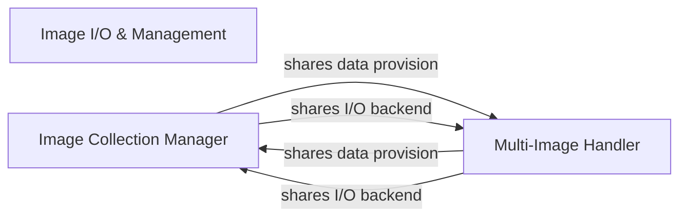

## Details

One paragraph explaining the functionality which is represented by this graph. What the main flow is and what is its purpose.

### Image I/O & Management [[Expand]](./Image_I_O_Management.md)
Manages the loading, saving, and organization of image data from various sources and formats, providing the initial input for processing. This component acts as the primary interface for bringing image data into the scikit-image ecosystem.

**Related Classes/Methods**:

- `skimage.io._io`

### Image Collection Manager
Responsible for handling and iterating over collections of individual image files. It provides a unified interface to manage multiple images as a single logical entity, facilitating batch processing and sequential access to image datasets.

**Related Classes/Methods**:

- <a href="https://github.com/scikit-image/scikit-image/blob/main/skimage/io/collection.py#L99-L405" target="_blank" rel="noopener noreferrer">`skimage.io.collection.ImageCollection` (99:405)</a>

### Multi-Image Handler
Specializes in loading and accessing frames from multi-dimensional or multi-frame image formats (e.g., multi-page TIFFs, video files). It enables efficient, on-demand access to specific frames within a single file, optimizing memory usage for large multi-frame data.

**Related Classes/Methods**:

- <a href="https://github.com/scikit-image/scikit-image/blob/main/skimage/io/collection.py#L436-L492" target="_blank" rel="noopener noreferrer">`skimage.io.collection.MultiImage` (436:492)</a>

### [FAQ](https://github.com/CodeBoarding/GeneratedOnBoardings/tree/main?tab=readme-ov-file#faq)