```mermaid
graph LR
    Core_Data_Structures_Utilities["Core Data Structures & Utilities"]
    Input_Output_I_O_Modules["Input/Output (I/O) Modules"]
    Image_Preprocessing_Enhancement["Image Preprocessing & Enhancement"]
    Image_Segmentation["Image Segmentation"]
    Feature_Detection_Extraction["Feature Detection & Extraction"]
    Image_Restoration["Image Restoration"]
    Performance_Optimized_Kernels["Performance Optimized Kernels"]
    Core_Data_Structures_Utilities -- "provides data to" --> Image_Preprocessing_Enhancement
    Core_Data_Structures_Utilities -- "provides data to" --> Image_Segmentation
    Core_Data_Structures_Utilities -- "provides data to" --> Feature_Detection_Extraction
    Core_Data_Structures_Utilities -- "provides data to" --> Image_Restoration
    Input_Output_I_O_Modules -- "provides data to" --> Core_Data_Structures_Utilities
    Image_Preprocessing_Enhancement -- "provides data to" --> Image_Segmentation
    Image_Preprocessing_Enhancement -- "provides data to" --> Feature_Detection_Extraction
    Image_Preprocessing_Enhancement -- "provides data to" --> Image_Restoration
    Image_Segmentation -- "provides data to" --> Feature_Detection_Extraction
    Image_Restoration -- "provides data to" --> Image_Segmentation
    Image_Restoration -- "provides data to" --> Feature_Detection_Extraction
    Performance_Optimized_Kernels -- "supports" --> Image_Preprocessing_Enhancement
    Performance_Optimized_Kernels -- "supports" --> Image_Segmentation
    Performance_Optimized_Kernels -- "supports" --> Feature_Detection_Extraction
    Performance_Optimized_Kernels -- "supports" --> Image_Restoration
    Performance_Optimized_Kernels -- "operates on" --> Core_Data_Structures_Utilities
    click Image_Preprocessing_Enhancement href "https://github.com/CodeBoarding/GeneratedOnBoardings/blob/main/scikit-image/Image_Preprocessing_Enhancement.md" "Details"
```

## Details

The `scikit-image` project, as a Domain-Specific Library for Image Processing, is architected around modular design and functional specialization.

### Core Data Structures & Utilities
This foundational component provides the fundamental data structures for representing images (primarily NumPy arrays) and essential utility functions for array manipulation, type conversion, and basic image properties. It serves as the backbone for all other image processing operations.

**Related Classes/Methods**:

- `skimage._shared`
- `skimage.util`

### Input/Output (I/O) Modules
Manages the reading and writing of various image file formats (e.g., PNG, JPEG, TIFF). It abstracts away the complexities of file handling, allowing other components to focus solely on image data processing.

**Related Classes/Methods**:

- `skimage.io`

### Image Preprocessing & Enhancement [[Expand]](./Image_Preprocessing_Enhancement.md)
This functional module implements various image filtering techniques for noise reduction, edge enhancement, sharpening, and handles geometric and non-linear transformations of images, preparing them for further analysis. It acts as a crucial initial step in many image processing pipelines.

**Related Classes/Methods**:

- `skimage.filters`
- `skimage.transform`
- <a href="https://github.com/scikit-image/scikit-image/blob/main/skimage/filters/lpi_filter.py" target="_blank" rel="noopener noreferrer">`skimage.filters.lpi_filter.LPIFilter2D`</a>
- <a href="https://github.com/scikit-image/scikit-image/blob/main/skimage/transform/_geometric.py#L1328-L1555" target="_blank" rel="noopener noreferrer">`skimage.transform._geometric.AffineTransform` (1328:1555)</a>
- <a href="https://github.com/scikit-image/scikit-image/blob/main/skimage/transform/_geometric.py#L936-L1323" target="_blank" rel="noopener noreferrer">`skimage.transform._geometric.ProjectiveTransform` (936:1323)</a>
- <a href="https://github.com/scikit-image/scikit-image/blob/main/skimage/transform/_thin_plate_splines.py#L8-L250" target="_blank" rel="noopener noreferrer">`skimage.transform._thin_plate_splines.ThinPlateSplineTransform` (8:250)</a>

### Image Segmentation
Focuses on partitioning an image into multiple segments or objects. This component includes algorithms for thresholding, clustering, and graph-based segmentation, enabling the isolation of regions of interest.

**Related Classes/Methods**:

- `skimage.segmentation`

### Feature Detection & Extraction
Identifies and extracts meaningful features from images, such as edges, corners, keypoints, and descriptors. These features are critical for tasks like image registration, object recognition, and image matching.

**Related Classes/Methods**:

- `skimage.feature`

### Image Restoration
Addresses the problem of recovering an original image from a degraded version. This includes techniques for deblurring, advanced denoising (beyond simple filters), and image reconstruction from various forms of data.

**Related Classes/Methods**:

- `skimage.restoration`

### Performance Optimized Kernels
Contains highly optimized, low-level implementations of common image processing operations. These kernels often leverage underlying numerical libraries (like NumPy and SciPy) for efficiency, providing the computational horsepower for the higher-level functional modules.

**Related Classes/Methods**:

- `skimage._shared._ndimage_wrapper`
- <a href="https://github.com/scikit-image/scikit-image/blob/main/skimage/filters/_rank_order.py" target="_blank" rel="noopener noreferrer">`skimage.filters._rank_order`</a>

### [FAQ](https://github.com/CodeBoarding/GeneratedOnBoardings/tree/main?tab=readme-ov-file#faq)