```mermaid
graph LR
    Image_I_O_Management["Image I/O & Management"]
    Core_Utilities_Data_Structures["Core Utilities & Data Structures"]
    Image_Preprocessing_Enhancement["Image Preprocessing & Enhancement"]
    Feature_Extraction["Feature Extraction"]
    Image_Analysis_Measurement["Image Analysis & Measurement"]
    Image_I_O_Management -- "provides raw data to" --> Image_Preprocessing_Enhancement
    Image_I_O_Management -- "provides raw data to" --> Feature_Extraction
    Image_I_O_Management -- "provides raw data to" --> Image_Analysis_Measurement
    Core_Utilities_Data_Structures -- "provides foundational support to" --> Image_I_O_Management
    Core_Utilities_Data_Structures -- "provides foundational support to" --> Image_Preprocessing_Enhancement
    Core_Utilities_Data_Structures -- "provides foundational support to" --> Feature_Extraction
    Core_Utilities_Data_Structures -- "provides foundational support to" --> Image_Analysis_Measurement
    Image_Preprocessing_Enhancement -- "outputs processed images to" --> Feature_Extraction
    Image_Preprocessing_Enhancement -- "outputs processed images to" --> Image_Analysis_Measurement
    Feature_Extraction -- "outputs extracted features to" --> Image_Analysis_Measurement
    click Image_I_O_Management href "https://github.com/CodeBoarding/GeneratedOnBoardings/blob/main/scikit-image/Image_I_O_Management.md" "Details"
    click Core_Utilities_Data_Structures href "https://github.com/CodeBoarding/GeneratedOnBoardings/blob/main/scikit-image/Core_Utilities_Data_Structures.md" "Details"
    click Image_Preprocessing_Enhancement href "https://github.com/CodeBoarding/GeneratedOnBoardings/blob/main/scikit-image/Image_Preprocessing_Enhancement.md" "Details"
    click Feature_Extraction href "https://github.com/CodeBoarding/GeneratedOnBoardings/blob/main/scikit-image/Feature_Extraction.md" "Details"
    click Image_Analysis_Measurement href "https://github.com/CodeBoarding/GeneratedOnBoardings/blob/main/scikit-image/Image_Analysis_Measurement.md" "Details"
```

## Details

The `scikit-image` architecture is designed as a modular, API-centric, domain-specific library for image processing, leveraging numerical backends for performance.

### Image I/O & Management [[Expand]](./Image_I_O_Management.md)
Manages the loading, saving, and organization of image data from various sources and formats, providing the initial input for processing.

**Related Classes/Methods**:

- <a href="https://github.com/scikit-image/scikit-image/blob/main/skimage/io/collection.py#L99-L405" target="_blank" rel="noopener noreferrer">`skimage.io.collection.ImageCollection` (99:405)</a>
- <a href="https://github.com/scikit-image/scikit-image/blob/main/skimage/io/collection.py#L436-L492" target="_blank" rel="noopener noreferrer">`skimage.io.collection.MultiImage` (436:492)</a>

### Core Utilities & Data Structures [[Expand]](./Core_Utilities_Data_Structures.md)
Provides foundational utility functions, common data structures, and helper methods that are leveraged across different image processing modules, ensuring consistent data handling and manipulation.

**Related Classes/Methods**:

- <a href="https://github.com/scikit-image/scikit-image/blob/main/skimage/util/_map_array.py#L75-L198" target="_blank" rel="noopener noreferrer">`skimage.util._map_array.ArrayMap` (75:198)</a>

### Image Preprocessing & Enhancement [[Expand]](./Image_Preprocessing_Enhancement.md)
Implements various image filtering techniques for noise reduction, edge enhancement, sharpening, and handles geometric and non-linear transformations of images, preparing them for further analysis.

**Related Classes/Methods**:

- <a href="https://github.com/scikit-image/scikit-image/blob/main/skimage/filters/lpi_filter.py" target="_blank" rel="noopener noreferrer">`skimage.filters.lpi_filter.LPIFilter2D`</a>
- <a href="https://github.com/scikit-image/scikit-image/blob/main/skimage/transform/_geometric.py#L1328-L1555" target="_blank" rel="noopener noreferrer">`skimage.transform._geometric.AffineTransform` (1328:1555)</a>
- <a href="https://github.com/scikit-image/scikit-image/blob/main/skimage/transform/_geometric.py#L936-L1323" target="_blank" rel="noopener noreferrer">`skimage.transform._geometric.ProjectiveTransform` (936:1323)</a>
- <a href="https://github.com/scikit-image/scikit-image/blob/main/skimage/transform/_thin_plate_splines.py#L8-L250" target="_blank" rel="noopener noreferrer">`skimage.transform._thin_plate_splines.ThinPlateSplineTransform` (8:250)</a>

### Feature Extraction [[Expand]](./Feature_Extraction.md)
Identifies and extracts distinctive features from images, such as corners, blobs, keypoints, and descriptors, which are fundamental for tasks like image registration and object recognition.

**Related Classes/Methods**:

- <a href="https://github.com/scikit-image/scikit-image/blob/main/skimage/feature/orb.py#L24-L365" target="_blank" rel="noopener noreferrer">`skimage.feature.orb.ORB` (24:365)</a>
- <a href="https://github.com/scikit-image/scikit-image/blob/main/skimage/feature/sift.py#L101-L770" target="_blank" rel="noopener noreferrer">`skimage.feature.sift.SIFT` (101:770)</a>

### Image Analysis & Measurement [[Expand]](./Image_Analysis_Measurement.md)
Divides an image into multiple segments or regions and quantifies properties of image regions or detected features, including functionalities for fitting geometric models to image data.

**Related Classes/Methods**:

- <a href="https://github.com/scikit-image/scikit-image/blob/main/skimage/future/trainable_segmentation.py#L14-L86" target="_blank" rel="noopener noreferrer">`skimage.future.trainable_segmentation.TrainableSegmenter` (14:86)</a>
- <a href="https://github.com/scikit-image/scikit-image/blob/main/skimage/graph/_rag.py#L107-L302" target="_blank" rel="noopener noreferrer">`skimage.graph._rag.RAG` (107:302)</a>
- <a href="https://github.com/scikit-image/scikit-image/blob/main/skimage/measure/fit.py#L165-L450" target="_blank" rel="noopener noreferrer">`skimage.measure.fit.LineModelND` (165:450)</a>
- <a href="https://github.com/scikit-image/scikit-image/blob/main/skimage/measure/fit.py#L454-L703" target="_blank" rel="noopener noreferrer">`skimage.measure.fit.CircleModel` (454:703)</a>
- <a href="https://github.com/scikit-image/scikit-image/blob/main/skimage/measure/_regionprops.py#L304-L811" target="_blank" rel="noopener noreferrer">`skimage.measure._regionprops.RegionProperties` (304:811)</a>

### [FAQ](https://github.com/CodeBoarding/GeneratedOnBoardings/tree/main?tab=readme-ov-file#faq)