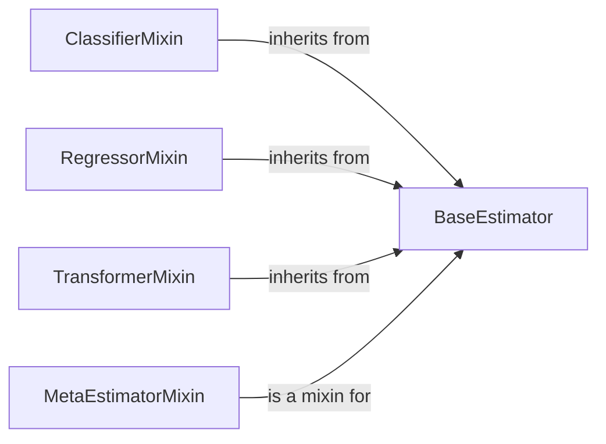

## Component Details

### BaseEstimator
The `BaseEstimator` class is the foundation for all estimators in scikit-learn, providing a consistent interface for parameter management through `get_params` and `set_params` methods. It also includes cloning functionality (`__sklearn_clone__`) to create copies of estimators, ensuring that models can be easily duplicated and reused. Additionally, it offers a basic string representation (`__repr__`) for model inspection.
- **Related Classes/Methods**: `sklearn.base.BaseEstimator`

### ClassifierMixin
The `ClassifierMixin` class is a mixin designed for classifier estimators, providing a default `score` method that calculates the accuracy score using `sklearn.metrics.accuracy_score`. This mixin simplifies the implementation of classifier scoring by offering a standardized approach, reducing code duplication and ensuring consistency across different classifiers.
- **Related Classes/Methods**: `sklearn.base.ClassifierMixin`

### RegressorMixin
The `RegressorMixin` class is a mixin tailored for regressor estimators, offering a default `score` method that computes the R^2 score using `sklearn.metrics.r2_score`. This mixin streamlines the implementation of regressor scoring by providing a consistent method across different regressors, promoting code reuse and standardization.
- **Related Classes/Methods**: `sklearn.base.RegressorMixin`

### TransformerMixin
The `TransformerMixin` class is a mixin intended for transformer estimators, supplying a default `fit_transform` method that sequentially calls the `fit` and `transform` methods. This simplifies the creation of transformers by offering a standard way to combine fitting and transformation steps, reducing boilerplate code and ensuring a consistent interface.
- **Related Classes/Methods**: `sklearn.base.TransformerMixin`

### MetaEstimatorMixin
The `MetaEstimatorMixin` class is a mixin class for meta-estimators, which are estimators that compose other estimators. It provides utility methods for getting the fitted sub-estimators, enabling easy access and manipulation of the underlying models within meta-estimators.
- **Related Classes/Methods**: `sklearn.base.MetaEstimatorMixin`
