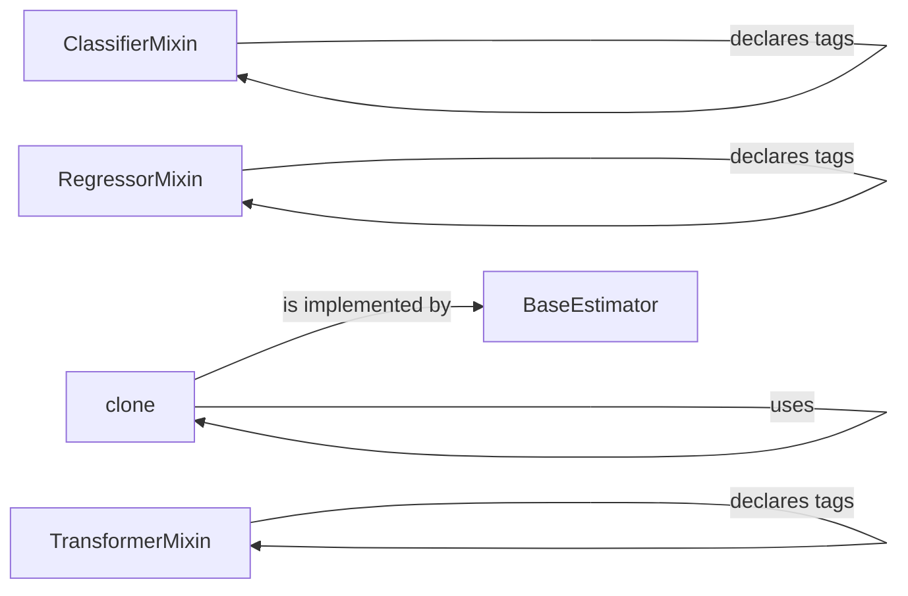

## Component Details

The `Core Estimators and Transformers` component in scikit-learn defines the foundational classes and interfaces for all estimators and transformers. It ensures a consistent API for model training, prediction, and data transformation across the library. The `BaseEstimator` class provides common methods for parameter management, validation, and cloning, while mixin classes like `TransformerMixin`, `ClassifierMixin`, and `RegressorMixin` extend this base functionality for specific estimator types. This unified foundation promotes code reuse, simplifies model development, and ensures interoperability between different scikit-learn components.

### BaseEstimator
Base class for all estimators in scikit-learn. It provides core functionalities like parameter management (get_params, set_params), validation (_validate_params), and cloning (__sklearn_clone__). It serves as a foundation for all estimators, ensuring consistency in their interfaces and behaviors.
**Related Classes/Methods**:

- <a href="https://github.com/scikit-learn/scikit-learn/blob/master/sklearn/base.py#L156-L473" target="_blank" rel="noopener noreferrer">`sklearn.base.BaseEstimator` (156:473)</a>
- <a href="https://github.com/scikit-learn/scikit-learn/blob/master/sklearn/base.py#L233-L255" target="_blank" rel="noopener noreferrer">`sklearn.base.BaseEstimator:get_params` (233:255)</a>
- <a href="https://github.com/scikit-learn/scikit-learn/blob/master/sklearn/base.py#L257-L313" target="_blank" rel="noopener noreferrer">`sklearn.base.BaseEstimator:_get_params_html` (257:313)</a>
- <a href="https://github.com/scikit-learn/scikit-learn/blob/master/sklearn/base.py#L315-L357" target="_blank" rel="noopener noreferrer">`sklearn.base.BaseEstimator:set_params` (315:357)</a>
- <a href="https://github.com/scikit-learn/scikit-learn/blob/master/sklearn/base.py#L359-L360" target="_blank" rel="noopener noreferrer">`sklearn.base.BaseEstimator:__sklearn_clone__` (359:360)</a>
- <a href="https://github.com/scikit-learn/scikit-learn/blob/master/sklearn/base.py#L461-L473" target="_blank" rel="noopener noreferrer">`sklearn.base.BaseEstimator:_validate_params` (461:473)</a>
- <a href="https://github.com/scikit-learn/scikit-learn/blob/master/sklearn/base.py#L203-L231" target="_blank" rel="noopener noreferrer">`sklearn.base.BaseEstimator:_get_param_names` (203:231)</a>

### ClassifierMixin
Mixin class for all classifier estimators in scikit-learn. It provides a default implementation for the `__sklearn_tags__` method, which is used to declare the estimator's capabilities and requirements. It interacts with BaseEstimator by extending its functionality with classifier-specific tags.
**Related Classes/Methods**:

- <a href="https://github.com/scikit-learn/scikit-learn/blob/master/sklearn/base.py#L476-L546" target="_blank" rel="noopener noreferrer">`sklearn.base.ClassifierMixin` (476:546)</a>
- <a href="https://github.com/scikit-learn/scikit-learn/blob/master/sklearn/base.py#L513-L518" target="_blank" rel="noopener noreferrer">`sklearn.base.ClassifierMixin:__sklearn_tags__` (513:518)</a>

### RegressorMixin
Mixin class for all regressor estimators in scikit-learn. It provides a default implementation for the `__sklearn_tags__` method, which is used to declare the estimator's capabilities and requirements. It interacts with BaseEstimator by extending its functionality with regressor-specific tags.
**Related Classes/Methods**:

- <a href="https://github.com/scikit-learn/scikit-learn/blob/master/sklearn/base.py#L549-L637" target="_blank" rel="noopener noreferrer">`sklearn.base.RegressorMixin` (549:637)</a>
- <a href="https://github.com/scikit-learn/scikit-learn/blob/master/sklearn/base.py#L586-L591" target="_blank" rel="noopener noreferrer">`sklearn.base.RegressorMixin:__sklearn_tags__` (586:591)</a>

### TransformerMixin
Mixin class for all transformer estimators in scikit-learn. It provides a default implementation for the `fit_transform` method, which chains the `fit` and `transform` methods. It interacts with BaseEstimator by extending its functionality with transformer-specific methods.
**Related Classes/Methods**:

- <a href="https://github.com/scikit-learn/scikit-learn/blob/master/sklearn/base.py#L799-L895" target="_blank" rel="noopener noreferrer">`sklearn.base.TransformerMixin` (799:895)</a>
- <a href="https://github.com/scikit-learn/scikit-learn/blob/master/sklearn/base.py#L832-L835" target="_blank" rel="noopener noreferrer">`sklearn.base.TransformerMixin:__sklearn_tags__` (832:835)</a>

### clone
A function in `sklearn.base` that creates a deep copy of an estimator. It uses `_clone_parametrized` to handle the cloning process, ensuring that all parameters are properly copied. It is used by BaseEstimator to provide cloning functionality.
**Related Classes/Methods**:

- <a href="https://github.com/scikit-learn/scikit-learn/blob/master/sklearn/base.py#L44-L95" target="_blank" rel="noopener noreferrer">`sklearn.base:clone` (44:95)</a>
- <a href="https://github.com/scikit-learn/scikit-learn/blob/master/sklearn/base.py#L98-L153" target="_blank" rel="noopener noreferrer">`sklearn.base:_clone_parametrized` (98:153)</a>