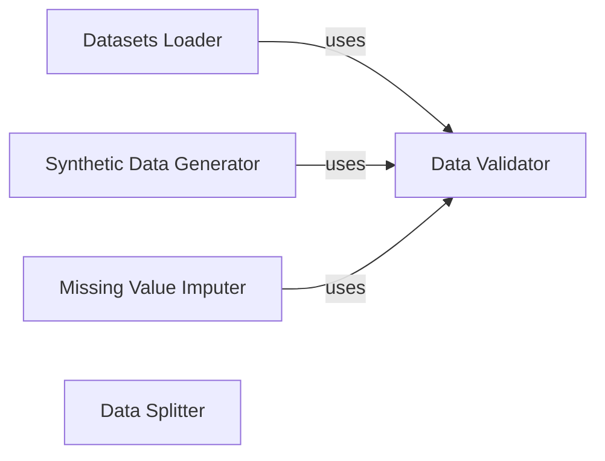

## Component Details

The Data Management subsystem in scikit-learn focuses on providing tools and utilities for handling data, including loading datasets from various sources, generating synthetic datasets, imputing missing values, splitting data into training and testing sets, and validating input data. The core functionality revolves around preparing data for machine learning tasks, ensuring data quality, and facilitating the creation of robust and reliable models.

### Datasets Loader
This component provides functions for loading datasets from various sources, including built-in datasets, remote URLs, and local files. It handles different data formats and provides utilities for fetching and caching data. It interacts with `sklearn.datasets._base` for base dataset loading functionalities and `sklearn.utils.validation` for data validation.
- **Related Classes/Methods**: `sklearn.datasets._base`, `sklearn.datasets._twenty_newsgroups`, `sklearn.datasets._lfw`, `sklearn.datasets._openml`, `sklearn.datasets._arff_parser`, `sklearn.datasets._california_housing`, `sklearn.datasets._species_distributions`, `sklearn.datasets._svmlight_format_io`, `sklearn.datasets._covtype`, `sklearn.datasets._olivetti_faces`, `sklearn.datasets._rcv1`, `sklearn.datasets._kddcup99`

### Synthetic Data Generator
This component provides functions for generating synthetic datasets for various machine learning tasks, including classification, regression, and clustering. It allows users to create datasets with specific characteristics and properties for testing and experimentation. It relies on `sklearn.datasets._samples_generator` for generating the data and interacts with `sklearn.utils.validation` for data validation.
- **Related Classes/Methods**: `sklearn.datasets._samples_generator`

### Missing Value Imputer
This component provides classes for imputing missing values in datasets using different strategies, such as mean, median, most frequent, constant value, or iterative imputation. It handles different data types and provides options for customizing the imputation process. It uses `sklearn.impute._base` for base imputation functionalities and interacts with `sklearn.utils.validation` for data validation.
- **Related Classes/Methods**: `sklearn.impute._base`, `sklearn.impute._iterative`, `sklearn.impute._knn`, `sklearn.impute.SimpleImputer`, `sklearn.impute.IterativeImputer`, `sklearn.impute.KNNImputer`

### Data Splitter
This component provides classes and functions for splitting data into training and testing sets using various cross-validation strategies. It allows users to create different types of splits for evaluating model performance and preventing overfitting. It relies on `sklearn.model_selection._split` for splitting logic.
- **Related Classes/Methods**: `sklearn.model_selection._split`, `sklearn.model_selection._split.train_test_split`, `sklearn.model_selection._split.BaseCrossValidator`

### Data Validator
This component provides utility functions for validating input data, including checking the shape, type, and format of arrays, and converting data to the appropriate format. It ensures that the data is in the correct format for subsequent processing steps. It is used by other components like `Datasets Loader`, `Synthetic Data Generator`, and `Missing Value Imputer`.
- **Related Classes/Methods**: `sklearn.utils.validation`
