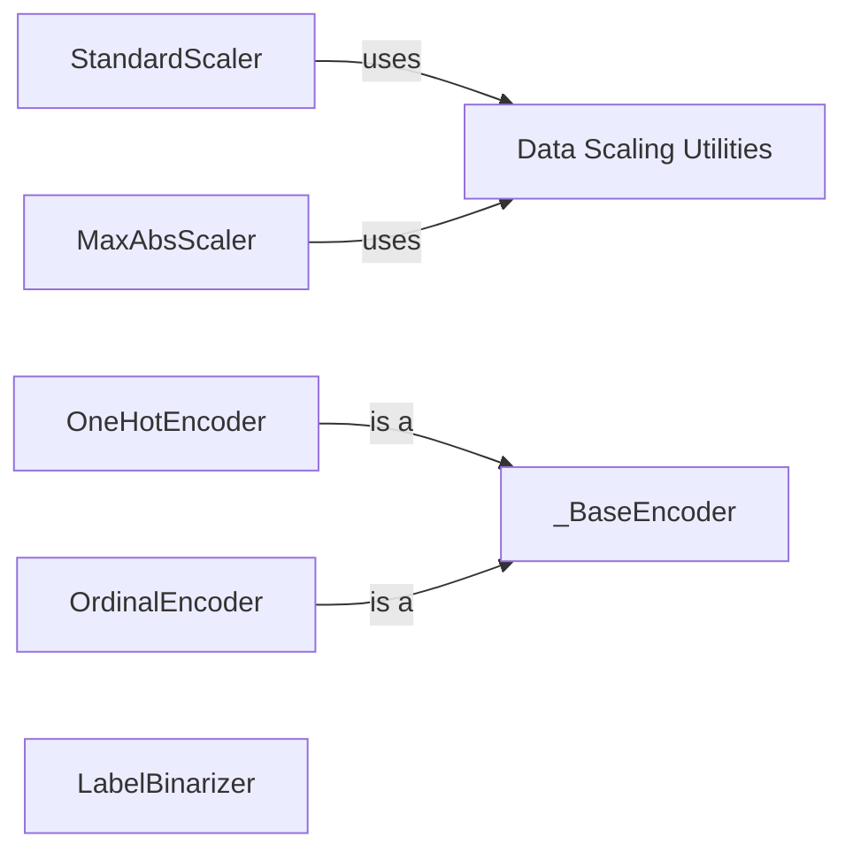

## Component Details

The Data Preprocessing and Feature Engineering component provides a suite of tools for transforming raw data into a format suitable for machine learning models. This involves scaling numerical features to a standard range, encoding categorical features into numerical representations, and imputing missing values. The goal is to improve model performance by ensuring data quality and compatibility with the chosen algorithms. The main flow involves selecting appropriate preprocessing techniques based on the data's characteristics, applying these transformations using classes like StandardScaler, OneHotEncoder, and SimpleImputer, and then feeding the processed data into the machine learning model.

### StandardScaler
StandardScaler standardizes features by removing the mean and scaling to unit variance. It is used to center and scale numerical features, making them comparable and preventing features with larger values from dominating the model. It uses the `scale` function from `sklearn.preprocessing._data` to perform the scaling.
**Related Classes/Methods**:

- <a href="https://github.com/scikit-learn/scikit-learn/blob/master/sklearn/preprocessing/_data.py#L723-L1149" target="_blank" rel="noopener noreferrer">`sklearn.preprocessing._data.StandardScaler` (723:1149)</a>
- <a href="https://github.com/scikit-learn/scikit-learn/blob/master/sklearn/preprocessing/_data.py#L882-L907" target="_blank" rel="noopener noreferrer">`sklearn.preprocessing._data.StandardScaler:fit` (882:907)</a>
- <a href="https://github.com/scikit-learn/scikit-learn/blob/master/sklearn/preprocessing/_data.py#L910-L1055" target="_blank" rel="noopener noreferrer">`sklearn.preprocessing._data.StandardScaler:partial_fit` (910:1055)</a>
- <a href="https://github.com/scikit-learn/scikit-learn/blob/master/sklearn/preprocessing/_data.py#L1144-L1149" target="_blank" rel="noopener noreferrer">`sklearn.preprocessing._data.StandardScaler:__sklearn_tags__` (1144:1149)</a>
- <a href="https://github.com/scikit-learn/scikit-learn/blob/master/sklearn/preprocessing/_data.py#L137-L292" target="_blank" rel="noopener noreferrer">`sklearn.preprocessing._data:scale` (137:292)</a>

### MaxAbsScaler
MaxAbsScaler scales features to the range [-1, 1] by dividing through the largest maximum absolute value in each feature. It is useful when dealing with sparse data or when preserving zero values is important. It also uses the `scale` function from `sklearn.preprocessing._data`.
**Related Classes/Methods**:

- <a href="https://github.com/scikit-learn/scikit-learn/blob/master/sklearn/preprocessing/_data.py#L1152-L1382" target="_blank" rel="noopener noreferrer">`sklearn.preprocessing._data.MaxAbsScaler` (1152:1382)</a>
- <a href="https://github.com/scikit-learn/scikit-learn/blob/master/sklearn/preprocessing/_data.py#L1241-L1260" target="_blank" rel="noopener noreferrer">`sklearn.preprocessing._data.MaxAbsScaler:fit` (1241:1260)</a>
- <a href="https://github.com/scikit-learn/scikit-learn/blob/master/sklearn/preprocessing/_data.py#L1263-L1310" target="_blank" rel="noopener noreferrer">`sklearn.preprocessing._data.MaxAbsScaler:partial_fit` (1263:1310)</a>
- <a href="https://github.com/scikit-learn/scikit-learn/blob/master/sklearn/preprocessing/_data.py#L1378-L1382" target="_blank" rel="noopener noreferrer">`sklearn.preprocessing._data.MaxAbsScaler:__sklearn_tags__` (1378:1382)</a>
- <a href="https://github.com/scikit-learn/scikit-learn/blob/master/sklearn/preprocessing/_data.py#L137-L292" target="_blank" rel="noopener noreferrer">`sklearn.preprocessing._data:scale` (137:292)</a>

### _BaseEncoder
_BaseEncoder is a base class for encoders, providing common functionality for handling infrequent categories and checking input data. It serves as a foundation for other encoders like OneHotEncoder and OrdinalEncoder. It contains methods for fitting and transforming data, as well as handling infrequent categories.
**Related Classes/Methods**:

- <a href="https://github.com/scikit-learn/scikit-learn/blob/master/sklearn/preprocessing/_encoders.py#L28-L462" target="_blank" rel="noopener noreferrer">`sklearn.preprocessing._encoders._BaseEncoder` (28:462)</a>
- <a href="https://github.com/scikit-learn/scikit-learn/blob/master/sklearn/preprocessing/_encoders.py#L72-L188" target="_blank" rel="noopener noreferrer">`sklearn.preprocessing._encoders._BaseEncoder:_fit` (72:188)</a>
- <a href="https://github.com/scikit-learn/scikit-learn/blob/master/sklearn/preprocessing/_encoders.py#L190-L256" target="_blank" rel="noopener noreferrer">`sklearn.preprocessing._encoders._BaseEncoder:_transform` (190:256)</a>
- <a href="https://github.com/scikit-learn/scikit-learn/blob/master/sklearn/preprocessing/_encoders.py#L324-L404" target="_blank" rel="noopener noreferrer">`sklearn.preprocessing._encoders._BaseEncoder:_fit_infrequent_category_mapping` (324:404)</a>
- <a href="https://github.com/scikit-learn/scikit-learn/blob/master/sklearn/preprocessing/_encoders.py#L458-L462" target="_blank" rel="noopener noreferrer">`sklearn.preprocessing._encoders._BaseEncoder:__sklearn_tags__` (458:462)</a>

### OneHotEncoder
OneHotEncoder encodes categorical features as a one-hot numeric array. It transforms each categorical feature into a set of binary features, where each binary feature represents one category. This is useful for converting categorical data into a numerical format that machine learning models can understand. It inherits from `_BaseEncoder`.
**Related Classes/Methods**:

- <a href="https://github.com/scikit-learn/scikit-learn/blob/master/sklearn/preprocessing/_encoders.py#L465-L1251" target="_blank" rel="noopener noreferrer">`sklearn.preprocessing._encoders.OneHotEncoder` (465:1251)</a>
- <a href="https://github.com/scikit-learn/scikit-learn/blob/master/sklearn/preprocessing/_encoders.py#L803-L917" target="_blank" rel="noopener noreferrer">`sklearn.preprocessing._encoders.OneHotEncoder:_set_drop_idx` (803:917)</a>
- <a href="https://github.com/scikit-learn/scikit-learn/blob/master/sklearn/preprocessing/_encoders.py#L919-L940" target="_blank" rel="noopener noreferrer">`sklearn.preprocessing._encoders.OneHotEncoder:_compute_transformed_categories` (919:940)</a>
- <a href="https://github.com/scikit-learn/scikit-learn/blob/master/sklearn/preprocessing/_encoders.py#L973-L998" target="_blank" rel="noopener noreferrer">`sklearn.preprocessing._encoders.OneHotEncoder:fit` (973:998)</a>
- <a href="https://github.com/scikit-learn/scikit-learn/blob/master/sklearn/preprocessing/_encoders.py#L1000-L1085" target="_blank" rel="noopener noreferrer">`sklearn.preprocessing._encoders.OneHotEncoder:transform` (1000:1085)</a>
- <a href="https://github.com/scikit-learn/scikit-learn/blob/master/sklearn/preprocessing/_encoders.py#L1087-L1204" target="_blank" rel="noopener noreferrer">`sklearn.preprocessing._encoders.OneHotEncoder:inverse_transform` (1087:1204)</a>
- <a href="https://github.com/scikit-learn/scikit-learn/blob/master/sklearn/preprocessing/_encoders.py#L1206-L1239" target="_blank" rel="noopener noreferrer">`sklearn.preprocessing._encoders.OneHotEncoder:get_feature_names_out` (1206:1239)</a>

### OrdinalEncoder
OrdinalEncoder encodes categorical features as ordinal integers. It transforms each categorical feature into a single integer representing the category's order. This is suitable for ordinal categorical features where the order of categories is meaningful. It inherits from `_BaseEncoder`.
**Related Classes/Methods**:

- <a href="https://github.com/scikit-learn/scikit-learn/blob/master/sklearn/preprocessing/_encoders.py#L1254-L1698" target="_blank" rel="noopener noreferrer">`sklearn.preprocessing._encoders.OrdinalEncoder` (1254:1698)</a>
- <a href="https://github.com/scikit-learn/scikit-learn/blob/master/sklearn/preprocessing/_encoders.py#L1474-L1580" target="_blank" rel="noopener noreferrer">`sklearn.preprocessing._encoders.OrdinalEncoder:fit` (1474:1580)</a>
- <a href="https://github.com/scikit-learn/scikit-learn/blob/master/sklearn/preprocessing/_encoders.py#L1582-L1612" target="_blank" rel="noopener noreferrer">`sklearn.preprocessing._encoders.OrdinalEncoder:transform` (1582:1612)</a>

### LabelBinarizer
LabelBinarizer binarizes labels in a one-vs-all fashion. It transforms a multiclass or multilabel array into a binary matrix. This is useful for converting categorical labels into a binary format for classification tasks.
**Related Classes/Methods**:

- <a href="https://github.com/scikit-learn/scikit-learn/blob/master/sklearn/preprocessing/_label.py#L174-L426" target="_blank" rel="noopener noreferrer">`sklearn.preprocessing._label.LabelBinarizer` (174:426)</a>
- <a href="https://github.com/scikit-learn/scikit-learn/blob/master/sklearn/preprocessing/_label.py#L315-L335" target="_blank" rel="noopener noreferrer">`sklearn.preprocessing._label.LabelBinarizer:fit_transform` (315:335)</a>
- <a href="https://github.com/scikit-learn/scikit-learn/blob/master/sklearn/preprocessing/_label.py#L337-L369" target="_blank" rel="noopener noreferrer">`sklearn.preprocessing._label.LabelBinarizer:transform` (337:369)</a>
- <a href="https://github.com/scikit-learn/scikit-learn/blob/master/sklearn/preprocessing/_label.py#L371-L420" target="_blank" rel="noopener noreferrer">`sklearn.preprocessing._label.LabelBinarizer:inverse_transform` (371:420)</a>
- <a href="https://github.com/scikit-learn/scikit-learn/blob/master/sklearn/preprocessing/_label.py#L422-L426" target="_blank" rel="noopener noreferrer">`sklearn.preprocessing._label.LabelBinarizer:__sklearn_tags__` (422:426)</a>

### Data Scaling Utilities
A collection of utility functions for scaling data, including handling zeros in scale. These utilities are used internally by scalers like StandardScaler and MaxAbsScaler to perform the actual scaling operations. The main function is `scale`.
**Related Classes/Methods**:

- <a href="https://github.com/scikit-learn/scikit-learn/blob/master/sklearn/preprocessing/_data.py#L137-L292" target="_blank" rel="noopener noreferrer">`sklearn.preprocessing._data:scale` (137:292)</a>