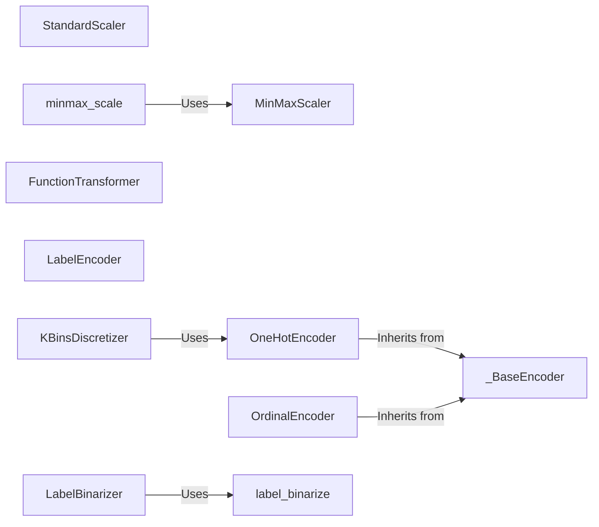

## Component Details

### StandardScaler
StandardScaler standardizes features by removing the mean and scaling to unit variance. It transforms the data such that each feature has a mean of 0 and a standard deviation of 1. This is a common preprocessing step for many machine learning algorithms.
- **Related Classes/Methods**: `sklearn.preprocessing._data.StandardScaler`

### MinMaxScaler
MinMaxScaler scales and translates each feature individually such that it is in the given range on the training set, typically between zero and one. It is useful when you need to bound your data within a specific range.
- **Related Classes/Methods**: `sklearn.preprocessing._data.MinMaxScaler`

### OneHotEncoder
OneHotEncoder encodes categorical features as a one-hot numeric array. It converts each category to a binary vector where only one element is 1 and the rest are 0. This is useful for converting categorical data into a format that machine learning algorithms can understand.
- **Related Classes/Methods**: `sklearn.preprocessing._encoders.OneHotEncoder`

### OrdinalEncoder
OrdinalEncoder encodes categorical features as ordinal integers. It assigns a unique integer to each category based on the order of appearance or a specified order. This is suitable for ordinal categorical features where the order of categories matters.
- **Related Classes/Methods**: `sklearn.preprocessing._encoders.OrdinalEncoder`

### KBinsDiscretizer
KBinsDiscretizer bins continuous data into intervals. It discretizes continuous features into a fixed number of bins, which can be useful for converting continuous data into categorical data or for simplifying complex relationships.
- **Related Classes/Methods**: `sklearn.preprocessing._discretization.KBinsDiscretizer`

### FunctionTransformer
FunctionTransformer constructs a transformer from an arbitrary callable. It allows users to apply a custom function to input data as part of a preprocessing pipeline, providing flexibility for custom transformations.
- **Related Classes/Methods**: `sklearn.preprocessing._function_transformer.FunctionTransformer`

### LabelEncoder
LabelEncoder encodes target labels with values between 0 and n_classes-1. It transforms non-numerical labels to numerical labels, which is necessary for many classification algorithms.
- **Related Classes/Methods**: `sklearn.preprocessing._label.LabelEncoder`

### LabelBinarizer
LabelBinarizer binarizes labels in a one-vs-all fashion. It transforms a multi-class or multi-label target to a binary representation, which is useful for multi-label classification problems.
- **Related Classes/Methods**: `sklearn.preprocessing._label.LabelBinarizer`
