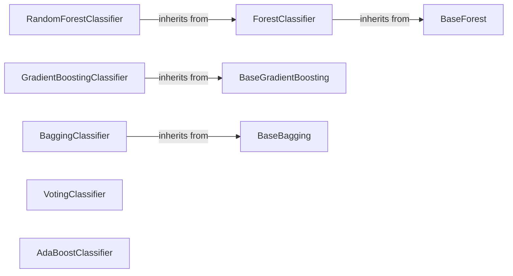

## Component Details

The Ensemble Methods component in scikit-learn provides a suite of meta-estimators designed to combine the predictions of multiple base estimators to enhance overall performance. These methods leverage the diversity of individual models to improve accuracy, robustness, and generalization to unseen data. The ensemble methods include bagging, boosting, and voting classifiers and regressors.

### BaseForest
The BaseForest class provides a foundation for forest-based ensemble methods. It handles common functionalities such as fitting estimators, validating input data, and computing out-of-bag (OOB) predictions. It serves as an abstract base class for both ForestClassifier and ForestRegressor, defining the structure and common methods for random forest-like algorithms.
**Related Classes/Methods**:

- <a href="https://github.com/scikit-learn/scikit-learn/blob/master/sklearn/ensemble/_forest.py#L207-L720" target="_blank" rel="noopener noreferrer">`sklearn.ensemble._forest.BaseForest` (207:720)</a>
- <a href="https://github.com/scikit-learn/scikit-learn/blob/master/sklearn/ensemble/_forest.py#L328-L540" target="_blank" rel="noopener noreferrer">`sklearn.ensemble._forest.BaseForest:fit` (328:540)</a>
- <a href="https://github.com/scikit-learn/scikit-learn/blob/master/sklearn/ensemble/_forest.py#L261-L285" target="_blank" rel="noopener noreferrer">`sklearn.ensemble._forest.BaseForest:apply` (261:285)</a>
- <a href="https://github.com/scikit-learn/scikit-learn/blob/master/sklearn/ensemble/_forest.py#L287-L325" target="_blank" rel="noopener noreferrer">`sklearn.ensemble._forest.BaseForest:decision_path` (287:325)</a>
- <a href="https://github.com/scikit-learn/scikit-learn/blob/master/sklearn/ensemble/_forest.py#L558-L622" target="_blank" rel="noopener noreferrer">`sklearn.ensemble._forest.BaseForest:_compute_oob_predictions` (558:622)</a>
- <a href="https://github.com/scikit-learn/scikit-learn/blob/master/sklearn/ensemble/_forest.py#L701-L712" target="_blank" rel="noopener noreferrer">`sklearn.ensemble._forest.BaseForest:estimators_samples_` (701:712)</a>

### ForestClassifier
The ForestClassifier class is an ensemble classifier that uses a collection of decision tree classifiers. It inherits from BaseForest and implements methods for prediction, probability estimation, and log-probability estimation. It aggregates the predictions of individual trees to make a final classification decision, providing a robust and accurate classification model.
**Related Classes/Methods**:

- <a href="https://github.com/scikit-learn/scikit-learn/blob/master/sklearn/ensemble/_forest.py#L739-L1005" target="_blank" rel="noopener noreferrer">`sklearn.ensemble._forest.ForestClassifier` (739:1005)</a>
- <a href="https://github.com/scikit-learn/scikit-learn/blob/master/sklearn/ensemble/_forest.py#L882-L919" target="_blank" rel="noopener noreferrer">`sklearn.ensemble._forest.ForestClassifier:predict` (882:919)</a>
- <a href="https://github.com/scikit-learn/scikit-learn/blob/master/sklearn/ensemble/_forest.py#L921-L967" target="_blank" rel="noopener noreferrer">`sklearn.ensemble._forest.ForestClassifier:predict_proba` (921:967)</a>
- <a href="https://github.com/scikit-learn/scikit-learn/blob/master/sklearn/ensemble/_forest.py#L969-L999" target="_blank" rel="noopener noreferrer">`sklearn.ensemble._forest.ForestClassifier:predict_log_proba` (969:999)</a>

### RandomForestClassifier
The RandomForestClassifier class is a specific type of ForestClassifier that uses a random subset of features for each tree. It inherits from ForestClassifier and is a popular and powerful ensemble method for classification tasks, known for its high accuracy and robustness to overfitting.
**Related Classes/Methods**:

- <a href="https://github.com/scikit-learn/scikit-learn/blob/master/sklearn/ensemble/_forest.py#L1174-L1565" target="_blank" rel="noopener noreferrer">`sklearn.ensemble._forest.RandomForestClassifier` (1174:1565)</a>

### BaseGradientBoosting
BaseGradientBoosting provides the foundation for gradient boosting methods. It includes methods for fitting the model, predicting, and managing the boosting process. It is an abstract class that defines the core structure and methods for gradient boosting algorithms, allowing for both classification and regression tasks.
**Related Classes/Methods**:

- <a href="https://github.com/scikit-learn/scikit-learn/blob/master/sklearn/ensemble/_gb.py#L353-L1123" target="_blank" rel="noopener noreferrer">`sklearn.ensemble._gb.BaseGradientBoosting` (353:1123)</a>
- <a href="https://github.com/scikit-learn/scikit-learn/blob/master/sklearn/ensemble/_gb.py#L615-L810" target="_blank" rel="noopener noreferrer">`sklearn.ensemble._gb.BaseGradientBoosting:fit` (615:810)</a>
- <a href="https://github.com/scikit-learn/scikit-learn/blob/master/sklearn/ensemble/_gb.py#L812-L942" target="_blank" rel="noopener noreferrer">`sklearn.ensemble._gb.BaseGradientBoosting:_fit_stages` (812:942)</a>
- <a href="https://github.com/scikit-learn/scikit-learn/blob/master/sklearn/ensemble/_gb.py#L962-L967" target="_blank" rel="noopener noreferrer">`sklearn.ensemble._gb.BaseGradientBoosting:_raw_predict` (962:967)</a>
- <a href="https://github.com/scikit-learn/scikit-learn/blob/master/sklearn/ensemble/_gb.py#L1085-L1118" target="_blank" rel="noopener noreferrer">`sklearn.ensemble._gb.BaseGradientBoosting:apply` (1085:1118)</a>

### GradientBoostingClassifier
GradientBoostingClassifier is a gradient boosting method for classification. It inherits from BaseGradientBoosting and implements methods for classification-specific tasks like decision function and probability estimation. It builds a strong classifier by combining multiple weak learners in a stage-wise fashion, optimizing a differentiable loss function.
**Related Classes/Methods**:

- <a href="https://github.com/scikit-learn/scikit-learn/blob/master/sklearn/ensemble/_gb.py#L1126-L1735" target="_blank" rel="noopener noreferrer">`sklearn.ensemble._gb.GradientBoostingClassifier` (1126:1735)</a>
- <a href="https://github.com/scikit-learn/scikit-learn/blob/master/sklearn/ensemble/_gb.py#L1612-L1632" target="_blank" rel="noopener noreferrer">`sklearn.ensemble._gb.GradientBoostingClassifier:predict` (1612:1632)</a>
- <a href="https://github.com/scikit-learn/scikit-learn/blob/master/sklearn/ensemble/_gb.py#L1661-L1683" target="_blank" rel="noopener noreferrer">`sklearn.ensemble._gb.GradientBoostingClassifier:predict_proba` (1661:1683)</a>
- <a href="https://github.com/scikit-learn/scikit-learn/blob/master/sklearn/ensemble/_gb.py#L1561-L1586" target="_blank" rel="noopener noreferrer">`sklearn.ensemble._gb.GradientBoostingClassifier:decision_function` (1561:1586)</a>

### BaseBagging
The BaseBagging class provides a base class for bagging ensemble methods. It handles the core logic for fitting multiple estimators on bootstrapped subsets of the training data. It includes methods for generating bagging indices, fitting estimators in parallel, and making predictions, providing a flexible framework for creating bagging-based ensembles.
**Related Classes/Methods**:

- <a href="https://github.com/scikit-learn/scikit-learn/blob/master/sklearn/ensemble/_bagging.py#L282-L684" target="_blank" rel="noopener noreferrer">`sklearn.ensemble._bagging.BaseBagging` (282:684)</a>
- <a href="https://github.com/scikit-learn/scikit-learn/blob/master/sklearn/ensemble/_bagging.py#L343-L395" target="_blank" rel="noopener noreferrer">`sklearn.ensemble._bagging.BaseBagging:fit` (343:395)</a>
- <a href="https://github.com/scikit-learn/scikit-learn/blob/master/sklearn/ensemble/_bagging.py#L400-L575" target="_blank" rel="noopener noreferrer">`sklearn.ensemble._bagging.BaseBagging:_fit` (400:575)</a>
- <a href="https://github.com/scikit-learn/scikit-learn/blob/master/sklearn/ensemble/_bagging.py#L586-L601" target="_blank" rel="noopener noreferrer">`sklearn.ensemble._bagging.BaseBagging:_get_estimators_indices` (586:601)</a>

### BaggingClassifier
The BaggingClassifier class is an ensemble classifier that uses bagging to combine the predictions of multiple base classifiers. It inherits from BaseBagging and implements methods for prediction, probability estimation, and log-probability estimation. It aggregates the predictions of individual classifiers to make a final classification decision, reducing variance and improving generalization.
**Related Classes/Methods**:

- <a href="https://github.com/scikit-learn/scikit-learn/blob/master/sklearn/ensemble/_bagging.py#L687-L1192" target="_blank" rel="noopener noreferrer">`sklearn.ensemble._bagging.BaggingClassifier` (687:1192)</a>
- <a href="https://github.com/scikit-learn/scikit-learn/blob/master/sklearn/ensemble/_bagging.py#L937-L969" target="_blank" rel="noopener noreferrer">`sklearn.ensemble._bagging.BaggingClassifier:predict` (937:969)</a>
- <a href="https://github.com/scikit-learn/scikit-learn/blob/master/sklearn/ensemble/_bagging.py#L971-L1043" target="_blank" rel="noopener noreferrer">`sklearn.ensemble._bagging.BaggingClassifier:predict_proba` (971:1043)</a>
- <a href="https://github.com/scikit-learn/scikit-learn/blob/master/sklearn/ensemble/_bagging.py#L1045-L1123" target="_blank" rel="noopener noreferrer">`sklearn.ensemble._bagging.BaggingClassifier:predict_log_proba` (1045:1123)</a>

### VotingClassifier
VotingClassifier is an ensemble method that combines multiple estimators using a voting mechanism. It implements methods for classification tasks, allowing for both hard and soft voting schemes to aggregate the predictions of diverse classifiers into a single, more robust prediction.
**Related Classes/Methods**:

- <a href="https://github.com/scikit-learn/scikit-learn/blob/master/sklearn/ensemble/_voting.py#L194-L539" target="_blank" rel="noopener noreferrer">`sklearn.ensemble._voting.VotingClassifier` (194:539)</a>
- <a href="https://github.com/scikit-learn/scikit-learn/blob/master/sklearn/ensemble/_voting.py#L354-L405" target="_blank" rel="noopener noreferrer">`sklearn.ensemble._voting.VotingClassifier:fit` (354:405)</a>
- <a href="https://github.com/scikit-learn/scikit-learn/blob/master/sklearn/ensemble/_voting.py#L407-L434" target="_blank" rel="noopener noreferrer">`sklearn.ensemble._voting.VotingClassifier:predict` (407:434)</a>
- <a href="https://github.com/scikit-learn/scikit-learn/blob/master/sklearn/ensemble/_voting.py#L448-L465" target="_blank" rel="noopener noreferrer">`sklearn.ensemble._voting.VotingClassifier:predict_proba` (448:465)</a>
- <a href="https://github.com/scikit-learn/scikit-learn/blob/master/sklearn/ensemble/_voting.py#L467-L497" target="_blank" rel="noopener noreferrer">`sklearn.ensemble._voting.VotingClassifier:transform` (467:497)</a>

### AdaBoostClassifier
AdaBoostClassifier is a boosting method that combines multiple weak learners into a strong learner. It inherits from BaseWeightBoosting and implements methods for classification tasks. AdaBoost iteratively adjusts the weights of training instances, focusing on those that are difficult to classify, to create a powerful ensemble.
**Related Classes/Methods**:

- <a href="https://github.com/scikit-learn/scikit-learn/blob/master/sklearn/ensemble/_weight_boosting.py#L342-L864" target="_blank" rel="noopener noreferrer">`sklearn.ensemble._weight_boosting.AdaBoostClassifier` (342:864)</a>
- <a href="https://github.com/scikit-learn/scikit-learn/blob/master/sklearn/ensemble/_weight_boosting.py#L616-L638" target="_blank" rel="noopener noreferrer">`sklearn.ensemble._weight_boosting.AdaBoostClassifier:predict` (616:638)</a>
- <a href="https://github.com/scikit-learn/scikit-learn/blob/master/sklearn/ensemble/_weight_boosting.py#L674-L715" target="_blank" rel="noopener noreferrer">`sklearn.ensemble._weight_boosting.AdaBoostClassifier:decision_function` (674:715)</a>
- <a href="https://github.com/scikit-learn/scikit-learn/blob/master/sklearn/ensemble/_weight_boosting.py#L787-L813" target="_blank" rel="noopener noreferrer">`sklearn.ensemble._weight_boosting.AdaBoostClassifier:predict_proba` (787:813)</a>
- <a href="https://github.com/scikit-learn/scikit-learn/blob/master/sklearn/ensemble/_weight_boosting.py#L845-L864" target="_blank" rel="noopener noreferrer">`sklearn.ensemble._weight_boosting.AdaBoostClassifier:predict_log_proba` (845:864)</a>