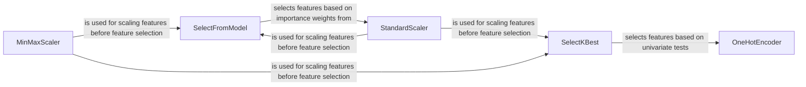

## Component Details

### SelectKBest
SelectKBest selects the K best features based on univariate statistical tests. It acts as a filter, independently evaluating each feature's relevance to the target variable using a scoring function like chi2, f_classif, or mutual information. The top K features with the highest scores are retained, while the rest are discarded. This is useful for dimensionality reduction and improving model performance by focusing on the most informative features.
- **Related Classes/Methods**: `sklearn.feature_selection._univariate_selection.SelectKBest`

### SelectFromModel
SelectFromModel is a meta-transformer that selects features based on the importance weights assigned by a base estimator. The base estimator can be any supervised learning model with a feature_importances_ or coef_ attribute. Features with importance weights below a specified threshold are removed. This allows feature selection to be integrated directly into the model training process, leveraging the model's own assessment of feature importance.
- **Related Classes/Methods**: `sklearn.feature_selection._from_model.SelectFromModel`

### OneHotEncoder
OneHotEncoder transforms categorical features into one-hot encoded numerical features. Each category is represented as a binary vector, where only one element is 1 and the rest are 0. This is essential for converting categorical data into a format suitable for many machine learning algorithms that require numerical input. It handles multiple categories within a single feature and can be configured to drop one category to avoid multicollinearity.
- **Related Classes/Methods**: `sklearn.preprocessing._encoders.OneHotEncoder`

### MinMaxScaler
MinMaxScaler scales features by transforming each feature to a given range, typically between 0 and 1. It preserves the shape of the original distribution. It is useful when you have features on different scales and want to normalize them to a common range. This can be beneficial for algorithms sensitive to feature scaling.
- **Related Classes/Methods**: `sklearn.preprocessing._data.MinMaxScaler`

### StandardScaler
StandardScaler standardizes features by removing the mean and scaling to unit variance. It transforms the data such that each feature has a mean of 0 and a standard deviation of 1. This is a common preprocessing step that helps improve the performance of many machine learning algorithms, especially those that assume normally distributed data.
- **Related Classes/Methods**: `sklearn.preprocessing._data.StandardScaler`
