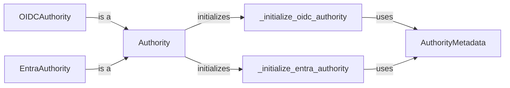

## Component Details

The Identity Provider Abstraction component in MSAL Python handles interactions with various identity providers like Azure AD and ADFS. It resolves the authority URL, retrieves metadata, and provides endpoint and capability information. This abstraction enables MSAL to support diverse identity providers without significant code changes. The core flow involves initializing an Authority object, determining the authority type (OIDC or Entra), retrieving metadata, and providing access to endpoints for authentication.

### Authority
The Authority class serves as the base class for handling different types of authorities. It manages the authority URL, validates the authority, and initializes the appropriate authority handler (OIDC or Entra) based on the authority type. It also provides methods for retrieving metadata and constructing endpoints.
- **Related Classes/Methods**: `msal.authority.Authority`

### OIDCAuthority
The OIDCAuthority class extends the Authority class and provides specific functionality for OpenID Connect authorities. It handles OIDC-specific metadata retrieval and endpoint discovery, adhering to the OIDC protocol standards.
- **Related Classes/Methods**: `msal.authority.OIDCAuthority`

### EntraAuthority
The EntraAuthority class extends the Authority class and provides specific functionality for Entra authorities (Azure AD). It handles Entra-specific metadata retrieval and endpoint discovery, tailored for Azure AD environments.
- **Related Classes/Methods**: `msal.authority.EntraAuthority`

### AuthorityMetadata
The AuthorityMetadata class represents the metadata of an authority, including endpoints, capabilities, and other relevant information. It is used by the Authority class and its subclasses to store and access authority-specific configuration details retrieved from the identity provider.
- **Related Classes/Methods**: `msal.authority.AuthorityMetadata`

### _initialize_oidc_authority
This method is responsible for initializing the Authority object as an OpenID Connect (OIDC) authority. It performs specific setup and configuration steps required for OIDC authentication flows, such as retrieving OIDC metadata.
- **Related Classes/Methods**: `msal.authority.Authority`

### _initialize_entra_authority
This method initializes the Authority object as an Entra authority (Azure AD). It performs specific setup and configuration steps required for Azure AD authentication flows, such as retrieving Azure AD metadata.
- **Related Classes/Methods**: `msal.authority.Authority`
