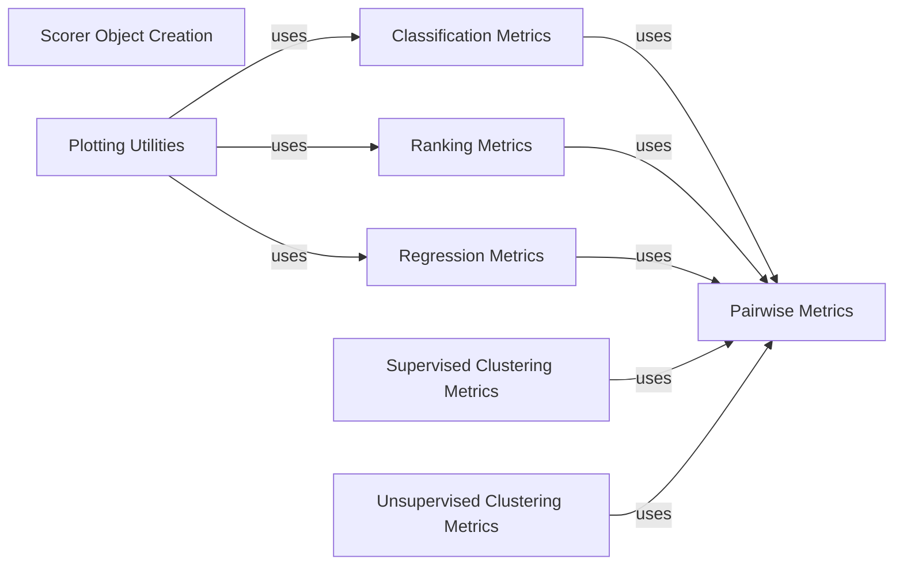

## Component Details

The Metrics and Scoring Functions component in scikit-learn provides a comprehensive suite of tools for evaluating machine learning model performance. It encompasses a wide range of metrics tailored to different task types, including classification, regression, and clustering. The component also offers functionalities for creating custom scoring functions, enabling users to define evaluation criteria specific to their problem domains. These metrics and scoring functions are essential for model selection, hyperparameter tuning, and performance monitoring.

### Classification Metrics
This component provides metrics specifically designed for evaluating classification models. It includes measures such as accuracy, precision, recall, F1-score, and log loss. Additionally, it offers tools for generating confusion matrices, which provide detailed insights into the types of errors made by the classifier.
**Related Classes/Methods**:

- <a href="https://github.com/scikit-learn/scikit-learn/blob/master/sklearn/metrics/_classification.py#L296-L368" target="_blank" rel="noopener noreferrer">`sklearn.metrics._classification.accuracy_score` (296:368)</a>
- <a href="https://github.com/scikit-learn/scikit-learn/blob/master/sklearn/metrics/_classification.py#L3147-L3225" target="_blank" rel="noopener noreferrer">`sklearn.metrics._classification.log_loss` (3147:3225)</a>
- <a href="https://github.com/scikit-learn/scikit-learn/blob/master/sklearn/metrics/_classification.py#L381-L543" target="_blank" rel="noopener noreferrer">`sklearn.metrics._classification.confusion_matrix` (381:543)</a>
- <a href="https://github.com/scikit-learn/scikit-learn/blob/master/sklearn/metrics/_classification.py#L1790-L2045" target="_blank" rel="noopener noreferrer">`sklearn.metrics._classification.precision_recall_fscore_support` (1790:2045)</a>

### Regression Metrics
This component provides metrics for evaluating regression models. It includes measures such as mean squared error, mean absolute error, and R-squared score, which quantify the accuracy and goodness-of-fit of the regression predictions.
**Related Classes/Methods**:

- <a href="https://github.com/scikit-learn/scikit-learn/blob/master/sklearn/metrics/_regression.py#L523-L600" target="_blank" rel="noopener noreferrer">`sklearn.metrics._regression.mean_squared_error` (523:600)</a>
- <a href="https://github.com/scikit-learn/scikit-learn/blob/master/sklearn/metrics/_regression.py#L225-L306" target="_blank" rel="noopener noreferrer">`sklearn.metrics._regression.mean_absolute_error` (225:306)</a>
- <a href="https://github.com/scikit-learn/scikit-learn/blob/master/sklearn/metrics/_regression.py#L1144-L1306" target="_blank" rel="noopener noreferrer">`sklearn.metrics._regression.r2_score` (1144:1306)</a>

### Unsupervised Clustering Metrics
This component provides metrics for evaluating clustering performance without relying on ground truth labels. It includes measures such as silhouette score and Calinski-Harabasz score, which assess the quality and compactness of the clusters.
**Related Classes/Methods**:

- <a href="https://github.com/scikit-learn/scikit-learn/blob/master/sklearn/metrics/cluster/_unsupervised.py#L51-L138" target="_blank" rel="noopener noreferrer">`sklearn.metrics.cluster._unsupervised.silhouette_score` (51:138)</a>
- <a href="https://github.com/scikit-learn/scikit-learn/blob/master/sklearn/metrics/cluster/_unsupervised.py#L325-L386" target="_blank" rel="noopener noreferrer">`sklearn.metrics.cluster._unsupervised.calinski_harabasz_score` (325:386)</a>

### Scorer Object Creation
This component defines the infrastructure for creating scorer objects from metric functions. It allows users to create custom scoring functions and provides a standardized way to evaluate models across different metrics. It includes functionalities for checking the validity of scoring parameters and handling multi-metric scoring.
**Related Classes/Methods**:

- <a href="https://github.com/scikit-learn/scikit-learn/blob/master/sklearn/metrics/_scorer.py#L653-L730" target="_blank" rel="noopener noreferrer">`sklearn.metrics._scorer.make_scorer` (653:730)</a>
- <a href="https://github.com/scikit-learn/scikit-learn/blob/master/sklearn/metrics/_scorer.py#L945-L1049" target="_blank" rel="noopener noreferrer">`sklearn.metrics._scorer.check_scoring` (945:1049)</a>
- <a href="https://github.com/scikit-learn/scikit-learn/blob/master/sklearn/metrics/_scorer.py#L359-L408" target="_blank" rel="noopener noreferrer">`sklearn.metrics._scorer._Scorer` (359:408)</a>
- <a href="https://github.com/scikit-learn/scikit-learn/blob/master/sklearn/metrics/_scorer.py#L100-L211" target="_blank" rel="noopener noreferrer">`sklearn.metrics._scorer._MultimetricScorer` (100:211)</a>

### Pairwise Metrics
This component focuses on calculating distances and similarities between pairs of data points. It provides implementations for various distance metrics like Euclidean, Manhattan, and cosine, as well as kernel functions like RBF and polynomial. These pairwise measures are fundamental for algorithms such as clustering, classification (e.g., k-NN), and kernel methods.
**Related Classes/Methods**:

- <a href="https://github.com/scikit-learn/scikit-learn/blob/master/sklearn/metrics/pairwise.py#L2269-L2477" target="_blank" rel="noopener noreferrer">`sklearn.metrics.pairwise.pairwise_distances` (2269:2477)</a>
- <a href="https://github.com/scikit-learn/scikit-learn/blob/master/sklearn/metrics/pairwise.py#L283-L388" target="_blank" rel="noopener noreferrer">`sklearn.metrics.pairwise.euclidean_distances` (283:388)</a>
- <a href="https://github.com/scikit-learn/scikit-learn/blob/master/sklearn/metrics/pairwise.py#L1683-L1738" target="_blank" rel="noopener noreferrer">`sklearn.metrics.pairwise.cosine_similarity` (1683:1738)</a>
- <a href="https://github.com/scikit-learn/scikit-learn/blob/master/sklearn/metrics/pairwise.py#L1567-L1612" target="_blank" rel="noopener noreferrer">`sklearn.metrics.pairwise.rbf_kernel` (1567:1612)</a>
- <a href="https://github.com/scikit-learn/scikit-learn/blob/master/sklearn/metrics/pairwise.py#L75-L234" target="_blank" rel="noopener noreferrer">`sklearn.metrics.pairwise.check_pairwise_arrays` (75:234)</a>

### Ranking Metrics
This component focuses on evaluating the performance of ranking models and information retrieval systems. It includes metrics like ROC AUC score, average precision score, and NDCG score, which assess the quality of ranked lists.
**Related Classes/Methods**:

- <a href="https://github.com/scikit-learn/scikit-learn/blob/master/sklearn/metrics/_ranking.py#L466-L700" target="_blank" rel="noopener noreferrer">`sklearn.metrics._ranking.roc_auc_score` (466:700)</a>
- <a href="https://github.com/scikit-learn/scikit-learn/blob/master/sklearn/metrics/_ranking.py#L921-L1056" target="_blank" rel="noopener noreferrer">`sklearn.metrics._ranking.precision_recall_curve` (921:1056)</a>
- <a href="https://github.com/scikit-learn/scikit-learn/blob/master/sklearn/metrics/_ranking.py#L43-L105" target="_blank" rel="noopener noreferrer">`sklearn.metrics._ranking.auc` (43:105)</a>
- <a href="https://github.com/scikit-learn/scikit-learn/blob/master/sklearn/metrics/_ranking.py#L1796-L1903" target="_blank" rel="noopener noreferrer">`sklearn.metrics._ranking.ndcg_score` (1796:1903)</a>

### Supervised Clustering Metrics
This component provides metrics for evaluating clustering performance when ground truth labels are available. It includes measures such as adjusted Rand index and normalized mutual information, which assess the similarity between the predicted clusters and the true labels.
**Related Classes/Methods**:

- <a href="https://github.com/scikit-learn/scikit-learn/blob/master/sklearn/metrics/cluster/_supervised.py#L349-L451" target="_blank" rel="noopener noreferrer">`sklearn.metrics.cluster._supervised.adjusted_rand_score` (349:451)</a>
- <a href="https://github.com/scikit-learn/scikit-learn/blob/master/sklearn/metrics/cluster/_supervised.py#L1073-L1174" target="_blank" rel="noopener noreferrer">`sklearn.metrics.cluster._supervised.normalized_mutual_info_score` (1073:1174)</a>
- <a href="https://github.com/scikit-learn/scikit-learn/blob/master/sklearn/metrics/cluster/_supervised.py#L96-L171" target="_blank" rel="noopener noreferrer">`sklearn.metrics.cluster._supervised.contingency_matrix` (96:171)</a>

### Plotting Utilities
This component offers functions for visualizing various metrics, such as confusion matrices, ROC curves, and precision-recall curves. These plots provide visual representations of model performance, aiding in model interpretation and comparison.
**Related Classes/Methods**:

- <a href="https://github.com/scikit-learn/scikit-learn/blob/master/sklearn/metrics/_plot/confusion_matrix.py#L15-L499" target="_blank" rel="noopener noreferrer">`sklearn.metrics._plot.confusion_matrix.ConfusionMatrixDisplay` (15:499)</a>
- <a href="https://github.com/scikit-learn/scikit-learn/blob/master/sklearn/metrics/_plot/roc_curve.py#L22-L796" target="_blank" rel="noopener noreferrer">`sklearn.metrics._plot.roc_curve.RocCurveDisplay` (22:796)</a>
- <a href="https://github.com/scikit-learn/scikit-learn/blob/master/sklearn/metrics/_plot/precision_recall_curve.py#L14-L555" target="_blank" rel="noopener noreferrer">`sklearn.metrics._plot.precision_recall_curve.PrecisionRecallDisplay` (14:555)</a>