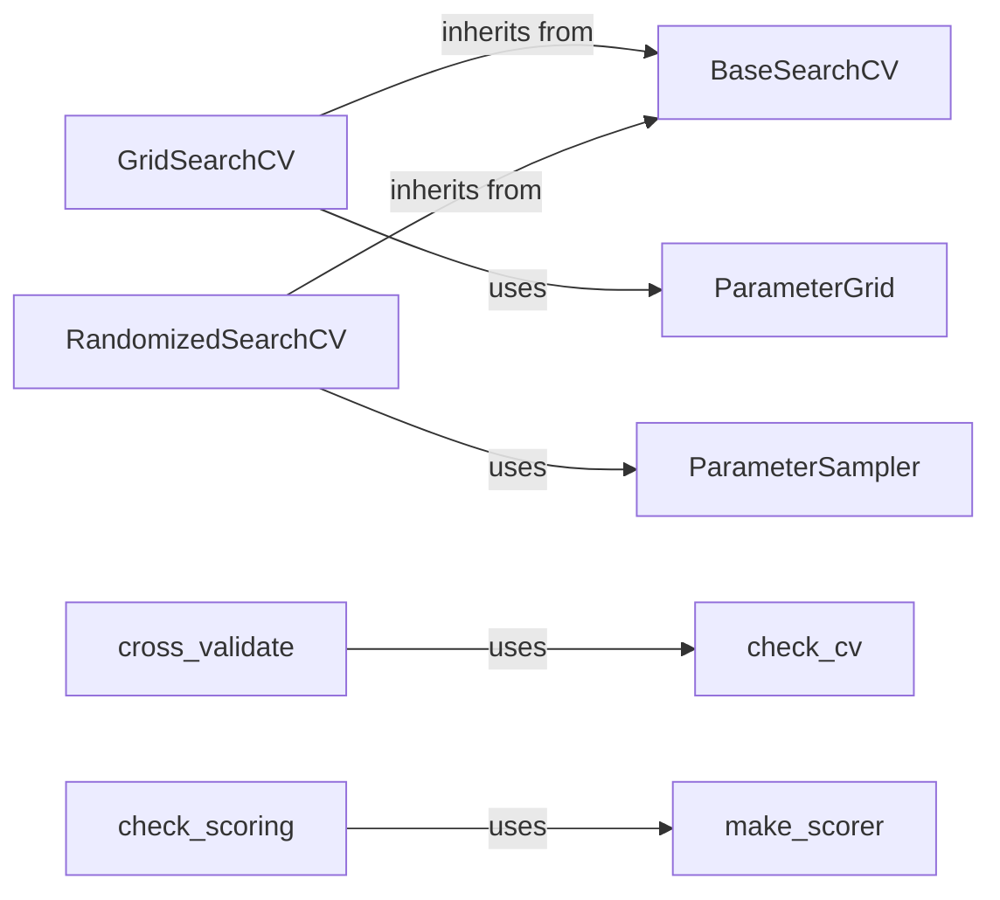

## Component Details

The Model Evaluation and Selection component in scikit-learn provides tools for assessing model performance, selecting the best model from a set of candidates, and tuning hyperparameters to optimize model generalization. It encompasses cross-validation techniques for robust performance estimation, scoring metrics to quantify model accuracy, and search strategies like GridSearchCV and RandomizedSearchCV for efficient hyperparameter optimization. These tools enable users to evaluate model accuracy, compare different models, and optimize model parameters for improved generalization and predictive power.

### BaseSearchCV
Base class for hyperparameter search with cross-validation. It provides common functionality for GridSearchCV and RandomizedSearchCV, such as fitting, prediction, scoring, and result formatting. It handles the cross-validation logic and stores the results of each fold.
**Related Classes/Methods**:

- <a href="https://github.com/scikit-learn/scikit-learn/blob/master/sklearn/model_selection/_search.py#L484-L494" target="_blank" rel="noopener noreferrer">`sklearn.model_selection._search.BaseSearchCV:__sklearn_tags__` (484:494)</a>
- <a href="https://github.com/scikit-learn/scikit-learn/blob/master/sklearn/model_selection/_search.py#L496-L553" target="_blank" rel="noopener noreferrer">`sklearn.model_selection._search.BaseSearchCV:score` (496:553)</a>
- <a href="https://github.com/scikit-learn/scikit-learn/blob/master/sklearn/model_selection/_search.py#L556-L576" target="_blank" rel="noopener noreferrer">`sklearn.model_selection._search.BaseSearchCV:score_samples` (556:576)</a>
- <a href="https://github.com/scikit-learn/scikit-learn/blob/master/sklearn/model_selection/_search.py#L579-L598" target="_blank" rel="noopener noreferrer">`sklearn.model_selection._search.BaseSearchCV:predict` (579:598)</a>
- <a href="https://github.com/scikit-learn/scikit-learn/blob/master/sklearn/model_selection/_search.py#L601-L621" target="_blank" rel="noopener noreferrer">`sklearn.model_selection._search.BaseSearchCV:predict_proba` (601:621)</a>
- <a href="https://github.com/scikit-learn/scikit-learn/blob/master/sklearn/model_selection/_search.py#L624-L644" target="_blank" rel="noopener noreferrer">`sklearn.model_selection._search.BaseSearchCV:predict_log_proba` (624:644)</a>
- <a href="https://github.com/scikit-learn/scikit-learn/blob/master/sklearn/model_selection/_search.py#L647-L667" target="_blank" rel="noopener noreferrer">`sklearn.model_selection._search.BaseSearchCV:decision_function` (647:667)</a>
- <a href="https://github.com/scikit-learn/scikit-learn/blob/master/sklearn/model_selection/_search.py#L670-L689" target="_blank" rel="noopener noreferrer">`sklearn.model_selection._search.BaseSearchCV:transform` (670:689)</a>
- <a href="https://github.com/scikit-learn/scikit-learn/blob/master/sklearn/model_selection/_search.py#L692-L711" target="_blank" rel="noopener noreferrer">`sklearn.model_selection._search.BaseSearchCV:inverse_transform` (692:711)</a>
- <a href="https://github.com/scikit-learn/scikit-learn/blob/master/sklearn/model_selection/_search.py#L733-L739" target="_blank" rel="noopener noreferrer">`sklearn.model_selection._search.BaseSearchCV:classes_` (733:739)</a>
- <a href="https://github.com/scikit-learn/scikit-learn/blob/master/sklearn/model_selection/_search.py#L836-L859" target="_blank" rel="noopener noreferrer">`sklearn.model_selection._search.BaseSearchCV:_get_scorers` (836:859)</a>
- <a href="https://github.com/scikit-learn/scikit-learn/blob/master/sklearn/model_selection/_search.py#L861-L886" target="_blank" rel="noopener noreferrer">`sklearn.model_selection._search.BaseSearchCV:_check_scorers_accept_sample_weight` (861:886)</a>
- <a href="https://github.com/scikit-learn/scikit-learn/blob/master/sklearn/model_selection/_search.py#L888-L912" target="_blank" rel="noopener noreferrer">`sklearn.model_selection._search.BaseSearchCV:_get_routed_params_for_fit` (888:912)</a>
- <a href="https://github.com/scikit-learn/scikit-learn/blob/master/sklearn/model_selection/_search.py#L918-L1107" target="_blank" rel="noopener noreferrer">`sklearn.model_selection._search.BaseSearchCV:fit` (918:1107)</a>
- <a href="https://github.com/scikit-learn/scikit-learn/blob/master/sklearn/model_selection/_search.py#L1109-L1193" target="_blank" rel="noopener noreferrer">`sklearn.model_selection._search.BaseSearchCV:_format_results` (1109:1193)</a>
- <a href="https://github.com/scikit-learn/scikit-learn/blob/master/sklearn/model_selection/_search.py#L1195-L1226" target="_blank" rel="noopener noreferrer">`sklearn.model_selection._search.BaseSearchCV:get_metadata_routing` (1195:1226)</a>

### GridSearchCV
Performs an exhaustive search over a specified parameter grid. It inherits from BaseSearchCV and uses ParameterGrid to generate all possible combinations of parameter values. It then evaluates the model for each combination using cross-validation.
**Related Classes/Methods**:

- <a href="https://github.com/scikit-learn/scikit-learn/blob/master/sklearn/model_selection/_search.py#L1576-L1601" target="_blank" rel="noopener noreferrer">`sklearn.model_selection._search.GridSearchCV:__init__` (1576:1601)</a>
- <a href="https://github.com/scikit-learn/scikit-learn/blob/master/sklearn/model_selection/_search.py#L1603-L1605" target="_blank" rel="noopener noreferrer">`sklearn.model_selection._search.GridSearchCV:_run_search` (1603:1605)</a>

### RandomizedSearchCV
Performs a randomized search over a specified parameter distribution. It inherits from BaseSearchCV and uses ParameterSampler to generate random combinations of parameter values. It then evaluates the model for each combination using cross-validation.
**Related Classes/Methods**:

- <a href="https://github.com/scikit-learn/scikit-learn/blob/master/sklearn/model_selection/_search.py#L1959-L1988" target="_blank" rel="noopener noreferrer">`sklearn.model_selection._search.RandomizedSearchCV:__init__` (1959:1988)</a>
- <a href="https://github.com/scikit-learn/scikit-learn/blob/master/sklearn/model_selection/_search.py#L1990-L1996" target="_blank" rel="noopener noreferrer">`sklearn.model_selection._search.RandomizedSearchCV:_run_search` (1990:1996)</a>

### ParameterSampler
Generates a sequence of parameter settings by sampling from specified distributions. It is used by RandomizedSearchCV to create random combinations of parameter values.
**Related Classes/Methods**:

- <a href="https://github.com/scikit-learn/scikit-learn/blob/master/sklearn/model_selection/_search.py#L305-L338" target="_blank" rel="noopener noreferrer">`sklearn.model_selection._search.ParameterSampler:__iter__` (305:338)</a>
- <a href="https://github.com/scikit-learn/scikit-learn/blob/master/sklearn/model_selection/_search.py#L340-L346" target="_blank" rel="noopener noreferrer">`sklearn.model_selection._search.ParameterSampler:__len__` (340:346)</a>

### ParameterGrid
Generates a grid of parameter settings. It is used by GridSearchCV to create all possible combinations of parameter values.
**Related Classes/Methods**:

- <a href="https://github.com/scikit-learn/scikit-learn/blob/master/sklearn/model_selection/_search.py#L60-L210" target="_blank" rel="noopener noreferrer">`sklearn.model_selection._search.ParameterGrid` (60:210)</a>

### cross_validate
Evaluates metric(s) by cross-validation and also records fit/score times. It differs from cross_val_score by allowing for multiple metric scoring and to return train scores, fit times and score times in addition to the test score.
**Related Classes/Methods**:

- <a href="https://github.com/scikit-learn/scikit-learn/blob/master/sklearn/model_selection/_validation.py#L124-L450" target="_blank" rel="noopener noreferrer">`sklearn.model_selection._validation:cross_validate` (124:450)</a>

### check_cv
Input checker routine for cross-validation. It is responsible for normalizing input into a cross-validation generator.
**Related Classes/Methods**:

- <a href="https://github.com/scikit-learn/scikit-learn/blob/master/sklearn/model_selection/_split.py#L2685-L2749" target="_blank" rel="noopener noreferrer">`sklearn.model_selection._split:check_cv` (2685:2749)</a>

### make_scorer
Make a scorer from a metric or scoring function.
**Related Classes/Methods**:

- <a href="https://github.com/scikit-learn/scikit-learn/blob/master/sklearn/metrics/_scorer.py#L653-L730" target="_blank" rel="noopener noreferrer">`sklearn.metrics._scorer:make_scorer` (653:730)</a>

### check_scoring
Determine scorer from user options.
**Related Classes/Methods**:

- <a href="https://github.com/scikit-learn/scikit-learn/blob/master/sklearn/metrics/_scorer.py#L945-L1049" target="_blank" rel="noopener noreferrer">`sklearn.metrics._scorer:check_scoring` (945:1049)</a>