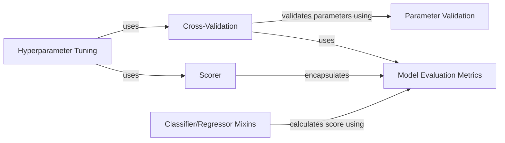

## Component Details

### Model Evaluation Metrics
This component provides a collection of functions for evaluating the performance of machine learning models. It includes metrics for classification (e.g., accuracy, precision, recall, F1-score, ROC AUC, log loss) and regression (e.g., R^2 score). These metrics quantify how well a model is performing on a given dataset, allowing for comparison and selection of the best model.
- **Related Classes/Methods**: `sklearn.metrics._classification`, `sklearn.metrics._regression`, `sklearn.metrics._ranking`, `sklearn.metrics._scorer`

### Cross-Validation
This component implements cross-validation techniques for estimating the generalization performance of a model. It splits the data into multiple folds, trains the model on some folds, and tests it on the remaining folds. This process is repeated multiple times, and the results are averaged to provide a more robust estimate of the model's performance than a single train-test split.
- **Related Classes/Methods**: `sklearn.model_selection._validation`, `sklearn.model_selection._split`

### Hyperparameter Tuning
This component provides tools for searching for the optimal hyperparameters of a machine learning model. It includes techniques such as grid search and randomized search, which systematically explore different combinations of hyperparameters and evaluate their performance using cross-validation. This allows for automated optimization of model performance.
- **Related Classes/Methods**: `sklearn.model_selection._search`

### Scorer
This component provides a way to create scoring objects from metric functions or callables. These scoring objects can be used in cross-validation and hyperparameter tuning to evaluate the performance of a model. It encapsulates a scoring function and provides a consistent interface for evaluating models.
- **Related Classes/Methods**: `sklearn.metrics._scorer`

### Parameter Validation
This component validates the parameters of an estimator against their declared types and values. It ensures that the parameters passed to a model are valid and consistent with the model's requirements, preventing errors and improving the reliability of the model.
- **Related Classes/Methods**: `sklearn.utils._param_validation`

### Classifier/Regressor Mixins
These mixin classes provide default implementations for common methods used by classifiers and regressors, such as the `score` method. The `score` method calculates a performance metric (e.g., accuracy for classifiers, R^2 for regressors) on a given dataset. These mixins promote code reuse and consistency across different types of models.
- **Related Classes/Methods**: `sklearn.base`
