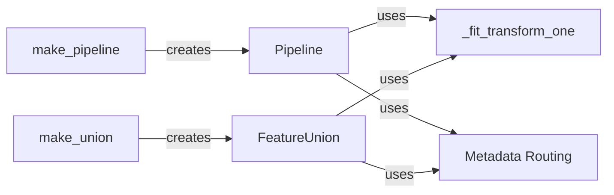

## Component Details

### Pipeline
The Pipeline class chains together a sequence of transformers and a final estimator. It implements the fit, transform, and predict methods by sequentially applying the transformers and then the final estimator. The Pipeline simplifies the process of building complex models by encapsulating multiple steps into a single object.
- **Related Classes/Methods**: `sklearn.pipeline.Pipeline`

### FeatureUnion
FeatureUnion applies a list of transformer objects in parallel to the input data and concatenates the results. This is useful for combining several feature extraction mechanisms into a single transformer. Each transformer in the FeatureUnion should implement the fit and transform methods.
- **Related Classes/Methods**: `sklearn.pipeline.FeatureUnion`

### make_pipeline
The make_pipeline function is a shorthand for constructing a Pipeline. It automatically names the estimators based on their types, simplifying the Pipeline creation process. It takes a variable number of estimators as input and returns a Pipeline object.
- **Related Classes/Methods**: `sklearn.pipeline.make_pipeline`

### make_union
The make_union function is a shorthand for constructing a FeatureUnion. It automatically names the transformers based on their types, simplifying the FeatureUnion creation process. It takes a variable number of transformers as input and returns a FeatureUnion object.
- **Related Classes/Methods**: `sklearn.pipeline.make_union`

### _fit_transform_one
This private function within Pipeline and FeatureUnion fits a single transformer to X and y, and returns the transformed result along with the fitted transformer. It handles the case where the transformer has a `fit_transform` method or separate `fit` and `transform` methods.
- **Related Classes/Methods**: `sklearn.pipeline._fit_transform_one`

### Metadata Routing
Metadata routing enables passing specific parameters to specific steps within a pipeline. Classes like `MetadataRouter`, `MethodMapping`, and functions like `process_routing` and `_routing_enabled` are used to configure and manage how parameters are routed to the underlying estimators' methods.
- **Related Classes/Methods**: `sklearn.utils._metadata_requests.MetadataRouter`, `sklearn.utils._metadata_requests.MethodMapping`, `sklearn.utils._metadata_requests.process_routing`, `sklearn.utils._metadata_requests._routing_enabled`
