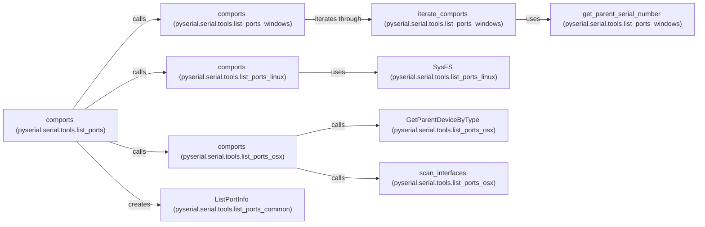

## Component Details

The Port Discovery component in PySerial provides a cross-platform way to list available serial ports on a system. It abstracts away the operating system-specific details of enumerating serial ports, offering a consistent interface for applications to find and connect to serial devices. The main flow involves calling the `comports` function, which then dispatches to platform-specific implementations (Windows, Linux, macOS) to retrieve port information. The results are encapsulated in `ListPortInfo` objects, which contain details like port name, description, and hardware ID. The `grep` function allows filtering the list of ports based on a pattern, and the `main` function provides a command-line interface for listing ports.

### comports (pyserial.serial.tools.list_ports)
This function serves as the main entry point for listing serial ports. It determines the operating system and calls the appropriate platform-specific `comports` implementation. It iterates through available ports and yields `ListPortInfo` objects containing port information.
- **Related Classes/Methods**: `serial/tools/list_ports.py`

### comports (pyserial.serial.tools.list_ports_windows)
Windows-specific implementation for listing serial ports. It uses Windows API calls (e.g., `win32com`) to enumerate COM ports and retrieve their properties. It iterates through the ports and retrieves additional information like the parent device's serial number.
- **Related Classes/Methods**: `serial/tools/list_ports_windows.py`

### iterate_comports (pyserial.serial.tools.list_ports_windows)
Iterates through the COM ports on Windows, yielding port information. It uses `EnumPorts` to get the ports and then retrieves detailed information about each port.
- **Related Classes/Methods**: `serial/tools/list_ports_windows.py`

### get_parent_serial_number (pyserial.serial.tools.list_ports_windows)
Retrieves the serial number of the parent device for a given COM port on Windows. This is done by querying the Windows Registry for the device's properties.
- **Related Classes/Methods**: `serial/tools/list_ports_windows.py`

### comports (pyserial.serial.tools.list_ports_linux)
Linux-specific implementation for listing serial ports. It relies on the sysfs filesystem to identify and retrieve serial port information. It searches for devices under `/dev` and uses `SysFS` to extract details.
- **Related Classes/Methods**: `serial/tools/list_ports_linux.py`

### SysFS (pyserial.serial.tools.list_ports_linux)
A class representing the sysfs filesystem on Linux, used to gather serial port information. It provides methods to read attributes from sysfs entries, such as device manufacturer and product.
- **Related Classes/Methods**: `serial/tools/list_ports_linux.py`

### comports (pyserial.serial.tools.list_ports_osx)
macOS-specific implementation for listing serial ports. It uses IOKit framework to enumerate serial ports and retrieve their properties. It uses functions like `scan_interfaces` and `GetParentDeviceByType` to find serial ports.
- **Related Classes/Methods**: `serial/tools/list_ports_osx.py`

### GetParentDeviceByType (pyserial.serial.tools.list_ports_osx)
Retrieves the parent device of a specific type on macOS using IOKit. This is used to find the USB device associated with a serial port.
- **Related Classes/Methods**: `serial/tools/list_ports_osx.py`

### scan_interfaces (pyserial.serial.tools.list_ports_osx)
Scans interfaces on macOS to identify serial ports. It uses IOKit to find devices matching the criteria for serial ports.
- **Related Classes/Methods**: `serial/tools/list_ports_osx.py`

### ListPortInfo (pyserial.serial.tools.list_ports_common)
A class that stores information about a serial port, such as port name, description, and hardware ID. It serves as a data structure to hold the information retrieved by the platform-specific implementations.
- **Related Classes/Methods**: `serial/tools/list_ports_common.py`
