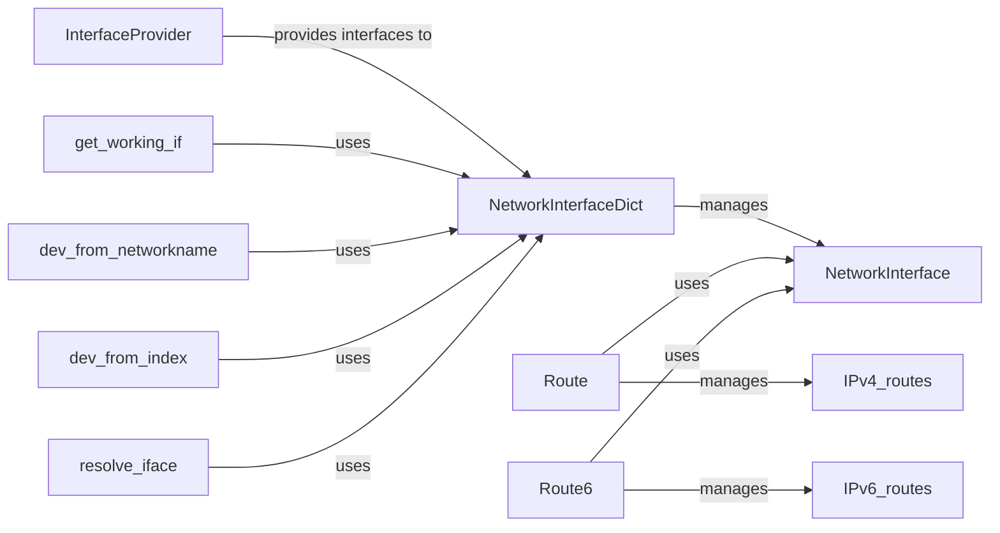

## Component Details

The RoutingEngine component in Scapy is responsible for managing and providing access to network routing information for both IPv4 and IPv6 protocols. It encompasses functionalities for adding, deleting, and querying routes, as well as resolving network interfaces and addresses. The component relies on the operating system's routing tables and network interface information to make routing decisions. It provides a set of tools and classes to interact with these system resources, abstracting away the complexities of different operating systems. The main flow involves initializing the routing tables, resolving interfaces, and providing methods for packet routing based on destination addresses.

### Route
The Route class manages the IPv4 routing table. It provides methods for adding, deleting, and modifying routes, as well as for resolving routes to specific interfaces. It interacts with the operating system to retrieve and update routing information.
- **Related Classes/Methods**: `scapy.scapy.route`

### Route6
The Route6 class manages the IPv6 routing table. It provides similar functionality to the Route class but for IPv6 routes. It interacts with the operating system to retrieve and update IPv6 routing information.
- **Related Classes/Methods**: `scapy.scapy.route6`

### NetworkInterface
The NetworkInterface class represents a network interface. It stores information about the interface, such as its name, IP address, MAC address, and other relevant details. It provides methods for updating its configuration and comparing itself to other interfaces.
- **Related Classes/Methods**: `scapy.scapy.interfaces`

### NetworkInterfaceDict
The NetworkInterfaceDict class is a dictionary-like class that manages a collection of NetworkInterface objects. It provides methods for registering interface providers, loading interface configurations, reloading interfaces, and accessing interfaces by name or index. It acts as a central repository for all network interfaces known to Scapy.
- **Related Classes/Methods**: `scapy.scapy.interfaces`

### InterfaceProvider
The InterfaceProvider class is an abstract base class or interface for classes that provide network interface information. Concrete implementations of this class are responsible for discovering and retrieving network interfaces from various sources (e.g., operating system, configuration files).
- **Related Classes/Methods**: `scapy.scapy.interfaces`

### get_working_if
This function retrieves the currently active or 'working' network interface. It relies on the NetworkInterfaceDict to access the available interfaces and determine the appropriate one based on certain criteria.
- **Related Classes/Methods**: `scapy.scapy.interfaces`

### dev_from_networkname
This function retrieves a network device (interface) based on its network name. It uses the NetworkInterfaceDict to look up the interface by name and return the corresponding device object.
- **Related Classes/Methods**: `scapy.scapy.interfaces`

### dev_from_index
This function retrieves a network device (interface) based on its index. It uses the NetworkInterfaceDict to look up the interface by index and return the corresponding device object.
- **Related Classes/Methods**: `scapy.scapy.interfaces`

### resolve_iface
This function resolves a given interface name or index to a NetworkInterface object. It uses the NetworkInterfaceDict to find the interface and return the corresponding object.
- **Related Classes/Methods**: `scapy.scapy.interfaces`
