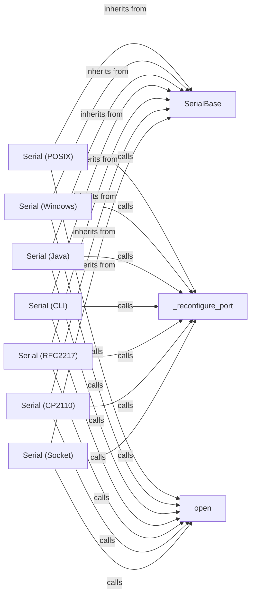

## Component Details

The Serial Port Configuration subsystem is responsible for managing the settings and communication of serial ports across different platforms. It provides an abstraction layer that allows applications to interact with serial ports using a consistent interface, regardless of the underlying operating system or hardware. The core of this subsystem is the `SerialBase` class, which defines the common interface for serial port operations. Platform-specific implementations, such as `Serial (POSIX)` and `Serial (Windows)`, inherit from `SerialBase` and provide the necessary functionality to interact with serial ports on their respective operating systems. The `_reconfigure_port` method is crucial for applying the serial port settings to the hardware, while the `open` method establishes the serial connection. Other implementations like `Serial (RFC2217)`, `Serial (CP2110)`, and `Serial (Socket)` extend the functionality to support network-based serial communication.

### SerialBase
The base class for serial port implementations, providing common attributes and methods for managing serial port settings like baud rate, parity, stop bits, and timeout values. It defines the interface for serial port operations.
- **Related Classes/Methods**: `serial/serialutil.py`

### Serial (POSIX)
Serial port implementation for POSIX systems (Linux, macOS). It handles opening and configuring the serial port using POSIX-specific system calls, such as `open()`, `close()`, `read()`, `write()`, and `ioctl()`. It inherits from SerialBase.
- **Related Classes/Methods**: `serial/serialposix.py`

### Serial (Windows)
Serial port implementation for Windows systems. It uses the Win32 API to open and configure the serial port, including functions like `CreateFile()`, `SetCommState()`, `ReadFile()`, and `WriteFile()`. It also handles overlapped I/O for asynchronous operations. It inherits from SerialBase.
- **Related Classes/Methods**: `serial/serialwin32.py`

### Serial (Java)
Serial port implementation for Java environments. It relies on Java Communications API (javax.comm) to interact with serial ports. This implementation is less common and might have limited support. It inherits from SerialBase.
- **Related Classes/Methods**: `serial/serialjava.py`

### Serial (CLI)
Serial port implementation that uses command-line interface tools (like `stty`) to configure the serial port. This is a less common approach and relies on external commands being available on the system. It inherits from SerialBase.
- **Related Classes/Methods**: `serial/serialcli.py`

### Serial (RFC2217)
Serial port implementation for communicating over a network using the RFC2217 protocol (Telnet Com Port Control Option). It allows accessing serial ports remotely via a Telnet connection. It inherits from SerialBase.
- **Related Classes/Methods**: `serial/rfc2217.py`

### Serial (CP2110)
Serial port implementation for CP2110 USB-to-UART bridge devices, accessed via a URL handler. It uses the CP2110 USB driver to communicate with the device. It inherits from SerialBase.
- **Related Classes/Methods**: `serial/urlhandler/protocol_cp2110.py`

### Serial (Socket)
Serial port implementation that uses a socket connection to communicate with a remote serial port server. It allows accessing serial ports over a network using TCP sockets. It inherits from SerialBase.
- **Related Classes/Methods**: `serial/urlhandler/protocol_socket.py`

### _reconfigure_port
A method responsible for applying the serial port settings (baud rate, parity, stop bits, etc.) to the underlying hardware or communication channel. Its implementation varies depending on the platform and connection type. It uses platform-specific APIs to configure the serial port.
- **Related Classes/Methods**: `serial/serialposix.py`, `serial/serialwin32.py`, `serial/serialcli.py`, `serial/rfc2217.py`, `serial/urlhandler/protocol_cp2110.py`, `serial/urlhandler/protocol_socket.py`

### open
A method responsible for opening the serial port and configuring it. Its implementation varies depending on the platform and connection type. It performs the necessary steps to establish a serial connection, such as opening the device file or creating a socket connection.
- **Related Classes/Methods**: `serial/serialposix.py`, `serial/serialwin32.py`, `serial/serialjava.py`, `serial/serialcli.py`, `serial/rfc2217.py`, `serial/urlhandler/protocol_cp2110.py`, `serial/urlhandler/protocol_socket.py`
